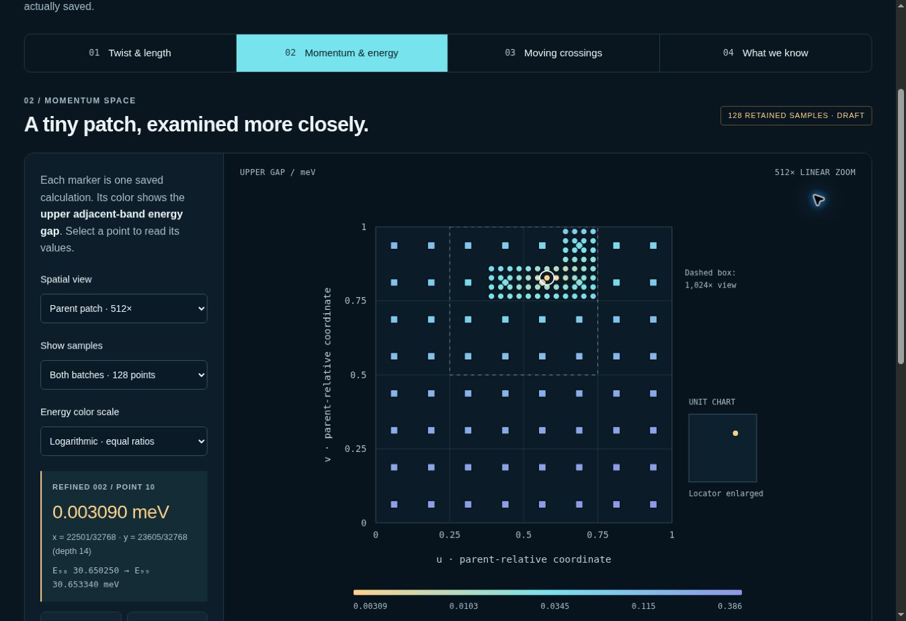

# Twistronics: mapping band crossings in twisted graphene

Two slightly rotated graphene sheets create a much larger moiré pattern. This
AI-assisted computational research project studies where selected electron-energy
bands meet in a strained bilayer model, how those crossings move, and which
claims the retained calculations can support. The crossings live in **momentum
space**, not at physical locations on a sheet.

**[Explore the visual field guide](docs/interactive-guide/README.md)** ·
**[Download the browser explorer](docs/interactive-guide/explorer.html)** ·
**[Read the current evidence](docs/STATUS.md)**

*Select individual samples, switch between linear and logarithmic energy colors,
zoom from a unit fractional chart into the sampled patch, rotate explanatory
graphene reference lattices, and replay saved node positions. The guide labels
geometry lessons, historical results, and current draft observations separately.*

> **Opening the interactive view:** GitHub displays the preview image but does
> not execute the explorer inside this README. Open
> [explorer.html](docs/interactive-guide/explorer.html), choose **Download raw
> file**, and open the downloaded file in your browser. It contains its own
> data and controls; no installation or research-engine run is needed.

## Current research snapshot

**Updated 25 September 2026 UTC.** The visual guide is published on `main`.
The newest displayed research observations are bound to
[`3f174f19b3ed5d57598accd1d7b1550fc7c9eeff`](https://github.com/alanfuller15/Twistronics/commit/3f174f19b3ed5d57598accd1d7b1550fc7c9eeff)
in draft [PR #5](https://github.com/alanfuller15/Twistronics/pull/5). Publishing
their presentation does not merge or certify that scientific track.

| Work | Retained result | What it establishes |
|---|---|---|
| Momentum-space mapping | **128 point spectra**: 64 coarse and 64 targeted refined samples, finite cutoff a, matrix dimension 196 | Approximate gaps at those sampled coordinates |
| Targeted refinement | Smallest sampled upper gap: **0.00819 → 0.00309 meV** | A tighter sampled region for follow-up; not a lower bound between points or proof of gap closure |
| Bounded S1b interval-inertia run | **29663/65536 ≈ 45.26% of quadrant area**, with 590 accepted cells | Partial accepted area within the declared quadrant [½, 1]²; frontier and unresolved cells keep the run inconclusive |
| Earlier v062 continuation | Six seeded nodes at **11 saved settings per engine** | Historical finite-model trajectories and spatial charge comparisons; not a complete braid |

**[Latest point-mapping report and figure](https://github.com/alanfuller15/Twistronics/blob/3f174f19b3ed5d57598accd1d7b1550fc7c9eeff/research/benchmarks/momentum_mapping_summary_001/OUTPUT/REPORT.md)** ·
**[Retained S1b execution and its limits](https://github.com/alanfuller15/Twistronics/blob/3f174f19b3ed5d57598accd1d7b1550fc7c9eeff/research/benchmarks/certification_s1b_quadrant_a_002/RUN/README.md)**

The 128 point samples add **no certified area**. The coverage fraction is an
area measure for one quadrant, not a cell count, full-domain coverage, or a
percentage of the project completed. Refinement was chosen from the coarse
results, so the combined samples are not an independent validation set.

## Learn through the visuals

| Lesson | Try it | Learn to distinguish |
|---|---|---|
| Twist & length | Change the angle, field of view and visible moiré cell | Atomic lattice spacing, moiré length and display magnification |
| Momentum & energy | Compare 1×, 512× and 1,024× views; inspect sample values | Fractional coordinates, physical momentum geometry and energy differences |
| Moving crossings | Step through saved settings and switch implementations | Measured states, connecting lines and unknown motion between samples |
| What we know | Follow exact source links and evidence labels | An illustration, a sampled observation, a software check and a certificate |

The [interactive guide](docs/interactive-guide/README.md) explains nm and Å,
meV and μeV, reciprocal-coordinate charts, linear versus area magnification,
logarithmic color scales, and momentum cutoff. Exact-value tables and keyboard
controls provide alternatives to pointing and color.

## Choose a reading path

| Your question | Start here |
|---|---|
| What is the project, and what should I read first? | [Start here](docs/START_HERE.md) |
| What do the current map and scales mean? | [Interactive field guide](docs/interactive-guide/README.md) |
| What is published, draft, or still open? | [Research status](docs/STATUS.md) |
| Which saved records produced these views? | [Presentation sources and hashes](docs/interactive-guide/sources.json) |
| How can I reproduce a presentation or inspect evidence? | [Reproducibility guide](docs/REPRODUCIBILITY.md) |
| What does the older node-continuation evidence show? | [Historical illustrated guide](docs/visual-guide/README.md) |
| What do the terms and version labels mean? | [Glossary](docs/GLOSSARY.md) |
| How is the research archive organized? | [Archive map](docs/ARCHIVE_MAP.md) |

<strong>Historical background: the v060/v062 node continuation</strong>

Two separately coded engines retain the same spatial charge classification,
**OPPOSITE**, at eleven sampled tunnelling ratios from 0.991 to 1.000 in v062.
The combined v060/v062 record has fifteen distinct ratios per engine,
including earlier SAME classifications. These compare topological charge signs
under declared frame conventions, not electric charge.

Markers show retained numerical states; connecting lines guide the eye. This
segment alone is not a demonstration of a complete braid. See the
[historical guide](docs/visual-guide/README.md), [report](research/v062/REPORT.md),
[method](research/v062/METHOD.md), and [coverage ledger](research/v062/COVERAGE.md).

The engines share a measurement framework and model assumptions. Their
agreement is a useful numerical check, not independent physical validation.
The v065 software evidence is a separate historical track, not a newer
numerical campaign.

## Open scientific work

Uniform full-domain isolation, the complete certified projector/transport/seam
composition, a continuous-path proof, infinite-cutoff convergence, and
experimental validation remain open. A passed software test, review, or
package gate does not by itself establish any of these results. The
microscopic relation between strain, tunnelling, and realizable device
controls also requires further work.

Useful outside feedback includes a decisive topology benchmark, a check on
symmetry and band-isolation assumptions, or a realistic observable and
experimental control path. Before proposing changes, read
[CONTRIBUTING.md](CONTRIBUTING.md) and bind claims to exact retained evidence.
