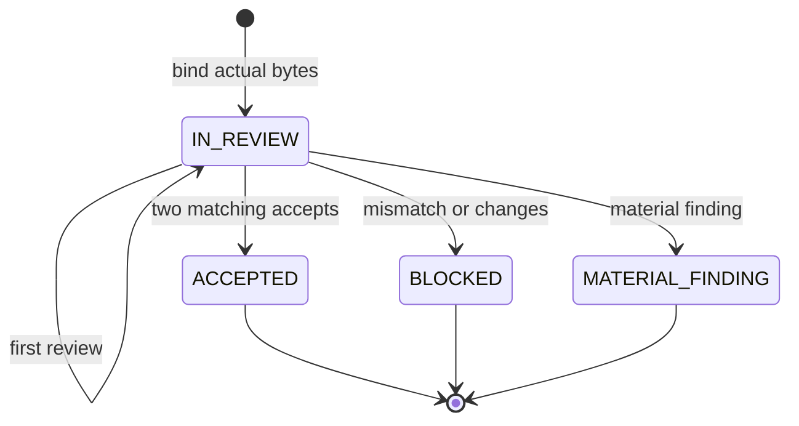

# Twistronics acceptance loop

This repository is a compartmentalized, evidence-only review loop for the
`twistronics_v079p_acceptance.zip` line. It coordinates a bounded Astra/Claude
review without asking Alan to manage intermediate iterations.

It **does not** execute scientific workloads, import project modules, run
numerical sweeps, merge branches, or convert retained results into new physical
claims. Its work is limited to byte-level provenance, record review, reviewer
envelopes, state transitions, and deterministic packaging.

## Operating contract

1. Work from a copy. The original v079p bundle is immutable input.
2. Declare every source file that defines the candidate and hash its actual
   bytes. Missing, changed, duplicated, escaping, or symlinked sources block.
3. Bind the round ID, reviewed commit, artifact digest, exact source/evidence
   inventories, G00-G17 ledger, and mandatory negative-control ledger into one
   canonical descriptor digest.
4. Permit no more than two ordered reviewer exchanges: Astra first and Claude
   second. Each message must review that exact descriptor and cite bound evidence.
5. Claims remain `RETAINED_EVIDENCE_ONLY`. A green state is package acceptance,
   not physical certification.
6. Notify Alan only when the state is `ACCEPTED`, `BLOCKED`, or
   `MATERIAL_FINDING`. `DRAFT` and `IN_REVIEW` remain inside the loop.
7. Two matching reviews produce `PREPACKAGE_ACCEPTED`. Package only its exact
   evidence binding; staged clean extraction (G16) and detached attestation
   (G17) produce the terminal `ACCEPTED` result.
   `MANIFEST.json` is intentionally excluded
   from its own file list; the ZIP digest is detached as `<archive>.sha256`.

The conservative two-message limit prevents an unbounded acknowledgement loop.
If either reviewer requests changes, the candidate is `BLOCKED`; a corrected
candidate receives a new binding digest and starts a new bounded cycle.

## State flow



## Commands

The implementation uses only the Python standard library. From this repository:

```bash
export PYTHONPATH="$PWD/src"

python -m twistronics_acceptance_loop create-state \
  --source-root /path/to/candidate-copy \
  --source-label v079p-candidate-1 \
  --source-all \
  --evidence-root /path/to/retained-evidence \
  --round-id TWI-ACC-v079p-R01-<artifact-prefix> \
  --baseline-sha <40-hex> \
  --reviewed-commit <40-hex> \
  --artifact-sha256 <64-hex> \
  --gate-results gate-results.json \
  --negative-controls negative-controls.json \
  --output state.json

python -m twistronics_acceptance_loop ingest-review \
  --state state.json \
  --message astra-review.json \
  --source-root /path/to/candidate-copy \
  --evidence-root /path/to/retained-evidence

python -m twistronics_acceptance_loop verify-state \
  --state state.json \
  --source-root /path/to/candidate-copy \
  --evidence-root /path/to/retained-evidence

python -m twistronics_acceptance_loop package \
  --state state.json \
  --source-root /path/to/candidate-copy \
  --evidence-root /path/to/evidence-only-tree \
  --output /path/outside/evidence/accepted-bundle
```

The final output is one atomically published directory containing
`package.zip`, `package.zip.sha256`, and `ATTESTATION.json`. A failed
postcheck or attestation write leaves no final bundle.

`create-state --source-all` recursively binds the exact regular-file inventory
of the isolated candidate root. Alternatively, repeated `--source` arguments
declare an exact set; any additional file in that root blocks verification. It
never infers a trusted set from a candidate summary. The review schema requires evidence
references, limitations, and actionable next steps even for an acceptance.

## Tests

```bash
PYTHONPATH=src python -m unittest discover -s tests -v
```

The tests cover byte tampering, exact gate/control ledgers, descriptor replay,
ordered and identity-bound reviews, unbound evidence, unrelated-tree packaging,
terminal closure, portable ZIP paths, deterministic packaging, manifest
verification, detached archive digests, clean extraction, and symlink refusal.

## Deliberate non-goals

- No GitHub write, merge, or publication operation.
- No Claude/Astra API client and no credential handling. Reviewer messages are
  supplied by an authorized outer coordinator.
- No shell or subprocess execution.
- No acceptance based only on declared hashes in a result summary.
- No numerical, physical, or scientific correctness determination.

See `AGENTS.md` for worker boundaries and `schemas/` for machine-readable
contracts. `docs/GITHUB_PROTOCOL.md` defines the shared Astra/Claude control
bus, `docs/ACCEPTANCE_GATES.md` defines the fail-closed gate set, and
`rounds/v079p/R00/` seeds the current blocker/provenance round.
