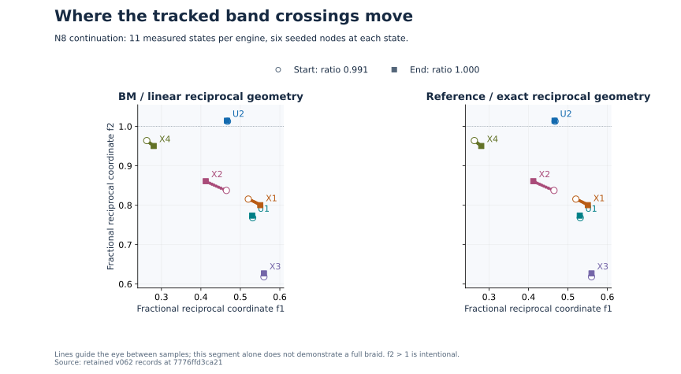
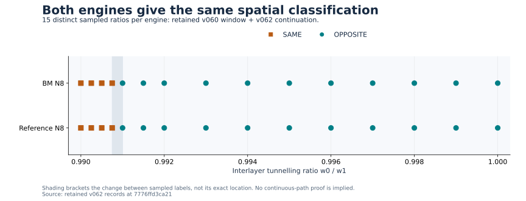
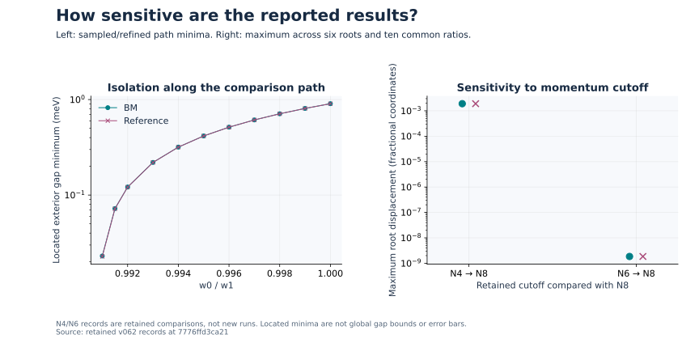
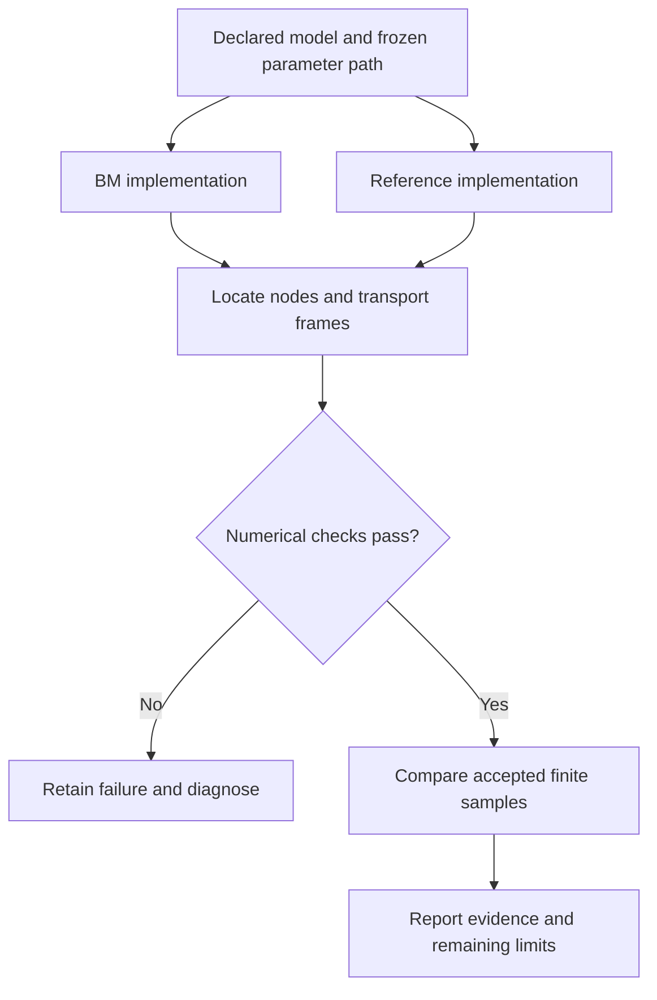

# A visual guide to the Twistronics project

> **Historical learning snapshot:** this guide explains retained v060/v062
> evidence from source snapshot `7776ffd3ca21`. It remains the recommended
> visual introduction, but it is not a summary of every later draft research
> track. See [Start here](../START_HERE.md) and [current status](../STATUS.md)
> before interpreting it as the project's latest state.

## The question in one minute

Can we track band crossings and their topological relationships reliably as parameters change in a continuum model of strained twisted bilayer graphene?

An electronic band describes allowed electron energies as a function of momentum. A **node** is a point where two bands meet. Near certain nodes, the eigenvectors have a winding structure that can be assigned a topological charge under specified symmetry and frame conventions. In multiband systems, moving nodes relative to nodes in adjacent band gaps can change charge relationships; this motivates studying nodal braiding and Euler-class topology.

The numerical project follows selected nodes, carries their eigenvector frames, and checks the result with a second implementation and numerical refinements. The figures below show a bounded published segment of that investigation. They do not depict real-space particle braiding, prove the complete campaign, or measure an experimental graphene sample.

## What is varied here?

The **v062** batch varies the interlayer tunnelling ratio **w0/w1** from 0.991 to 1.000. The model fixes w1 at 110 meV and sets w0 to 110 times that ratio. This particular figure is a tunnelling-ratio sweep within a strained model, not a sweep of the twist angle or an experimentally calibrated strain control.

The reported held state is A=0, B=−0.4, T=−0.8, phi=80°, theta=1.05°, eps=0.003, w_kappa=0 and w_mode=average. A, B and T are model state parameters; do not read T here as a temperature measurement. Exact conventions and algorithms belong to the [numerical plan](../../research/v062/NUMERICAL_PLAN.json), [report](../../research/v062/REPORT.md) and [method](../../research/v062/METHOD.md).

| Term | Meaning in these figures |
|---|---|
| BM / reference | Separately coded engines with linear / exact reciprocal geometry, respectively. They share the measurement harness and constant-tunnelling lab_nn_full approximation. |
| N4, N6, N8 | Momentum-cutoff settings. Both N8 engines have matrix dimension 1060 in this batch. N is not a number of graphene layers. |
| U1, U2 | The selected node pair whose charges are followed and compared. |
| X1–X4 | Four tracked adjacent-gap nodes. Only six seeded roots are tracked; this is not an exhaustive node count. |
| f1, f2 | Dimensionless fractional reciprocal coordinates, not distances on the sample. Their plot is a coordinate chart, not Cartesian physical momentum geometry. |
| Frame transport | Carrying a consistent local eigenvector basis along a specified path, needed to compare charge signs. |
| Exterior gap | Energy separation from bands outside the selected pair along a comparison path. It is not the zero gap at the node itself. |

## Where do the nodes move?



Open circles show the start and squares the end. Smaller markers are the intervening measured states. The two panels use the same coordinate limits. U2 remains above f2=1 because the numerical chart is explicitly **unwrapped**; moving it back into a unit square would misrepresent the calculation. Similar-looking panels do not mean exact equality: the report gives a maximum endpoint-root difference between engines of approximately 2.03×10⁻⁵ in fractional coordinates.

The eleven states include the repeated join at ratio 0.991 and ten new states per engine. Lines only connect those samples for readability. This late continuation segment does not draw a complete braiding history.

## What do the charge labels mean?



**SAME** and **OPPOSITE** compare the selected U-pair charges using the declared spatial frame-transport path. They do not name electric charge, electron spin, or an experimentally measured phase. They are also distinct from comparing each node's separately carried temporal charge.

This distinction matters: v062 retains individual temporal signs [1, 1] in the BM engine and [−1, −1] in the reference engine, while both yield OPPOSITE spatial comparisons. The absolute temporal signs depend on the inherited gauge and are not equated across engines. The [method](../../research/v062/METHOD.md) specifies how spatial transport and orientation connect these quantities.

The figure combines **retained v060 evidence** with **v062 continuation**, using the chain recorded in v062/SUMMARY.json. There are fifteen distinct ratios per engine. Shading marks the interval between the last sampled SAME and first sampled OPPOSITE label; it is not a fitted transition location. The earlier crossing calculation and its isolation rejection belong to [v060](../../research/v060/REPORT.md), not a new calculation performed for this guide.

## How robust are these measurements?



The left panel reports the minimum of the stored spatial-transport exterior-gap minima at each v062 state, including the two transport mesh resolutions. The smallest reported value across both engines is approximately **0.02277 meV**. These sampled/refined minima are not rigorous global lower bounds. Lines are visual guides between sampled parameter states.

The right panel compares N8 with retained N4 and N6 records at ten common ratios, taking the maximum displacement across all six roots and those ratios. Values are approximately **1.90×10⁻³** for N4 versus N8 and **1.85×10⁻⁹** for N6 versus N8. This is encouraging finite-cutoff agreement within these model conventions, not an infinite-cutoff error estimate. N4 and N6 were not rerun for v062 or this guide. Both axes use logarithmic vertical scales; markers are values, not uncertainty intervals.

Additional published checks include root convergence, band isolation along the selected path, frame joins, loop mesh/radius agreement and coarse/fine parameter transport. Agreement between engines cannot eliminate an error in their shared harness or assumptions.

## How the computation is organized

The following diagram explains the method; it is not a result plot.



## What remains open?

At this branch's source commit, the [coverage ledger](../../research/v062/COVERAGE.md) records N8 work for particular crossing, event and endpoint batches. It does not establish the full connecting campaign. In particular, complete flat-pair/Euler/endpoint-w1 coverage at N8, continuous-path proof, infinite-cutoff accuracy, a microscopic strain-dependent tunnelling law and experimental validation remain open. This guide does not promote software test counts into evidence of physical correctness.

For outside review, useful questions are: Which minimal model should the topology pipeline reproduce? Which symmetry or isolation assumption is most vulnerable? What observable could test the predicted spectral evolution, and can the chosen parameter path be realized in a device?

## Recreate the figures

These figures need no new simulations. From a checkout of this branch, use a separate plotting environment with Python, NumPy and Matplotlib, then run:

```bash
python docs/visual-guide/render.py
```

The script checks the SHA-256 hashes in [sources.json](sources.json), reads three existing JSON files, validates their state labels, root records, endpoints and gap minima, and writes SVG and PNG figures only under `docs/visual-guide/figures/`. It never imports or runs a research engine. A source mismatch stops rendering. The SVG figures are committed; PNG files are local previews. The plotting dependencies do not replace any scientific dependency pins.

Source snapshot: [`7776ffd3ca21`](https://github.com/alanfuller15/Twistronics/commit/7776ffd3ca219ff976e578103b895e25db60dcc2).

| Figure | Published input |
|---|---|
| Node paths | `research/v062/results/second_bm_lab_N8.json` and `second_ref_lab_N8.json`: `states[].nodes[].f` |
| Spatial classifications | `research/v062/SUMMARY.json`: `combined_braid2_chain` |
| Exterior gaps | Both raw result files: minimum over `states[].spatial_transport[].min_external_gap` |
| Cutoff comparison | `research/v062/SUMMARY.json`: `cutoff_comparisons[].max_node_displacement` |

Rendering verifies presentation consistency with retained data. It does not independently reproduce the numerical research or validate the physical model.

## Relevant theoretical background

- Ahn, Park and Yang, [Euler-class and fragile topology in twisted bilayer graphene](https://doi.org/10.1103/PhysRevX.9.021013).
- Bouhon and Slager, [Multi-gap topological conversion of Euler class via band-node braiding](https://arxiv.org/abs/2203.16741).
- Kang and Vafek, [Non-Abelian Dirac-node braiding in magic-angle twisted bilayer graphene](https://arxiv.org/abs/2002.10360).

These are context for the research question, not endorsements or independent verification of this repository.
