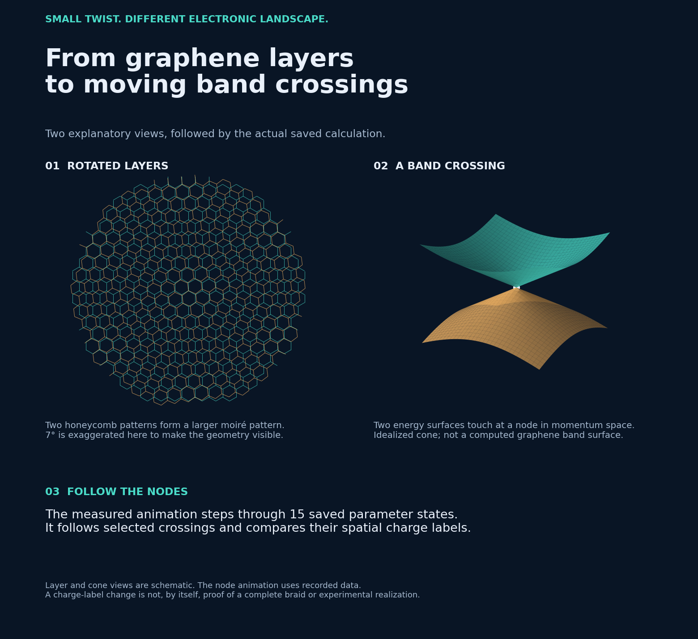
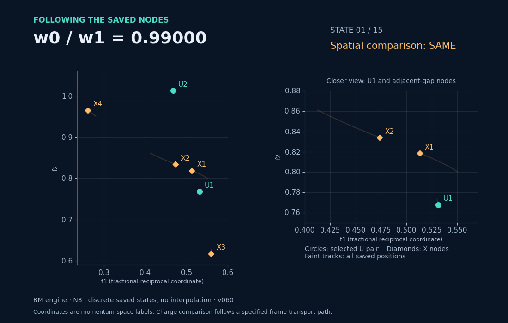

# From layers to saved node measurements



## Explore it

Download [explorer.html](explorer.html) using GitHub's **Download raw file** button, then open it in a browser. It works offline, without installation or external dependencies.

1. **Layers:** rotate two honeycomb patterns to see moiré geometry. This is an explanatory drawing; the angle is exaggerated. The retained calculation holds the twist angle at 1.05° and sweeps a tunnelling ratio.
2. **Bands:** open and close a gap in the generic model `E± = ±sqrt(kx² + ky² + m²)`. These are illustrative surfaces in arbitrary units, not computed graphene bands or a topology calculation.
3. **Measured nodes:** select BM or reference implementation, then step or play through the 15 retained parameter states. The coordinate and charge-label displays use saved data. No intermediate positions are generated.



## What the measured view means

The circles mark the selected U pair; diamonds mark X nodes in the adjacent gap. Axes are fractional reciprocal coordinates, not physical positions on the sample. The close-up shows U1, X1 and X2. Faint tracks show all retained positions; bright tracks show the sequence up to the current state. Lines only guide the eye.

SAME and OPPOSITE are spatial charge-comparison labels obtained using the recorded frame-transport prescription. They are not the sign of an individual node, nor an Euler-class value. See the [definitions and limitations](../visual-guide/README.md#what-do-the-charge-labels-mean).

The data join v060 (0.990–0.991) to v062 (0.991–1.000) at N8, retaining the common 0.991 state once. The builder checks the join and checks both sequences against the published v062 summary. This is a finite sampled segment, not proof of a completed braid, an infinite-cutoff result, or experimental feasibility. Both engines share parts of the measurement framework.

## Reproduce

From the repository root, with Python, NumPy, Matplotlib and Pillow installed:

```sh
python docs/visual-story/build_story.py
```

This reads the four retained aggregate JSON files in `research/v060/results/` and `research/v062/results/`, and the v062 summary. It does not execute the research engines. [sources.json](sources.json) records input hashes. `explorer-template.html` is the editable template; `explorer.html` embeds the measured data for offline use.
