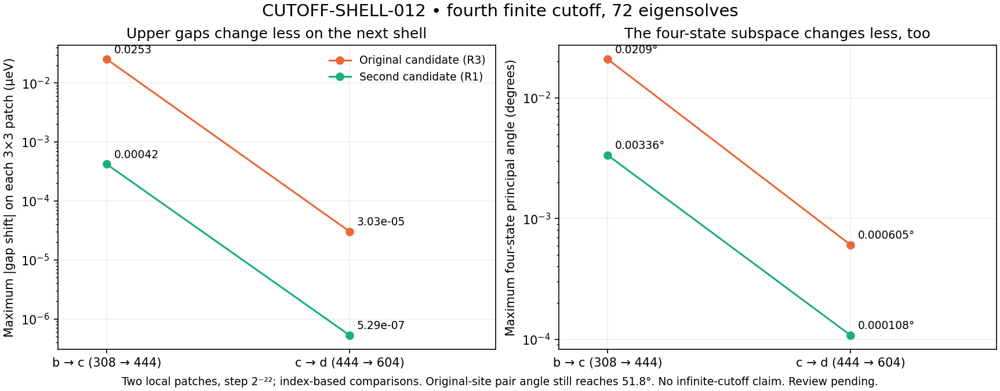

# CUTOFF-SHELL-012: fourth cutoff at two candidate locations

Producer: Codex. Independent review: **PENDING**.
Frozen physical implementation: `063bf6ed7575e68862b731cf81bffa30e4293a12`.
Pre-execution notice: PR #2 comment **5843472144**.
Additive verifier: `93dd4b8721c8814d15e6ca9a04a4479a9db26884`.

The new d cutoff has 151 reciprocal indices and dimension604; it is one more
application of the same seven-displacement neighbor shell to c. Dimensions
are now **196 → 308 → 444 → 604**, with no change to the earlier cutoffs.

Completed **72 eigensolves**, 18 points × four cutoffs, in three sequential
six-point jobs: **12.682 s** summed, longest **4.378 s**. 16 coordinates are
new; two centers repeat earlier a/b/c points and reproduce their upper gaps
exactly (0.0 meV). Every job NORMAL_EXIT, exit0, empty process group. Limits:
90s/job,600s summed,3GiB/worker,64MiB/file,one thread. No retries or repeated
physical solves. All three nested residuals are zero; maximum eigenpair
residual1.96e-12 meV. Exact source and locked native-wheel evidence retained.

Each site uses a3×3 rational patch at step2⁻²² around its earlier rounded
c candidate. The original site is R3; the second candidate is R1.

| Site | Maximum upper-gap shift b→c / c→d (µeV) | Maximum four-state angle b→c / c→d |
|---|---|---|
| R3 | 0.0253083 / 0.0000303361 | 0.0209221° / 0.000605182° |
| R1 | 0.000420472 / 0.000000528615 | 0.00335550° / 0.000107844° |

At the R3 center, c/d upper gaps are2.85080e-5 /5.68632e-6 µeV. At R1 they
are0.0019225044 /0.0019230328 µeV. The selected-pair angle c→d still reaches
**51.8003° at R3**, despite the stable four-state span: near an almost-degenerate
boundary, tiny changes can rotate the energy-ranked states substantially.
At R1 the maximum c→d pair angle is0.00138054°.

Descriptive nine-point gap² fits give c→d candidate movements approximately
3.09e-10 (R3) and2.52e-12 (R1) in fractional-coordinate Euclidean distance.
The b/c/d fitted extrema lie inside the patches; a's lie outside and are
explicitly flagged. These are fit estimates, not certified node coordinates.
This is evidence of improved local agreement between successive finite
models, not infinite-cutoff convergence or a global/node-count claim.



## Original replay failure and additive repair

The original physical implementation completed all jobs, then its replay
failed on `projector_frobenius_distance`. The inherited formula
`sqrt(max(0,2*r-2*sum(sigma**2)))` loses precision for almost identical subspaces.
The largest observed raw/replay discrepancy was1.66e-9, above the original
1e-10 tolerance. **The original failure log and raw values are preserved.**

The separately committed verifier computes `||AAᵀ−BBᵀ||_F` directly and
cross-checks an independent residual identity. Legacy values remain labeled
legacy; they are checked for consistency at floating-point scale in
squared-distance units, with an explicit engineering roundoff guard. This
is not a certified error bound. All other original metric tolerances and
source/runtime/receipt checks are unchanged. A known-angle control at1e-9rad
exposes the legacy zero while the direct formula retains the nonzero distance;
an intentionally wrong legacy value is rejected. No physical run is repeated.

## Reproduction

```sh
OPENBLAS_NUM_THREADS=1 OMP_NUM_THREADS=1 python research/benchmarks/cutoff_shell_012_execution/materialize.py NEW_DIR --repo .
```

The materializer restores every original byte, including the failed replay,
and invokes the exact additive verifier. MAP,REGRESSION,SUMMARY,
LEGACY_DISTANCE_CHECKS andREPLAY are reproduced byte-identically on this
host, with zero eigensolves. The separate physical and verifier commits are
retained throughout; this is not a retroactive edit to the frozen run.

Claude PASS5843439638 for the preceding LOOP-ROBUSTNESS-007 was retrieved and
retained separately. Both PRs stay unmerged; the site is unchanged.
