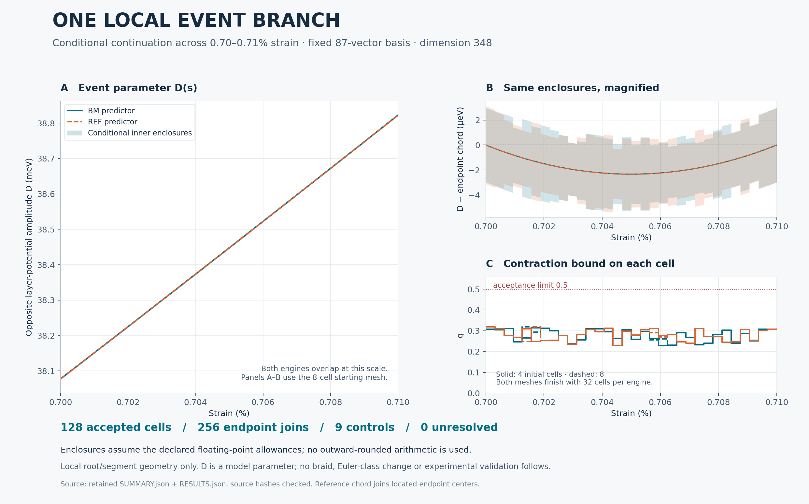

# A local event branch between two strain stations

**The declared fixed-basis continuation passes over strain 0.70%–0.71%, conditional on the floating-point allowances in the frozen plan.** Both Hamiltonian implementations pass with 4-cell and 8-cell starting meshes. Each campaign finishes with 32 accepted cells and passes every endpoint join. This advances the preceding [sampled comparison](../joint_mapping_guarded): the new calculation bounds the coupled root/segment equations throughout each accepted strain cell.



The event means that a named upper-gap node lies inside the segment joining two named flat-band nodes, using fixed periodic image lifts. It is a statement about this local geometry. It does not establish a braid or an Euler-class change.

## Result and scope

The basis contains the same **87 reciprocal indices (dimension 348)** at every strain. It is the N6-derived union in the preceding [BASIS.json](../joint_mapping_guarded/BASIS.json), not a changing radial cutoff. Twist is 1°, strain angle is 15°, P=1, geometry is `exact`, kinetic convention is `lab_nn_full`, and tunnelling remains constant at w₁=110 and w₀=88 meV. D is the model's opposite layer-potential amplitude ±D, not a calibrated experimental field.

| Check | Retained result |
|---|---:|
| Analytic / failure / native-matrix controls | 9 pass |
| Campaigns | 2 engines × 2 starting meshes |
| Located centers | 150, including 75 common strain values per engine |
| Attempted cells | 232 |
| Accepted final cells | 128; 32 per campaign |
| Failed parent cells retained and subdivided | 104 |
| Point certificates | 132 across the four campaigns |
| Endpoint-to-cell containment checks | 256 pass |
| Unresolved cells or joins | 0 |
| Largest cellwise contraction bound q | 0.318217; gate 0.5 |
| Largest self-map bound | 0.568217; gate 0.8 |
| Smallest complementary-matrix margin | greater than 8.28284 meV |
| Segment parameter t, all full tubes | within [0.7230402, 0.7262933] |

Numbers in the last four rows are rounded conservatively for display. The complementary-matrix margin bounds the fixed-frame matrix K in [METHOD.md](METHOD.md); it is not a direct full-Hamiltonian neighboring-band gap bound. Centers and endpoint results are cached where identical, so campaign counts are not counts of independent data.

Conditional endpoint enclosures below contain the union of the two engine results, rounded outward for display:

| Strain | Endpoint D enclosure (meV) |
|---|---|
| 0.70% | [38.0778962, 38.0778994] |
| 0.71% | [38.8226272, 38.8226306] |

The full-cell inner enclosures are wider: their D half-widths range from approximately **0.002012 to 0.003115 meV**. Panel B displays that width relative to the chord joining located endpoint centers. The chord is only a plotting reference. These bounds do not resolve every feature of the plotted predictor's small curvature. Tight endpoint checks and tiny engine differences must not be substituted for the continuous-cell enclosure width.

Fresh native checks find maximum matrix-entry discrepancy 4.10 × 10⁻¹² meV and final crossing gap 9.97 × 10⁻¹¹ meV (rounded upward). The largest located D difference between engines is 4.42 × 10⁻¹² meV and fractional-coordinate difference is 1.84 × 10⁻¹⁴. These comparisons check numerical consistency; they do not establish physical precision. Both engines share the fixed-basis adapter, analytic derivative formula and diagnostic framework.

## What is bounded

The ten unknowns are three `(f1, f2, E)` node states and D; strain is the external parameter. Nine equations set fixed-frame two-band Schur complements to zero. A tenth equation sets the scaled signed area of the three nodes to zero. The full tubes must also keep the upper node strictly inside the finite segment, separate all three root neighborhoods, preserve the selected periodic images and remain inside the coordinate domain.

Analytic inverse-deformation identities supply uniform nonlinear strain remainder bounds. No finite-difference sample is used as a continuum bound. A weighted contraction calculation bounds one local coupled zero for every strain in each accepted cell. Independent zero-width point certificates must fit inside both incident full tubes at a shared endpoint; overlapping outer tubes alone never passes. These joins identify one continuous local event branch over the declared interval, conditional on the numerical inputs being enclosed by the stated allowances.

Ordinary floating-point eigensolvers, norms and inverses are used. **This is not an outward-rounded, verified-arithmetic proof.** The report reconstructs native matrices and stored frames, then recomputes all primitive data, cells, coverage and joins with the same published bound functions. Its maximum retained-data reconstruction discrepancy is zero in this run; that is reproducibility in this environment, not an independently coded proof. The derivation and its assumptions are in [METHOD.md](METHOD.md).

No complete node inventory, complete event surface, global event uniqueness, charge transport, full braid, Euler-class change, infinite-cutoff accuracy, novelty or physical validation is claimed. This flat-pair segment is not automatically the moving comparison stem in the separate N8 contour evidence chain. No N8 campaign was run here. The next substantive gates are a complete relevant node inventory and justified transport/charge calculations along a declared path; extending this local branch alone would not settle either.

## Controls and retained history

The controls include a curved analytic event D(s)=s² with nonlinear Schur roots, constant orthogonal basis covariance, rejection of an undersized radius, complementary closure, a singular coupled map and an outside-segment crossing, plus endpoint containment and rejection of outer-box overlap alone. Analytic strain derivatives and Taylor bounds are checked against both native Hamiltonians.

The first analytic fixture mistakenly placed p.x=0.2 and q.x=0.8, so the selected minimum-image segment wrapped across the boundary and differed from its intended test geometry. Its positive and outside-segment checks failed. The fixture was corrected to p.x=0.3 and q.x=0.7, with an interior upper node at 0.5 and an outside test at 0.9. The original source, output and log are preserved as `INITIAL_CONTROL_FIXTURE.*`. Acceptance thresholds, equations and the production domain were unchanged. All nine corrected controls passed before production.

Production took 260.6 seconds here, excluding controls and reporting. Logged locator work accounts for 13,782 root/native eigensolves; final production checks add 900 spectral evaluations and the report adds another 900. These counters exclude the full spectra and singular-value calculations used to assemble the bounds, so they are not total linear-algebra work or a scaling benchmark.

## Reproduce

Use the full repository at this branch: the preceding review's preserved partner ZIP, fixed-basis adapter and guarded root solver are required. Requirements are Python, NumPy, SciPy, Matplotlib and threadpoolctl. The retained production environment used Python 3.12.14, NumPy 2.3.5 and SciPy 1.17.0 with one BLAS thread.

From this directory, reconcile the retained records and regenerate the figures:

```bash
OPENBLAS_NUM_THREADS=1 OMP_NUM_THREADS=1 python report.py
OPENBLAS_NUM_THREADS=1 OMP_NUM_THREADS=1 python figure.py
```

`report.py` checks bound source hashes, reconstructs native matrices and stored frames, and audits every retained interval and join. `figure.py` verifies the summary's source hashes before plotting. Re-running a report or figure can change artifact bytes across software environments; the release manifest identifies the retained originals.

For new production, use a disposable checkout and first move `RESULTS.json`, `FRAMES.npz`, `RESULTS_PRODUCER.json.gz`, `PACKAGING.json`, `SUMMARY.json` and the report/figure outputs aside. Run `controls.py`, `run.py`, `report.py`, then `figure.py` with the same thread settings. `run.py` refuses to overwrite retained results and checks that controls bind the executable sources. Re-running controls changes their record hashes; reconcile the resulting fresh production, not the previous release. The declared budget is finite and there is no resume mechanism in this bounded runner.

## Evidence

[PLAN.json](PLAN.json) freezes the interval, tolerances, budgets and radius rule. [CONTROLS.json](CONTROLS.json) records the controls. [RESULTS.json](RESULTS.json) retains every locator evaluation, center, attempted cell, failed parent, point check and join. [FRAMES.npz](FRAMES.npz) stores the pair frames. [SUMMARY.json](SUMMARY.json) and [REPORT.log](REPORT.log) hold the reconciliation. [FIGURE.json](FIGURE.json) binds the plotted summary, rendering source and outputs; [SVG](event_branch.svg) is available for sharing.

`RESULTS.json` was losslessly compacted after production to fit the file-upload limit. `RESULTS_PRODUCER.json.gz` preserves the exact original pretty-printed bytes; `PACKAGING.json` records both hashes and sizes. The report checks parsed equality. No numerical value or failed record was removed. `MANIFEST.json` hashes every release file except itself.

Parent commit: `ef82a53d4b15e768ea748e028aa597c632fd1d9b`. All changes in this iteration are confined to `research/benchmarks/joint_mapping_continuation`.
