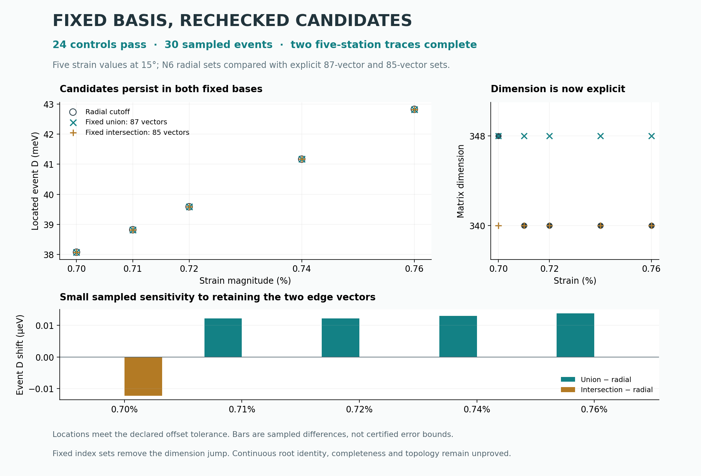

# Guarded mapping tools and a fixed-basis comparison

**The eight reviewed runner defects have guarded replacements, and all 24
controls pass.** The bounded numerical batch locates all 30 requested event
candidates: five strain values, three basis choices and both Hamiltonian
implementations. Both fixed-union traces also complete their five declared
stations using carried seeds.



This iteration builds on the [partner review](../joint_mapping_review/).
The original partner sources remain unchanged in its ZIP. New modules
`jm_model.py`, `jm_sweep.py` and `jm_trace.py` use a new plan/record schema;
they are not drop-in replacements for the partner command line. The partner
supplied the exploratory sweep/trace concept and real-basis assembly; guarded
root solving comes from [r1_newton](../r1_newton/).

## Numerical result

The fixed bases are the union (87 reciprocal vectors; dimension 348) and
intersection (85 vectors; dimension 340) of the six previously retained N6
candidate sets. They differ by `(0,-4)` and `(0,4)`. Their complete sorted
indices are frozen in [BASIS.json](BASIS.json). Index membership stays unchanged
while the lattice vectors and Hamiltonian entries follow the chosen strain.

| Strain | Radial dimension | Radial event D (meV) | Fixed union D (meV) | Fixed intersection D (meV) |
|---:|---:|---:|---:|---:|
| 0.70% | 348 | 38.0778978 | 38.0778978 | 38.0778856 |
| 0.71% | 340 | 38.8226165 | 38.8226287 | 38.8226165 |
| 0.72% | 340 | 39.5858410 | 39.5858532 | 39.5858410 |
| 0.74% | 340 | 41.1669939 | 41.1670069 | 41.1669939 |
| 0.76% | 340 | 42.8199651 | 42.8199788 | 42.8199651 |

The **0.71% point is new**, seeded by arithmetic interpolation of the retained
0.70% and 0.72% seed coordinates and D. It passes the same bounded checks.
Its radial basis already has dimension 340, narrowing the observed membership
change to between sampled strains 0.70% and 0.71%. The exact transition is not
located; matching endpoint sets do not exclude intervening membership changes.

The largest difference between the two fixed-basis located event values is
approximately **1.4 × 10⁻⁵ meV** (0.014 µeV) in this sample. This is a sampled
truncation-sensitivity comparison, not an accuracy bound. Table digits identify
locator outputs, not physical precision.

Event acceptance uses signed-offset tolerance 10⁻⁹ in fractional coordinates,
not a certified error bound on D. Bisection may stop on that residual before
reaching its 10⁻⁹ meV width-stop threshold. Identical dyadic trial values can
occur across engines and produce repeated differences in the table. Both
engines returned the same accepted D trial in all 30 cases; maximum final
coordinate disagreement is 1.15 × 10⁻¹⁴. This does not imply exact engine
agreement or eliminate shared diagnostic error.

The report recomputes **120 native complex final spectra** across all 40
accepted event/trace stations, each paired with an affine-real comparison.
Maximum final native crossing gap is 9.31 × 10⁻¹¹ meV; maximum native/affine
matrix-entry discrepancy is 3.19 × 10⁻¹² meV (rounded upward).
Production records account for **7,042 eigensolves**; the report adds 240
spectral evaluations. The numerical batch and two traces took 104.8 seconds
here, excluding controls and reporting. This is not a scaling forecast.

## Runner changes

| Reviewed failure | New behavior |
|---|---|
| Resume ignores cutoff/grid | A sidecar binds full plan, engine/model, basis list, solver settings and source hashes. Incompatible resume is rejected before ledger mutation. |
| Error rows count as completed | Only successful states are skipped. Failed states retry once per invocation, up to the plan's total-attempt limit. |
| Torn JSONL tail destroys next record | Exact incomplete tail bytes are fsynced to a hash-named quarantine file before truncation. A valid unterminated record receives a newline. Malformed interior lines and hash-chain mismatches stop the run. |
| Supporting-line zero outside segment accepted | Every accepted scalar evaluation must have a declared interior segment parameter and adequate flat-node separation. |
| Secant escapes bracket | Bisection stays inside the caller's absolute bracket, with no bracket expansion. |
| Exhaustion relaxes tolerance | The same residual gate applies throughout. Exhaustion, rejected measurements and width-stop failure remain failures. |
| Seed N ignored | N is inherited. Conflicting N and incompatible model metadata are rejected; a changed index set requires an explicit reseed declaration. |
| Work counters omit earlier measurements | Every endpoint/interior scalar evaluation and known root/native eigensolve count is retained, including failed measurements. Unexpected exceptions explicitly mark cost completeness false. |

A nonblocking filesystem lock enforces one writer per sweep ledger. Records
carry sequence numbers and a hash chain. Two-worker execution and resume are
exercised by a real small-grid control; this is not a scaling benchmark.

The survey merges declared tracked seeds with grid minima and an optional
segment-strip scan. Every refinement attempt is retained in a successful
survey record. Accepted coordinates remain in the closed unit square and are
checked there; **no modulo wrapping of roots is performed**. Including the
tracked seed recovers the original known crossing node. Grid plus local
scanning still cannot certify a complete inventory.

Trace output is reserved against overwrite, then saved after each station and
on a structured stopping condition. A radial-basis trace stops when membership
changes between stations. Fixed seed boxes, flat-pair separation and periodic
image choices constrain each scalar search; they do not certify continuous
identity or assignment between stations. A trace is still exploratory.

## Fixed-basis construction

Each native engine constructs its geometry normally. The adapter replaces all
basis-dependent index, dimension, position-map and reciprocal-vector fields,
then rebuilds the static Hamiltonian with that engine's own assembly method.
Real affine coefficients are built only after reconstruction. No uncoupled
padding states or static matrices from another dimension are reused.

Six matrix controls cover both engines: matching-index reconstructions equal
the native radial matrices at the two endpoint cases, and the 85-vector matrix
equals the corresponding principal submatrix of the 87-vector matrix at the
same geometry. All six observed entrywise differences are zero. Fresh native
checks additionally test the affine construction at accepted event points.
The basis adapter and diagnostic framework are shared between engines.

## Reproduce and use

Requirements: Python, NumPy, SciPy, Matplotlib and threadpoolctl. Run from this
directory. The scripts verify and extract the preserved partner sources via
the preceding review's `inputs.py`.

Reconcile retained results and regenerate the figure:

```bash
OPENBLAS_NUM_THREADS=1 OMP_NUM_THREADS=1 python report.py
OPENBLAS_NUM_THREADS=1 OMP_NUM_THREADS=1 python figure.py
```

Run an exploratory single-state sweep with known tracked seeds, then resume
the same output (the second command skips its successful state):

```bash
OPENBLAS_NUM_THREADS=1 OMP_NUM_THREADS=1 python jm_sweep.py example_sweep.json /tmp/jm_sweep.jsonl 1
OPENBLAS_NUM_THREADS=1 OMP_NUM_THREADS=1 python jm_sweep.py example_sweep.json /tmp/jm_sweep.jsonl 1
```

Run the declared five-station fixed-union trace from the first retained seed:

```bash
OPENBLAS_NUM_THREADS=1 OMP_NUM_THREADS=1 python jm_trace.py ../joint_mapping_review/N6_CANDIDATE_SEEDS.json example_trace.json /tmp/jm_trace.json
```

Use a fresh output name for a changed plan or new trace. The sweep accepts a
worker count as its third argument. Candidates are in each ledger record's
`result.candidates`; the partner's old seed-export CLI is not reused. Trace
seeds must carry the explicit N/model/basis metadata shown in the retained
input file. Each trace station supplies an absolute D bracket.

For fresh production, use a disposable checkout and move retained
`RESULTS.json`, `TRACE_BM.json` and `TRACE_REF.json` aside. Run `controls.py`,
`run.py`, `report.py`, then `figure.py`, with the same thread settings. The
runner refuses to overwrite retained results and verifies that controls match
the executable sources. Re-running controls changes timing and record hashes;
that modified checkout needs a fresh production run before reconciliation.

## Evidence and scope

The [frozen plan](PLAN.json), [controls](CONTROLS.json),
[event evaluations](RESULTS.json), [BM trace](TRACE_BM.json),
[REF trace](TRACE_REF.json) and [summary](SUMMARY.json) retain the evidence.
The figure uses saved results and verifies their source hashes.
`MANIFEST.json` hashes every release file except itself. Parent commit:
`cf8c1071c87fa465ed9a19d79b4e7d8b63207ada`.

Fixed index sets remove this discrete dimension change from the finite-model
family. They do not establish continuous root identity, event uniqueness,
complete node counts, a full braid or an Euler-class change. These events use
the flat-pair center segment, not automatically the exact moving comparison
stem in the separate N8 contour evidence chain.

All points use twist 1°, strain angle 15°, constant w₁=110 and w₀=88 meV, exact
geometry and `lab_nn_full`. D is the opposite layer-potential amplitude ±D meV;
P is a dimensionless tunnelling scale. Neither is calibrated to an experimental
control here. No infinite-cutoff convergence, novelty or physical validation
is claimed. A useful next numerical gate is continuous root/segment tracking
in one declared fixed basis, with isolation and inventory controls.
