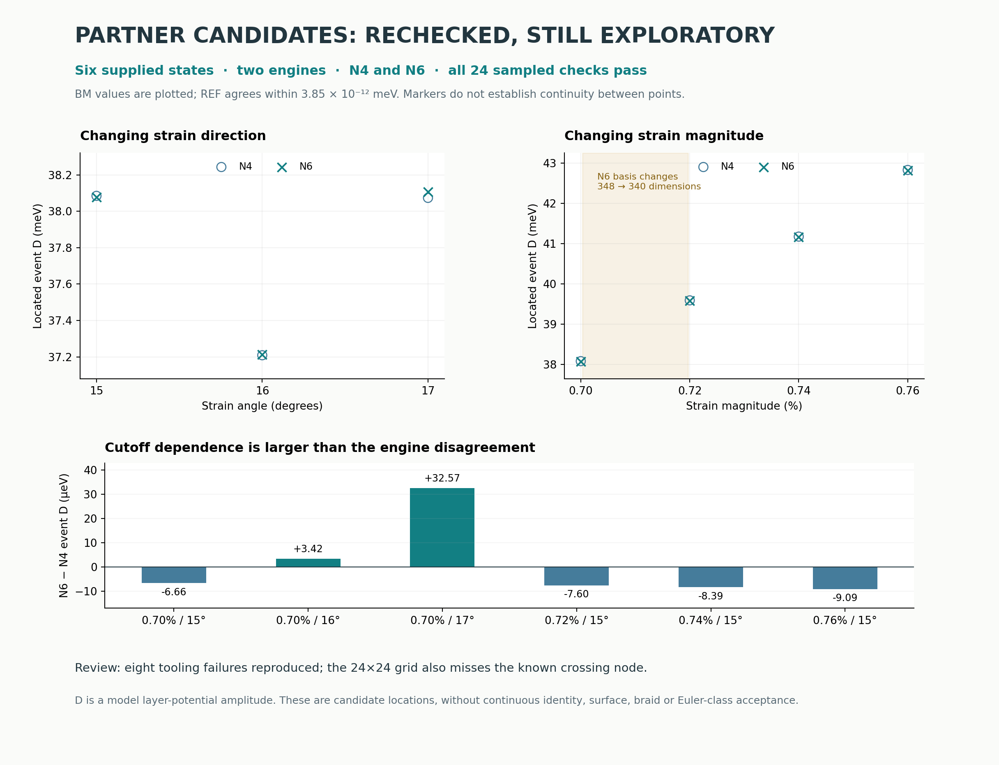

# Joint mapping: useful candidates, runner fixes required

**All six distinct supplied event candidates reproduce in both Hamiltonian
implementations at N4 and N6 under bounded sampled checks.** The bundle is
useful for locating follow-up candidates. Its unattended sweep and tracing
tools need correction before a larger campaign: eight consequential failure
cases were reproduced against the unchanged partner code.

A new numerical finding is that **the N6 basis changes from 348 to 340
dimensions between the supplied strain values 0.70% and 0.72%**. Continuous
event-surface arguments need an explicit common-basis treatment or controlled
truncation comparison across that change.



## What was preserved and inspected

The [original ZIP](partner_joint_mapping.zip) and its
[input manifest](INPUT_MANIFEST.json) are retained unchanged. SHA-256:
`a73d14e0d877f115788da34c0c93d85c0353e96b1ba7a4d6a0890490f77f4538`.

The supplied `bm_strain.py` and `tbg_ref.py` are byte-identical to the engines
in `r1_reproduction`. Its `fast_engine.py` is byte-identical to the original
partner engine already preserved in `r1_newton`; it is not the guarded solver
variant used in our subsequent checks.

Source inspection found no network calls, deletion operations or subprocess
launches in the imported mapping path. The sweep appends and fsyncs its output;
seed extraction and tracing overwrite their specified output files. Regression
tests use disposable paths. `nodewind.py` has an unguarded top-level calculation
and was not executed or imported. The unrelated legacy charge/Euler routines
were not used as acceptance evidence.

## Rechecked event candidates

The two supplied trace files have seven rows but share their initial point,
giving six distinct states. At every state we checked both native complex
Hamiltonians and used the published guarded Newton solver for the two flat
nodes and the upper node. Each root stays within a fixed ±0.02 fractional
coordinate box around its supplied seed. A bracketed Brent solve searches only
within ±0.1 meV of the supplied D. Every accepted sample has an interior segment
parameter, unchanged periodic-image choice and a native gap below 10⁻⁸ meV.

Both engines use matching cutoff padding 10⁻⁶ Å⁻¹. Twist is 1°, P = 1, kinetic
mode is `lab_nn_full`, geometry is exact, and tunnelling remains w₁ = 110 meV,
w₀ = 88 meV. D means opposite layer potentials ±D, not a calibrated displacement
field. P is a dimensionless tunnelling scale, not a pressure calibration.

| Strain | Angle | Rechecked N4 event D (meV) | Rechecked N6 event D (meV) | N6 − N4 (meV) |
|---:|---:|---:|---:|---:|
| 0.70% | 15° | 38.084562 | 38.077898 | −0.006665 |
| 0.70% | 16° | 37.208753 | 37.212171 | +0.003418 |
| 0.70% | 17° | 38.073323 | 38.105891 | +0.032568 |
| 0.72% | 15° | 39.593442 | 39.585841 | −0.007601 |
| 0.74% | 15° | 41.175379 | 41.166994 | −0.008385 |
| 0.76% | 15° | 42.829055 | 42.819965 | −0.009090 |

The table uses BM outputs; REF agrees within **3.85 × 10⁻¹² meV** in event D
and **2.68 × 10⁻¹⁴** in fractional coordinates. Those differences measure
implementation consistency, not physical accuracy. The largest observed
cutoff shift is **0.0325682 meV**, at 17°. No infinite-cutoff accuracy is inferred.

All **24 state/cutoff/engine rows pass**. The runner retains **1,496 solver
eigensolves**, 570 native-spectrum evaluations (each paired with an affine-real
spectrum comparison), every scalar-solver evaluation and every guarded root
history. A separate report repeats 72 final native complex spectra and checks
the saved geometry, coordinate boxes, brackets, source hashes and engine
comparisons. Maximum refined native gap is 9.44 × 10⁻¹¹ meV; maximum final
signed-offset magnitude is 1.10 × 10⁻¹¹ in fractional-coordinate units.

These are **sampled candidate checks**. The spatial boxes constrain the
search; they are not uniqueness certificates. The checks do not certify
continuous identity as strain or angle varies, event uniqueness, absence of
other roots, or a continuous surface between points.

## Basis change and the grid blind spot

At N6, the strain-0.70% point has 87 reciprocal vectors; the 0.72%, 0.74% and
0.76% points have 85. Vectors `(0,−4)` and `(0,4)` leave the retained set between
the first two supplied strain values, removing eight matrix dimensions.
The exact transition location is not computed here. N4 has the same 37-vector
set at all supplied points; the sampled angle points also share a basis at
each tested cutoff. Matching sets at sampled endpoints do not prove they
remain unchanged everywhere between them.

The focused [grid replay](GRID_REPLAY.json) confirms the partner's observation:
at strain 0.007, angle 15°, D38 and N4, the 24×24 survey returns two flat nodes,
three upper nodes and four lower nodes, but misses the upper node supplied by
the tracked record. Refining that tracked seed recovers a native small-gap root
absent from the survey list. These are found-root counts, not complete counts.
The proposed dense local search near the flat-pair segment is not implemented
in the supplied `survey()`.

## Reproduced tooling findings

Each finding has a runnable regression and retained evidence in
[REGRESSIONS.json](REGRESSIONS.json). Original sources remain inside the ZIP
and are extracted unchanged by `inputs.py` when needed.

| Finding | Demonstrated consequence | Required correction |
|---|---|---|
| Resume key includes only the five knobs | An N6/grid48 request silently skips a completed N4/grid24 state | Bind the full model, N, grid, solver settings and source/plan hashes to the run and state identity |
| Error records count as completed | A transiently failed state is never retried on resume | Distinguish success, failure and retry policy |
| Truncated JSONL tail is left in place | The next appended valid record joins the broken line and becomes unreadable | Recover or quarantine the partial tail before appending |
| No finite-segment gate | A supporting-line zero at t = 2 is returned as an event | Require a declared interior t margin at every accepted event |
| Secant iterations are not bracket-preserving | A valid initial sign bracket is left during iteration | Use a bounded bracket-preserving solver and retain all evaluations |
| Tolerance relaxes after iteration exhaustion | An offset of −7.5 × 10⁻⁶ is returned with requested tolerance 10⁻⁷ | Enforce one unchanged residual gate; retain exhaustion as failure |
| Seed cutoff is ignored by default | A seed tagged N6 is traced and saved as N4 unless N is explicitly passed | Validate or inherit cutoff and model metadata |
| Point cost reports only the last measurement | A three-evaluation synthetic solve reports 3 solves instead of 9, before any bracketing cost | Accumulate all attempted work, including lost roots and failed brackets |

Additional source-review issues: the tracer carries seeds but has no formal
identity or assignment guard; the survey wraps returned Newton roots with `%1`
without recomputing the gap at the wrapped coordinate; and trace failure/loss
is printed but not stored as a structured stopping reason. The fast engine
also retains the previously identified stale-gap return on iteration exhaustion,
although these callers reject its `converged=False` result. These observations
are distinguished from the eight reproduced regressions above.

The bundle's throughput forecast is not validated. Per-point counters omit
work, the trace timer excludes seed location, and its printed point count
includes that seed. The calibration plan contains **72**, rather than roughly
50, states. No large sweep or scaling benchmark was run for this review. The
31-second candidate check here uses different work and safeguards and is not
an apples-to-apples tracer throughput estimate.

## How to use this contribution

1. Keep the partner sweep/trace concept as an exploratory candidate generator.
   Correct resume integrity, bound the event solver, validate finite-segment
   crossings and retain failures before launching unattended runs.
2. Merge tracked seeds with grid candidates and retain every refinement attempt.
   A denser local scan may find more roots; it still cannot certify completeness.
3. Use a declared common reciprocal-index set, or quantify the effect of changing
   it, before treating the strain trace as one continuous finite-model family.
4. Reuse the six [rechecked N6 seed records](N6_CANDIDATE_SEEDS.json) as inputs
   to future frozen acceptance runs. They are explicitly tagged as candidates.

The current bounded N8 contour work remains a separate evidence chain. This
bundle concerns zeros relative to the flat-pair center segment; that segment
is not automatically the exact moving base-to-anchor stem from
[r1_stem](../r1_stem/). A nearby D value does not identify the two geometries.
Nothing here establishes charge transport, a full braid, an Euler-class change,
experimental feasibility or novelty.

## Reproduction and provenance

The [plan](PLAN.json) was frozen after source inspection and before regressions
and numerical candidate checks. The later focused grid replay reproduces an
explicitly documented blind spot; it is not a new inventory campaign.

With NumPy, SciPy and Matplotlib installed, run from this directory:

```bash
OPENBLAS_NUM_THREADS=1 OMP_NUM_THREADS=1 python regressions.py
OPENBLAS_NUM_THREADS=1 OMP_NUM_THREADS=1 python replay_grid.py
OPENBLAS_NUM_THREADS=1 OMP_NUM_THREADS=1 python report.py
OPENBLAS_NUM_THREADS=1 OMP_NUM_THREADS=1 python figure.py
```

For fresh candidate calculations, use a disposable checkout, move its retained
`CANDIDATES.json` aside, then run `check_candidates.py` before `report.py`.
The runner refuses to overwrite retained candidate results. `inputs.py`
verifies the ZIP and extracts its exact files into the ignored `original/`
directory; those files are never patched. Logs and the release manifest are
included. Parent commit: `b946a848a83ddfb6002ec78624f91a8dc52fcbc3`.
