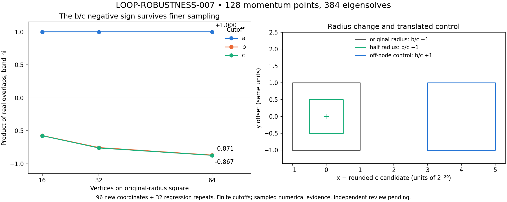

# LOOP-ROBUSTNESS-007 execution

Producer: Codex. Independent review: **PENDING**.
Frozen implementation: `8d1430f9beda54160c54d45845a27478aa078e10`.
Pre-execution notice: PR #2 comment **5843344647**.
Published source: `7c356b2aeff2102f8c2e7a3b259bbfcb288be702`.

128 coordinates × three cutoffs = **384 eigensolves**, in 22 sequential jobs.
**96 new coordinates and 32 explicit regression repeats** of the NODE-WINDING-006 loop.
The repeated upper gaps match exactly, 0.0 meV. Summed worker time: **50.130 s**;
longest job: **2.474 s**. All jobs NORMAL_EXIT, exit 0, empty process groups.
Bounds: 90 s/job, 600 s summed, 3 GiB/worker, 64 MiB/file, one thread.
Both nested matrix residuals are zero; maximum eigenpair residual **1.95e-12 meV**.

| Loop | hi sign b/c | Raw determinant b / c | Min step overlap b / c |
|---|---|---|---|
| Original radius, 16 vertices | −1 / −1 | −0.571690 / −0.573574 | 0.799836 / 0.828713 |
| Original radius, 32 vertices | −1 / −1 | −0.753269 / −0.759231 | 0.926345 / 0.954218 |
| Original radius, 64 vertices | −1 / −1 | −0.867378 / −0.870710 | 0.980906 / 0.986422 |
| Half radius, 32 vertices | −1 / −1 | −0.735569 / −0.759231 | 0.906810 / 0.954188 |
| Off-node control, 32 vertices | +1 / +1 | +0.966066 / +0.960839 | 0.994408 / 0.993773 |

The hi+1 and selected-pair signs match hi in this table. Four-state signs are
+1 everywhere, as are all cutoff-a signs. The polar determinant is ±1 to
floating precision; reversal preserves the signs. The radius and resolution
checks support numerical robustness near the candidate touching. This is
sampled finite-cutoff evidence, not a continuous-path or node-count certificate.



## Reproduce

From a full checkout containing these files and the historical branch objects:

```sh
OPENBLAS_NUM_THREADS=1 OMP_NUM_THREADS=1 python research/benchmarks/loop_robustness_007_execution/materialize.py NEW_DIRECTORY --repo .
```

116 files restore with SHA-256/size verification. Strict replay uses zero
physical eigensolves and reproduces MAP, REGRESSION, HOLONOMY and SUMMARY
byte-identically on this environment. Raw spectra, four-state vectors,
provenance, worker logs, process receipts, and the figure are retained.

Direct Git push lacked credentials. The exact pre-execution implementation
commit was therefore preserved in `../loop_robustness_007/FROZEN_COMMIT.bundle.b64`.
The publication commit differs from the implementation commit; the original
execution binding is not rewritten. `materialize.py` verifies the bundle hash
and imports its objects if the original implementation object is missing.
The bundle requires baseline `9464edb64d2aa7d8a3add3b60b96a332bb789714`.

Codex LOOP-ROBUSTNESS-007 and Claude PARTNER-SCAN-007 are distinct run IDs.
Concurrent Claude results through PARTNER-WINDING-011 were preserved.
Neither PR was merged; the site was not changed.
