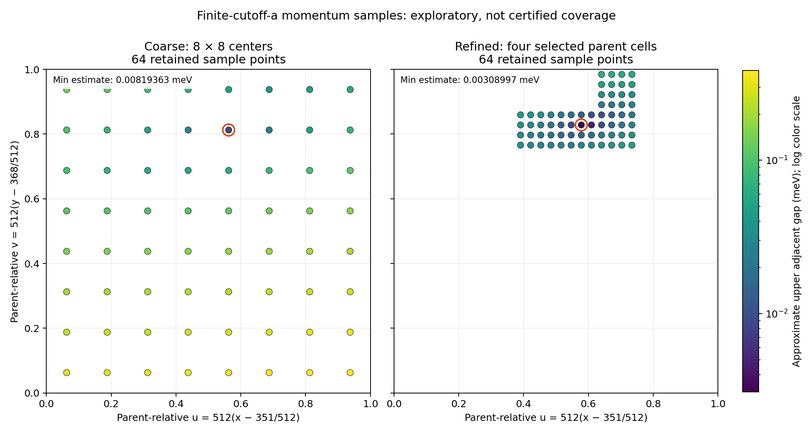

# Retained momentum-space point mapping

Approximate finite-cutoff-a point spectra only. Positive sampled gaps and window margins do not certify cell interiors, gap lower bounds, coverage, seams, topology, or physical gap closure. Historical certified coverage remains 29663/65536. Refinement was selected from coarse observations; the combined samples are not a uniform or independent validation set.

Both batches use the frozen finite-cutoff-a CASE (196 dimensions), with fractional momentum coordinates k=xG1+yG2. Values below are approximate binary64 point diagnostics in meV. Source/runtime and record replay are performed by each scout's check-only verifier; this summary checks the retained file bindings and derives statistics without model evaluation.

## Completed work

| Batch | Status | Completed / started | LDL calls | Elapsed (s) | Exit / receipt |
|---|---|---:|---:|---:|---|
| Coarse 001 | `EXPLORATORY_COMPLETE` | 64 / 64 | 0 | 2.752 | 0 / NORMAL_EXIT; group empty=True |
| Refined 002 | `EXPLORATORY_COMPLETE` | 64 / 64 | 0 | 2.985 | 0 / NORMAL_EXIT; group empty=True |

Each batch had a maximum of 64 eigensolver starts, one worker/native thread, 2 GiB address space, a 120/150-second watchdog, and no retry. A completed point is not a certified tile.

## Sampled gap and window statistics

| Batch | Lower gap range (meV) | Upper gap range (meV) | Local upper window width range (meV) | Fixed parent endpoints all expected |
|---|---:|---:|---:|---:|
| Coarse 001 | 26.5765882452–27.4481173239 | 0.008193629349–0.385512008303 | 0.00204840733725–0.0963780020758 | 34 / 64 |
| Refined 002 | 27.1137971631–27.3861943637 | 0.00308996545071–0.0630271820604 | 0.000772491362678–0.0157567955151 | 0 / 64 |

Coarse 001 minimum upper adjacent-gap estimate: **0.008193629349 meV**, at d12 (2812,2950); x=5625/8192, y=5901/8192.
Its cell has all eight same-depth neighboring cells sampled, so the sampled minimum is interior to the selected cell union rather than on its outer sample row or column. This does not establish a continuum minimum between samples.

Refined 002 minimum upper adjacent-gap estimate: **0.00308996545071 meV**, at d14 (11250,11802); x=22501/32768, y=23605/32768.
Its cell has all eight same-depth neighboring cells sampled, so the sampled minimum is interior to the selected cell union rather than on its outer sample row or column. This does not establish a continuum minimum between samples.

## Fixed parent windows

Mismatches count a wrong approximate strict negative count or equality at an endpoint. They are not certified inertia failures.

| Batch | Lower left | Lower right | Upper left | Upper right |
|---|---:|---:|---:|---:|
| Coarse 001 | 0 | 0 | 19 | 24 |
| Refined 002 | 0 | 0 | 64 | 63 |

Coarse 001: max sampled E98=30.70820581 meV; min sampled E99=30.5588450913 meV; signed common upper-gap intersection width=-0.149360718758 meV. This is an approximate sample comparison, not a certificate of existence or impossibility.

Refined 002: max sampled E98=30.6815620525 meV; min sampled E99=30.6241643184 meV; signed common upper-gap intersection width=-0.0573977340938 meV. This is an approximate sample comparison, not a certificate of existence or impossibility.

Combined samples: max sampled E98=30.70820581 meV; min sampled E99=30.5588450913 meV; signed common upper-gap intersection width=-0.149360718758 meV. This is an approximate sample comparison, not a certificate of existence or impossibility.

## Interpretation

The refined batch samples four cells selected by the smallest coarse upper-gap estimates; it is targeted follow-up, not a uniformly finer map of the entire parent. The fixed parent upper windows disagree with the expected approximate counts across this refined patch, while locally proposed windows remain positive at the sampled centers. This supports using frozen local-window proposals in a separately bounded interval batch instead of investing in the same fixed-parent-window comparison. The much narrower local windows may still be inconclusive on closed cells. No sampled minimum supplies a lower bound between samples, and a smaller refined minimum does not prove physical gap closure.

The plot displays sample locations only; orange rings identify each batch's sampled minimum. The axes are dimensionless parent-relative fractional coordinates u=512(x−351/512), v=512(y−368/512). Neither marker area nor the empty background represents certified momentum-space coverage.

Exact rational statistics, per-batch file hashes, source/runtime bindings, and receipt summaries are retained in `SUMMARY.json`. The SVG and PNG derive only from those retained point observations.
