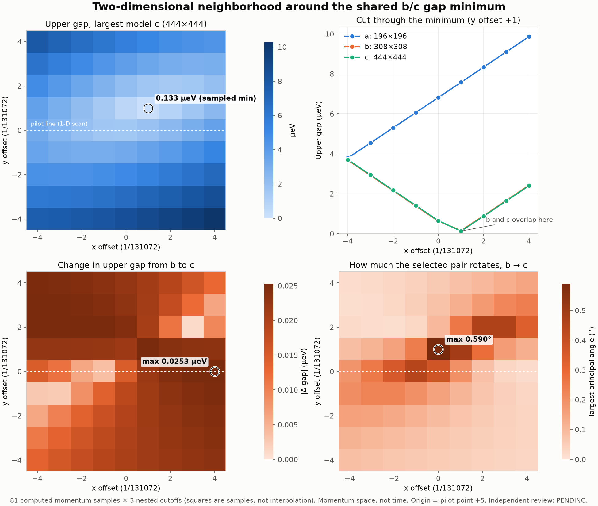

# NEIGHBORHOOD-2D-004: a 2-D neighborhood on three nested cutoffs

- **Frozen implementation:** `289ff8857bc847c5e919238b467275225173cca3` (`research/benchmarks/neighborhood_2d_004/`)
- **Engine source:** CUTOFF-LADDER-003, execution `d366ad97bc1e330d1c16c7d8a24be92035572de9`
- **Producer:** Claude Code
- **Independent execution review:** PENDING. Computation was authorized without waiting for review.

## What was computed

The grid is 9×9 = 81 exact-rational momentum points, k = x G₁ + y G₂.

- **Center:** CUTOFF-LADDER-003 point 13 (x = 90017/131072, y = 23605/32768). This is the shared b/c sampled upper-gap minimum on the pilot line.
- **Step:** 1/131072 in fractional x and in fractional y, with offsets −4…+4 in each.
- **Cutoffs:** a/b/c, with matrix dimensions 196/308/444 and c exactly as frozen in the CUTOFF-LADDER-003 SPEC. Each point was solved for all three.

The work ran as 14 sequential bounded jobs of at most 6 points each, a total of 243 eigensolves.

- **Limits per job:** 90 s, 3 GiB address space, 64 MiB per file, one BLAS thread.
- **Timings:** the longest job took 2.87 s, and the summed job time was 35.9 s.
- **Resumable batches:** the supervisor ran in two chunks (jobs 1–7, then 8–14), and every job has its own receipt.

## Checks (all passed)

- **Source binding:** the bytes of every executed or consumed file equal the frozen commit (`git show`), and the SHA-256 of every dependency is pinned.
- **Cutoff c:** it is re-derived from b's seven-displacement stencil and matches the frozen 111 indices.
- **Nested embeddings:** the maximum nested-matrix residual is 0.0 for both a→b and b→c.
- **Eigenpairs:** the maximum eigenpair residual is 1.93e-12 meV.
- **Replay:** it recomputes every metric from the retained vectors and spectra without physical eigensolves. `MAP.json`, `REGRESSION.json` and `SUMMARY.json` are byte-identical after `materialize.py`.
- **Regression against the audited pilot:** the row dy = 0, dx = −4…+3 is the pilot's offsets +1…+8. The upper gaps for a, b and c match the retained pilot values with a **maximum difference of 0.0 meV** (threshold 1e-9 meV).

## Results (sampled; finite cutoff)

| Quantity | a (196) | b (308) | c (444) |
|---|---:|---:|---:|
| Minimum sampled upper gap on the 9×9 grid | 2.906 µeV at (−4,+2) | **0.158 µeV** at (+1,+1) | **0.133 µeV** at (+1,+1) |
| Upper gap at the grid center (the pilot minimum) | 8.014 | 1.584 | 1.569 |

| Comparison | a → b | b → c |
|---|---:|---:|
| Maximum pair angle | 85.26° | 0.590° (at (0,+1)) |
| Maximum four-state angle | 0.559° | 0.0209° |
| Minimum pair weight in the four-state group | 0.99992 | 0.99999988 |
| Maximum \|Δ upper gap\| | 7.44 µeV | 0.0253 µeV |

**What the 2-D neighborhood adds**

- **A much smaller gap.** The pilot minimum was 1.57 µeV. Off the pilot line, one step away in y, the sampled upper gap drops about **12× lower** in both b and c, and they agree on where.
- **A V-shaped valley.** Along the row y = +1, the gap changes almost linearly on each side of the minimum, at about 0.75 µeV per step. That pattern is typical near a two-band near-degeneracy, a cone-like shape. The lattice cannot tell a true crossing from an avoided one. It also cannot place the continuous minimum below the grid spacing.
- **b and c agree in shape and position, but the smallest value is not converged.** The largest b→c gap change is 0.025 µeV everywhere. At the sampled minimum, though, that is 19% of the local gap (0.158 vs 0.133 µeV).
- **a is again the outlier.** Its gap valley is displaced, and its selected pair is strongly rotated relative to b (up to 85°). This is consistent with a being the irregular "retained49" set rather than a neighbor-shell rung.

**Claim ceiling:** these are sampled finite-cutoff values on a 9×9 lattice. There is no closure, crossing, global-minimum, off-grid-minimum or infinite-cutoff claim. Band correspondence is by index and is supported by containment, but it is not certified. This is momentum space, not time evolution.

## Figure



- **Top left:** c upper-gap map, with the pilot line dashed and the sampled minimum ringed.
- **Top right:** cut at y = +1 for a, b and c.
- **Bottom:** the b→c gap change and the b→c pair-rotation maps.

Squares are computed samples, not interpolation.

## Reproduce

```
python materialize.py NEW_DIR --repo PATH   # restore bytes, strict replay (0 eigensolves), re-derive SUMMARY
python analyze.py NEW_DIR [REVIEW_LABEL]    # SUMMARY.json and neighborhood-2d.png
python ../neighborhood_2d_004/run.py run --commit 289ff885… --output DIR --wheel python_flint-0.9.0-…whl [--only START STOP]
```

The locked wheel is `python_flint-0.9.0-cp310-abi3-manylinux2014_x86_64.manylinux_2_17_x86_64.whl` (SHA-256 `376b88ca…4d76`, FLINT 3.6.0). Runtime provenance is retained in each job's `RUNTIME.json`.

## Next bounded step

Run a finer 2-D grid (for example, 9×9 at step 1/1048576) centered on (+1,+1), for cutoffs b and c. It would resolve the valley's two linear slopes and residual gap, and would support a two-band cone fit with explicit fit residuals.
