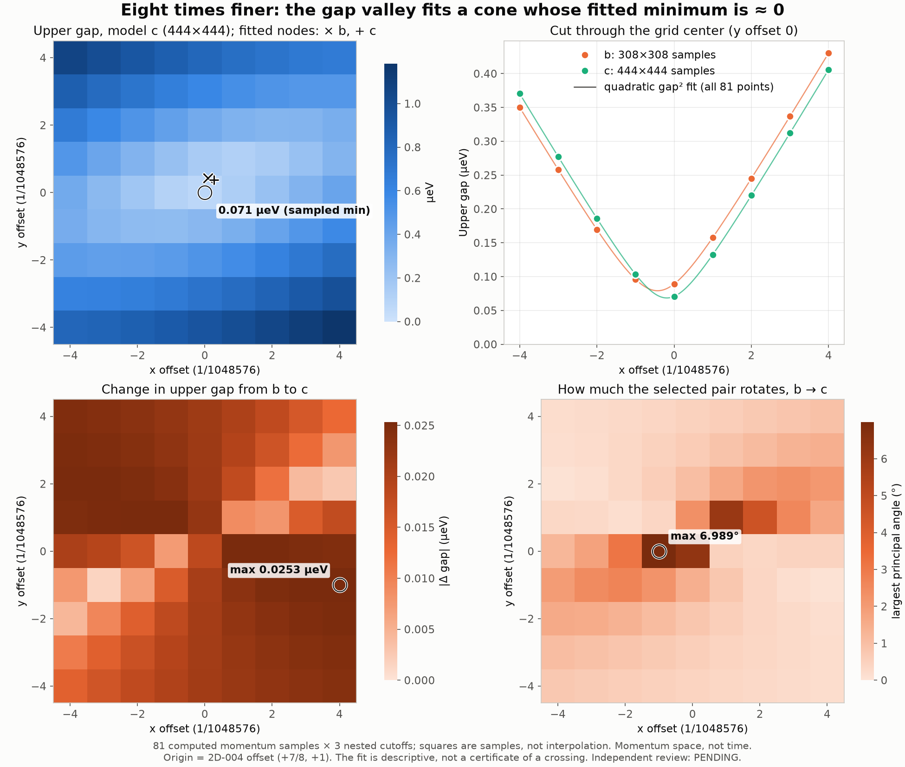

# NEIGHBORHOOD-REFINE-005: an 8×-refined 2-D grid at the gap minimum

- **Frozen implementation:** `97e4479bfd58f064dbdd8192de16f307792ce9be` (`research/benchmarks/neighborhood_refine_005/`). It uses the same engine as NEIGHBORHOOD-2D-004 (`289ff885`). Only the self-path and a label differ in `run.py`.
- **Source execution:** NEIGHBORHOOD-2D-004 record `706a967351f78259ea8fbd71701ab996d1e664d7`
- **Producer:** Claude Code
- **Independent execution review:** PENDING. Computation was not gated on review.

## Why this grid

On the 2D-004 coarse grid (step 1/131072), gap² near the sampled minimum (+1,+1) fits a general quadratic in (dx, dy) essentially exactly. Its minima are at coarse offsets (0.887, 1.054) for b and (0.908, 1.046) for c. That is the local form of a two-band cone.

This run places a 9×9 grid with step **1/1048576** (8× finer), centered on the nearest fine lattice point, x = 720143/1048576 and y = 94421/131072. It solves all three cutoffs a/b/c (196/308/444) at every point.

## Execution and checks (all passed)

- **Work done:** 14 bounded jobs of at most 6 points, 243 eigensolves. The longest job took 2.72 s, and the summed job time was 34.6 s. Limits were 90 s, 3 GiB and 64 MiB per job, one thread.
- **Source and matrices:** exact-commit source binding holds, the cutoff c shell is re-derived, nested residuals are 0.0, and the maximum eigenpair residual is 1.88e-12 meV.
- **Replay:** strict replay needs no physical eigensolves. `MAP.json`, `REGRESSION.json` and `SUMMARY.json` are byte-identical after `materialize.py`.
- **Regression:** fine offset (+1, 0) equals 2D-004 coarse (+1,+1). Its a/b/c upper gaps match the retained 2D-004 values with a **difference of 0.0 meV**.

## Results

| | b (308) | c (444) |
|---|---:|---:|
| Minimum sampled upper gap | 0.0891 µeV at (0,0) | 0.0708 µeV at (0,0) |
| Quadratic gap² fit: node location, in fine steps | (0.095, 0.429) | (0.264, 0.371) |
| Fitted node, fractional k (float) | (0.6867819737, 0.7203754702) | (0.6867821353, 0.7203754149) |
| Fitted minimum gap² | −3.95e-7 µeV² | −2.67e-7 µeV² |
| Largest fit residual in the gap, over 81 points | 8.6e-6 µeV | 8.2e-6 µeV |
| Cone principal slopes (µeV per 1/1048576 step) | 0.07827, 0.22495 | 0.07827, 0.22495 |

Cutoff a's sampled minimum here is 6.61 µeV. a's valley lies elsewhere, as in 2D-004.

**Interpretation (descriptive, not certified)**

- **A cone with a minimum near zero.** Across 81 samples, gap² is a quadratic in momentum to about 1e-5 µeV. Its fitted minimum is zero within fit precision: the fitted values are slightly negative, and a gap ≲ 1e-3 µeV cannot be excluded. This is the local form of a two-band **point touching (cone)** between bands 222 and 223 (zero-based, cutoff b/c indexing). It is consistent with a Dirac-type node at this finite cutoff, but it is **not a proof** of an exact crossing.
- **Going from b to c moves the node but leaves the cone unchanged.**
  - The two cones have the same principal slopes and axes to about 1e-6 relative.
  - The fitted node shifts by 0.18 fine steps, or about 1.7e-7 in fractional k.
  - The largest b→c gap change is still 0.025 µeV. It shows up as a large *relative* change (up to 26%) only because the gap itself is near zero.
- **Pair-angle growth near the node.** The b→c pair angle (bands 221/222) grows to 6.99° next to the node, compared with ≤0.59° on the coarse grid. Near a 222/223 touching, band 222's state rotates rapidly in k, so a tiny node shift between cutoffs shows up as a noticeable angle. The four-state angle stays at 0.021°, and pair-in-four containment stays ≥ 0.99999988.
- **This supersedes the minimum reported in 2D-004.** The 0.133 µeV sampled minimum there was a grid effect. On a denser grid the sampled minimum keeps falling, as expected for a cone.

**Claim ceiling:** these are sampled finite-cutoff values plus a descriptive fit. There is no certified crossing, winding/Euler or charge assignment, global-minimum or infinite-cutoff claim. This is momentum space, not time evolution.

## Figure



## Reproduce

```
python materialize.py NEW_DIR --repo PATH   # restore bytes, strict replay (0 eigensolves), re-derive SUMMARY
python analyze.py NEW_DIR [REVIEW_LABEL]
python ../neighborhood_refine_005/run.py run --commit 97e4479b… --output DIR --wheel python_flint-0.9.0-…whl [--only START STOP]
```

## Next bounded steps

1. **Node test:** evaluate b and c at their own fitted node points, using rational approximations, and at each other's. That takes 2 points × 3 cutoffs. The fit predicts a gap ≪ 0.07 µeV at a cutoff's own node and about 0.02–0.04 µeV at the other cutoff's node.
2. **Winding check:** run a small closed loop of momentum points around the fitted node, with a parallel-transport (Berry/Wilson) phase of bands 222/223. This distinguishes a symmetry-protected touching from an avoided crossing.
