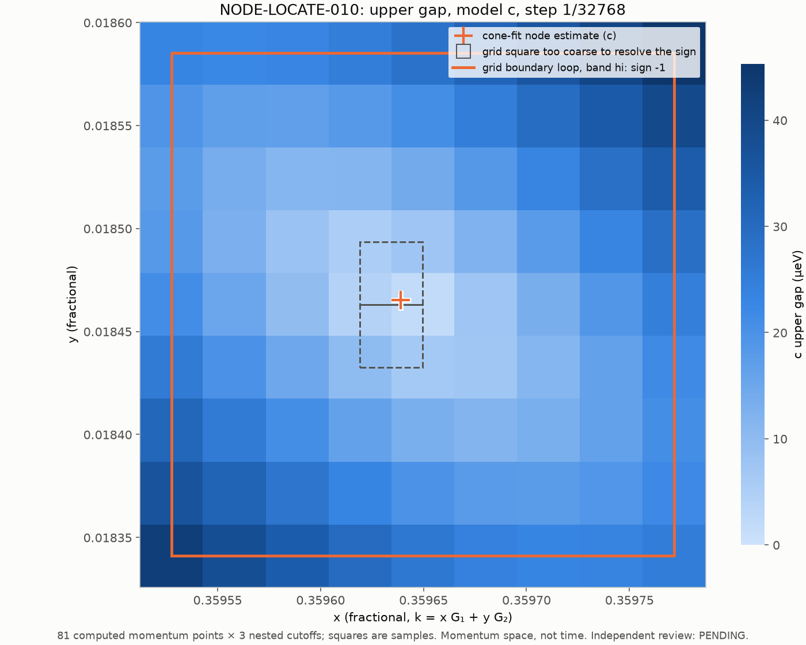

# NODE-LOCATE-010: 9×9 grid around the partner estimate

- **Frozen implementation:** `bb6ab06fa6d26a88882d4b8d7e5fb9e0c97c47bd`. The engine is identical to PARTNER-SCAN-007.
- **Producer:** Claude Code
- **Review:** PENDING

## What ran

The grid is 9×9 at step 1/32768, centered at (11785, 605)/32768 from the PARTNER-SCAN-009 fit.

- **Execution:** 81 points × a/b/c, 243 eigensolves in 5 jobs, longest job 6.6 s.
- **Checks:** strict replay is byte-identical, and the maximum eigenpair residual is 1.2e-12 meV. No earlier point coincides with this grid; the boundary-loop sign serves as the check.

## Results

- **Sampled minimum:** 1.80 µeV in b and c, 1.61 µeV in a.
- **Signs:** the boundary loop gives −1 in all cutoffs. Every resolvable grid square gives +1, and the two squares touching the fitted node are unresolved.
- **81-point gap² cone fit:**
  - The node is at (0.35963889, 0.01846526) for b and c, and at (0.35963996, 0.01846530) for a.
  - The largest gap residual is 0.0025 µeV.
  - The principal slopes, 4.134 and 7.839 µeV per step, are identical across a/b/c to about 1e-5.
  - The fitted minimum gap² is +0.006 µeV². At this scale the cone is slightly non-quadratic, so the fit alone does not reach zero. PARTNER-WINDING-011 tests the fitted points directly.

`python materialize.py NEW_DIR --repo PATH`, then `python analyze.py NEW_DIR`.
