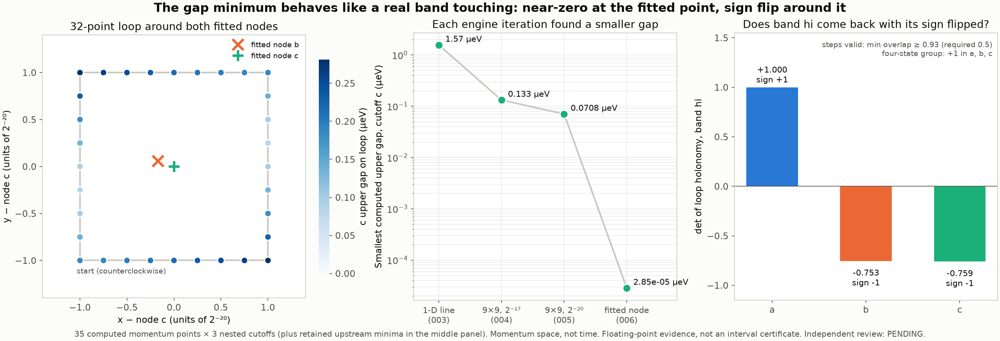

# NODE-WINDING-006: fitted-node gaps and a loop holonomy

- **Frozen implementation:** `9fd4f15f4ab1b30f7d0829db4a899947f869b284` (`research/benchmarks/node_winding_006/`). It uses the same three-cutoff engine as 004/005, adds a holonomy step to the replay, and labels points instead of giving grid offsets.
- **Source execution:** NEIGHBORHOOD-REFINE-005 record `2bc4791`
- **Producer:** Claude Code
- **Independent execution review:** PENDING. Computation was not gated on review.

## What was computed (35 points × cutoffs a/b/c, 105 eigensolves)

- **Two predicted node points.** These are the REFINE-005 gap² cone-fit minima for b and c, rounded to exact rationals with denominator 2³⁰ (1/1024 of a REFINE-005 step).
- **One regression point.** This is the REFINE-005 grid center. Its a/b/c upper gaps match the retained values with a **difference of 0.0 meV**.
- **A 32-point closed square loop.** Its half-width is 1/1048576 and it is centered on the fitted c node, so it encloses both fitted nodes. It runs counterclockwise with 8 points per side.

The work ran as 6 bounded jobs of at most 6 points. The longest job took 3.2 s, and the summed job time was 15.8 s. Limits were 90 s, 3 GiB and 64 MiB per job, one thread.

**Checks:**
- exact-commit binding, nested residuals of 0.0 and a maximum eigenpair residual of 1.78e-12 meV;
- a strict replay with zero eigensolves, after which `MAP`, `REGRESSION`, `HOLONOMY` and `SUMMARY` are byte-identical.

## Results

| Upper gap (µeV) | a | b | c |
|---|---:|---:|---:|
| at fitted node b | 7.437 | **6.6e-5** | 0.0253 |
| at fitted node c | 7.461 | 0.0253 | **2.9e-5** |
| smallest on the loop | 7.236 | 0.0714 | 0.0807 |

- **The fit predicts the node correctly.** Each cutoff's gap at its own fitted point is about 1,000–2,500× below the smallest REFINE-005 sample. The remaining size is what rounding the node coordinates to 2⁻³⁰ would leave, at most about 1e-4 µeV given the cone slopes. At the other cutoff's node, the gap is 0.0253 µeV, as the cone fit predicts for a node shift of 0.18 steps.
- **Holonomy.** The Hamiltonian is assembled as a real symmetric matrix, so eigenvectors are real. Around a closed loop, a band's transported sign is a Z₂ (0/π Berry phase) invariant. I computed it as the determinant of the ordered product of overlaps around the loop.
  - It is valid only if every step overlap has smallest singular value ≥ 0.5. The actual minimum is ≥ 0.93.

| Loop holonomy det (sign) | a | b | c |
|---|---:|---:|---:|
| band hi (upper selected band) | +1.000 (+1) | −0.753 (**−1**) | −0.759 (**−1**) |
| band hi+1 | +1.000 (+1) | −0.753 (−1) | −0.759 (−1) |
| selected pair (lo, hi) | +1.000 (+1) | −0.753 (−1) | −0.759 (−1) |
| four-state group | +1.000 (+1) | +1.000 (+1) | +1.000 (+1) |

**Reading.**
- **b and c:** the selected pair (lo, hi) returns with a π phase around the loop. The four-state group, which adds bands lo−1 and hi+1, returns without one. The pair's sign can flip only through a touching with an outside band. The gap to the band below the pair is at least 27.26 meV at every one of the 35 points, so the flip comes from an odd number of **hi/hi+1** point touchings inside the loop. Bands hi and hi+1 individually show the same −1.
- **Size of the determinants:** they are below 1 in magnitude only because the loop is discretized.
- **Cutoff a:** it returns +1, consistent with its gap valley lying elsewhere.
- **Relation to the selected pair:** this touching is a node between the selected pair's upper band and the band above it. It flips the pair's real-gauge holonomy.

A retained-vector check of the 2D-004 and REFINE-005 grids gives the same pattern: −1 on loops enclosing the fitted node, +1 on loops that do not. I ran it in scratch; it is not part of this packet.

**Claim ceiling:** this is floating-point finite-cutoff evidence of a hi/hi+1 point touching at cutoffs b and c. It is not an interval certificate, and it makes no infinite-cutoff claim.

## Figure



- **Left:** the loop geometry and the fitted nodes.
- **Middle:** the smallest computed c-cutoff gap at each engine iteration. The upstream values are cited from their retained SUMMARY files.
- **Right:** the loop holonomy determinant for band hi.

## Reproduce

```
python materialize.py NEW_DIR --repo PATH   # restore bytes; strict replay recomputes metrics and holonomy (0 eigensolves)
python analyze.py NEW_DIR [REVIEW_LABEL]
```

## Next bounded steps

- **Look for partner nodes:** in a real two-band gap, nodes are created and annihilated in pairs. Scan wider loops or a coarse ring around this node to find the partner or any nearby nodes.
- **Add a fourth nested cutoff:** test whether the node position converges.
