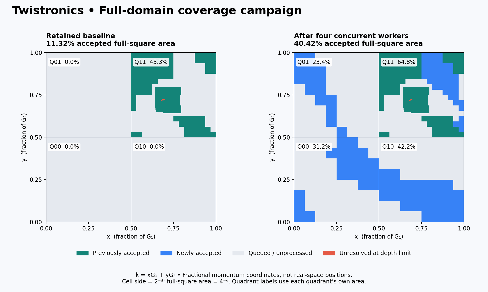

# First parallel full-domain expansion

Four physical S1b workers ran concurrently on 25 September 2026 UTC, following
Alan's direction to replicate the engine across quadrants. The bounded batch
completed **256 new cell attempts** and accepted **112 new cells**.

Retained accepted area increased from **11.32% to 40.42%
of the full coordinate square [0,1]²**, a gain of **29.10 percentage
points**. Exact accepted area is `105951/262144`; exact added area is `149/512`.
There are now **702 accepted cells** in this aggregate, **903 frontier
cells**, and **40 depth-limit unresolved cells**.

| Quadrant | New attempts | New accepted | Total accepted | Accepted quadrant area | Frontier cells | Unresolved cells |
|---|---:|---:|---:|---:|---:|---:|
| Q00 | 64 | 20 | 20 | 31.25% | 176 | 0 |
| Q01 | 64 | 15 | 15 | 23.44% | 196 | 0 |
| Q10 | 64 | 27 | 27 | 42.19% | 148 | 0 |
| Q11 | 64 | 50 | 640 | 64.79% | 383 | 40 |

Each quadrant is a quarter of the full square. q00 means x,y ∈ [0,½];
q01 means x ∈ [0,½], y ∈ [½,1]; q10 means x ∈ [½,1], y ∈ [0,½];
q11 means x,y ∈ [½,1]. These are fractional momentum coordinates in
k = xG₁ + yG₂, not real-space positions. Cell depth d means side 2⁻ᵈ and
full-square area 4⁻ᵈ. Shared edges have zero area and are not counted twice.

## What ran

- Exact implementation: `60ee0f3355adf46d1dee99e84e70b8acf0a360a2`.
- Independent pre-execution [Claude PASS](https://github.com/alanfuller15/Twistronics/pull/2#issuecomment-5827238845), retained in `IMPLEMENTATION_REVIEW.json`.
- Same pinned cutoff-a CASE, dimension 196. Four OS processes; one native
  thread each. q00/q01/q10 attempted their 64 depth-4 cells. q11 resumed its
  prior frontier, attempting 64 depth-5 cells. Existing accepted cells and
  unresolved cells were preserved.
- 1472 actual endpoint factorizations, below the 2,048 aggregate ceiling;
  every worker stayed below 512. Each had a 600-second deadline plus 10-second
  termination grace, and a 2 GiB address-space limit.
- All four process lifetimes overlapped for 169.43 seconds.
  This demonstrates concurrent execution; no controlled serial comparison was
  run, so no fourfold speedup is claimed.
- Precision was set to 128 bits before coefficient assembly. Historical q002
  appears to have assembled its rigorous Arb enclosures before resetting
  precision; that may have widened them, but does not invalidate the inherited
  interval bounds. New and inherited evidence remain distinguishable.

## Verification and interpretation

The supervisor reaped every worker, verified absent process groups, and bound
each durable log and receipt. Offline replay checked every hash-chain record,
queue choice, exact box, inertia count, signed pivot, window width, Gram bound,
and both congruences. A 512×512 occupancy raster proved that accepted, frontier
and unresolved cells form a complete disjoint partition. Lossless packaged logs
can be reconstructed and replayed with `materialize.py NEW_DIRECTORY`; no new
physical evaluations are performed by this command.

Status: **INCONCLUSIVE_PARTIAL_DOMAIN_COVERAGE**. Local replay passed; independent
post-execution evidence review is pending. The 40 inherited unresolved cells
remain unresolved. Accepted area describes the named finite-cutoff cell
isolation condition. Complete partition accounting does not mean complete
accepted coverage. No topology, seam, infinite-cutoff, or experimental claim
follows.

## Next work

Resume the saved frontier in separately frozen bounded rounds, keeping accepted
cells out of the work queue. Subdivide the failed coarse cells and retain a
separate track for narrow-gap regions where the current method is inconclusive.
Report added area per batch, accepted cell counts, remaining frontier area and
unresolved area. A genuine gap closing would need characterization rather than
being forced into an isolation certificate.
