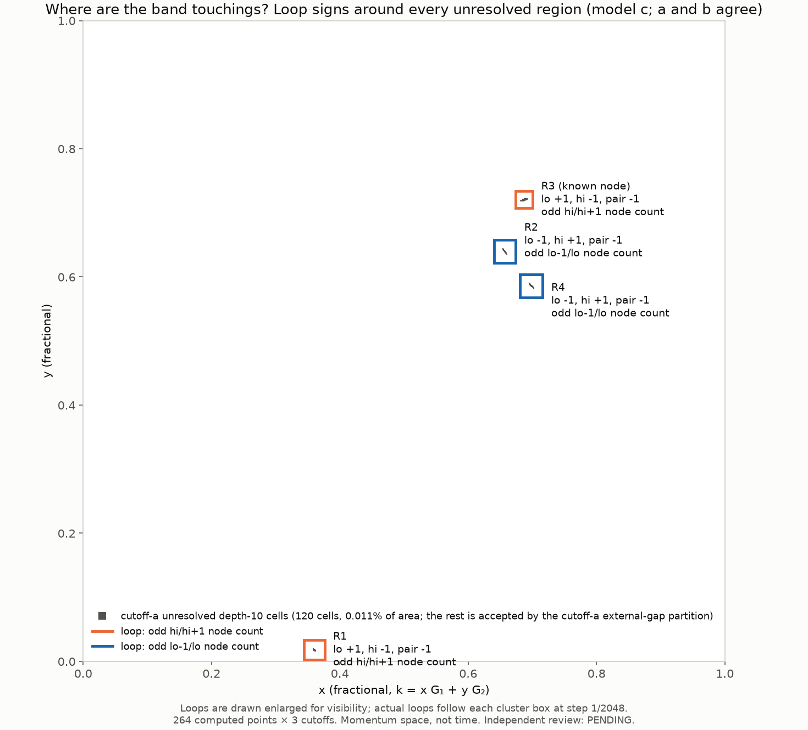

# PARTNER-LOOPS-008: partner search, stage 2 (loops around every other unresolved region)

- **Frozen implementation:** `b804becbefa90d6c5c2356a197f563147efce81d` (`research/benchmarks/partner_loops_008/`)
- **Producer:** Claude Code
- **Independent execution review:** PENDING

## Why these loops

The cutoff-a external-gap partition (`parallel_domain_006_execution/PARTITION.json`) accepts the whole zone except 120 depth-10 cells, which fall into four clusters. A cutoff-a node between the selected pair and an outside band can only sit in those unresolved cells. PARTNER-SCAN-007 showed that the known node's cluster holds an odd number of nodes. So this run puts a closed loop at step 1/2048 around each of the other three clusters, plus a 20-point control loop around the known node.

- **Execution:** 264 points × a/b/c, 792 eigensolves, 14 jobs of at most 20 points. The longest job took 6.7 s.
- **Checks:** strict replay is byte-identical, the regression point (the control loop's corner, a PARTNER-SCAN-007 grid point) matches exactly, and the maximum eigenpair residual is 2.2e-12 meV.

## Results (identical in a, b and c)

| Loop | lo | hi | pair | Reading | min step overlap | min upper / lower gap on loop (c) |
|---|---:|---:|---:|---|---:|---|
| **R1** (0.360, 0.018), 60 pts | +1 | **−1** | −1 | **odd hi/hi+1 node count: the partner** | 0.994 | 0.50 / 77.4 meV |
| R2 (0.657, 0.641), 88 pts | −1 | +1 | −1 | odd lo−1/lo node count | 0.988 | 13.4 / 0.57 meV |
| R4 (0.699, 0.586), 96 pts | −1 | +1 | −1 | odd lo−1/lo node count | 0.992 | 22.1 / 0.71 meV |
| R3, the known node (control), 20 pts | +1 | −1 | −1 | odd hi/hi+1 node count | 0.891 | 0.11 / 26.8 meV |

**Reading:** across the whole zone, the hi/hi+1 nodes that cutoff a can hold sit in exactly two unresolved regions, R3 (the known node) and R1, each with an odd count. **The partner of the known node is in R1**, about 0.36 away in fractional x. R2 and R4 instead hold nodes of the gap *below* the selected pair (lo−1/lo), and they form their own pair. The counts are mod 2, and the region argument uses the cutoff-a partition. Cutoffs b and c give the same signs on the same loops.

`python materialize.py NEW_DIR --repo PATH` restores the bytes and runs a strict replay (0 eigensolves). `python analyze.py NEW_DIR` then produces the summary and figure.
