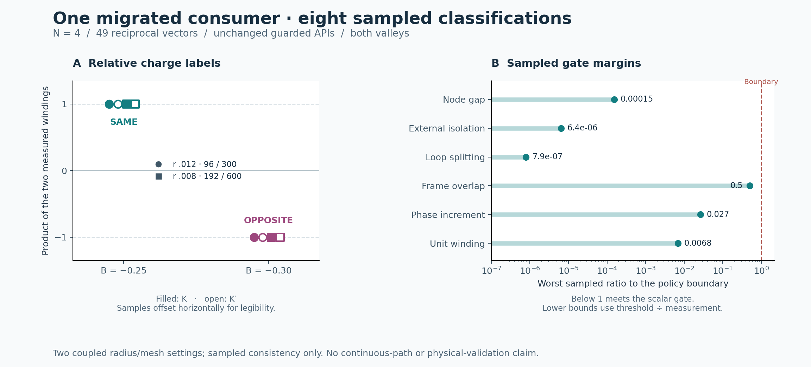

# v077p migration review

**The new braid-label entry point uses the published guarded APIs and reproduces all eight supplied classifications. Its delivery contract remains incomplete.** The consumer still exits successfully when every measurement is rejected or when no pair is found. A later discovery exception loses earlier in-memory rows. These are concrete software findings, not failed graphene measurements.



## What was verified

The unchanged v077p attachment is `partner_v077p.zip`, SHA-256 `bb46d2eec44f253d866104e4a7b14cee32aef7493e69e5b935969b07f10f45e1`. The five source hashes in its result record match the attachment. The guarded modules, loader, tests, negative-control recorder, prior plan and nested v074p archive are byte-identical to the published `variant-guard-repairs` release at `02bbe167f01b2197b07f6b52e388bb7b5946f481`; see `SOURCE_COMPARISON.json`.

One pass ran the unchanged entry point with passive recording; a second ran it without instrumentation in another fresh extraction. Both produced the expected eight rows. Excluding timings, 127 of 138 numeric leaves matched the supplied results exactly; the largest difference was 3.33067e-16. The clean repeat matches the recorded replay exactly, excluding timings. Labels, coordinates and source identities are unchanged. Differences at roundoff level occur in winding values.

The supplied test suite passes all 38 tests (`TESTS.log`). Its six structured negative controls replay (`NEGATIVE_NEGATIVE_CONTROLS.json`). These tests exercise the helpers. The consumer-specific failure injections below additionally exercise the new entry point.

| B | Valley | Radius | Loop/transport intervals | Label | Largest node gap (meV) | Smallest link overlap |
|---:|---:|---:|---:|---|---:|---:|
| -0.25 | +1 | 0.012 | 96/300 | SAME | 1.47056e-10 | 0.99802884 |
| -0.25 | -1 | 0.012 | 96/300 | SAME | 1.47056e-10 | 0.99802884 |
| -0.25 | +1 | 0.008 | 192/600 | SAME | 1.47056e-10 | 0.99951130 |
| -0.25 | -1 | 0.008 | 192/600 | SAME | 1.47056e-10 | 0.99951130 |
| -0.30 | +1 | 0.012 | 96/300 | OPPOSITE | 1.52593e-10 | 0.99785807 |
| -0.30 | -1 | 0.012 | 96/300 | OPPOSITE | 1.52593e-10 | 0.99785807 |
| -0.30 | +1 | 0.008 | 192/600 | OPPOSITE | 1.52593e-10 | 0.99920169 |
| -0.30 | -1 | 0.008 | 192/600 | OPPOSITE | 1.52593e-10 | 0.99920169 |

Each B/valley has **two coupled settings**: radius .012 with 96/300 intervals, and radius .008 with 192/600. Radius and resolution are not varied independently in this attachment. Winding signs depend on frame orientation; the SAME/OPPOSITE comparison uses their product.

## Evidence retained by this review

The original JSON counts 16,472 diagnostic rows but does not save them. It supplies only selected path endpoints, a basis count/hash, source hashes and policy thresholds. Contrary to the consumer docstring, it does not serialize full coordinate arrays, the ordered index list or complete model defaults for each row. The source and nested archive permit reconstruction, but reconstruction is distinct from retained run evidence.

Reviewer sidecars now retain 11 constructor records with defaults and ordered indices, harmonic arguments, all eight geometries, and 16,472 raw diagnostics: 5,944 frames, 8,224 links and 2,304 angle increments. Two node searches and 6 refinement returns are recorded; 0 of these refinements report failure. Full eigenvectors, full Hamiltonians and every optimizer evaluation are not retained.

`reconcile.py` reconstructs root/external gaps from saved spectra, winding sums from angle increments, all sampled scalar gate summaries and model/case identities. It checks the frame coordinates against complete geometry and checks exact K/K′ coordinate negation. 5,995 reconciliation checks pass. This is record reconciliation using the same underlying computations, not an independent physics engine.

## Consumer release controls

| Injected condition | Observed result | Required disposition |
|---|---|---|
| Every pair measurement raises `gt.Rejected` | Eight REJECTED rows retained; process exits 0 | Keep the rows and return nonzero for the expected-case acceptance command |
| Both node searches return no pair | Two NO_PAIR rows retained; process exits 0 | Enumerate missing expected cases and return nonzero |
| Second B discovery raises after four synthetic returns | Process exits 1; no new result JSON is written | Persist completed rows and structured discovery failure before exiting |
| MR1 is deliberately violated | METAMORPHIC JSON records false; process exits 0 | Make assertion failures affect exit status; keep diagnostics separate |

These controls use declared runtime substitutions on unchanged source in disposable directories. Their fake node/measurement results are **not scientific evidence**. Each subprocess exit and produced-file hash is in `EXECUTIONS.json`; all logs and produced records are retained.

## Remaining scope and documentation corrections

- Treat this as a new guarded braid-label entry point. The preserved `producers.py` dispatcher still calls historical topology code; running that old dispatcher does not invoke the new module.
- The included `PLAN.json` inside the attachment is the earlier API campaign plan, with Wilson/sign/sparse scopes and a statement of no new root search. This consumer actually calls `find_nodes` twice. Use a migration-specific plan; the review's separate `PLAN.json` declares its own scope and budgets.
- The metamorphic producer has only an archive-activation import added since v076; `claim_lint.py` is unchanged. The v076 release-gate and claim-binding findings therefore remain relevant. MR6 is still an unconditional diagnostic, and MR7 compares only three models.
- The numerical metamorphic replay agrees with the supplied nine rows, which comprise eight asserted rows plus one unconditional diagnostic. This does not prove an exact C3 relation from sharing an index set.
- README lint returns four findings and exit 1. They include scope wording, Unicode minus parsing and rounded node-gap matching. Four lint findings do not mean four numerical failures, and a passing prose lint would not establish correct scientific claims.
- The partner's per-row timing starts after model construction and node discovery. The prose's approximately 24.6-second sum is not an end-to-end bound. `EXECUTIONS.json` records separate reviewer wall times including setup, discovery and output; no speed comparison is claimed.

Only this consumer, this N=4 model family and these sampled settings were checked. There is no continuous-path proof, complete node inventory, Euler-class change, independent K′ implementation, cutoff-convergence claim or experimental validation. The remaining consumers and sparse Newton/event detection stay outside this migration.

## Reproduce

Use Python 3.12 with the versions in `REQUIREMENTS.txt`. `run_review.py` extracts fresh sources, removes only generated outputs in those temporary copies and applies fixed time limits. It never modifies the attachment.

```sh
OPENBLAS_NUM_THREADS=1 OMP_NUM_THREADS=1 MKL_NUM_THREADS=1 python run_review.py
python reconcile.py
python report.py
python verify_package.py --results-only
```

Run `python verify_package.py` before recomputation to verify the distributed hashes. Its expected exit-code checks deliberately include the failing partner behaviors demonstrated by synthetic controls.

Review `SUMMARY.json`, `EXECUTIONS.json`, `FABLE_NEXT_PASS.md` and the raw sidecars before quoting these results. The evidence-preserving wrapper supplements the original producer; it does not repair its exit or persistence behavior.
