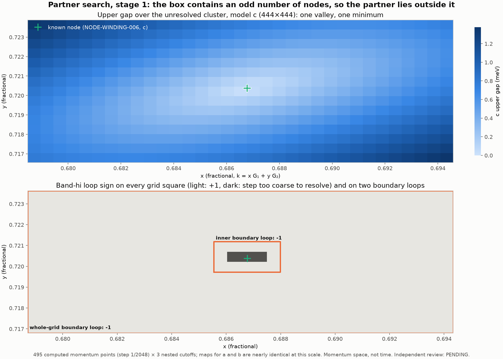

# PARTNER-SCAN-007: partner search, stage 1

- **Frozen implementation:** `f33507986f345bc2611fd88a1eee85d16390b4d9` (`research/benchmarks/partner_scan_007/`)
- **Producer:** Claude Code
- **Independent execution review:** PENDING. Computation was not gated on review.

## What was computed

The grid is 33×15 = 495 exact points at step 1/2048, with x = 1390…1422/2048 and y = 1468…1482/2048. It covers the cutoff-a unresolved depth-10 cluster (x 697–708, y 735–739 in `parallel_domain_006_execution/PARTITION.json`) that contains the NODE-WINDING-006 node. Every point was solved at cutoffs a/b/c.

- **Execution:** 25 bounded jobs of at most 20 points, 1,485 eigensolves, 165 s summed, longest job 7.0 s.
- **Checks:** nested residuals are 0.0, the maximum eigenpair residual is 2.0e-12 meV, and strict replay is byte-identical with zero eigensolves. No earlier point lies on this grid (`REGRESSION.json`: not applicable). The known-node control below serves as the consistency check.

## Results

- **Gap map:** the upper gap has a single valley with one sampled minimum, about 31.65 µeV at (1406, 1475)/2048, in all three cutoffs. That grid point is closest to the known node. At this scale a, b and c are nearly identical.
- **Grid squares:** the band-hi and selected-pair sign around every grid square is +1 wherever it can be resolved. The step is too coarse to resolve only the three squares touching the known node (i = 15–17, j = 7).
- **Box-boundary loops,** recomputed from retained vectors in `analyze.py`:

| Loop | a | b | c | min step overlap |
|---|---:|---:|---:|---:|
| whole 33×15 grid | −1 | −1 | −1 | 0.996 |
| inner 14×8 | −1 | −1 | −1 | 0.98 |
| inner 5×3 around the node | −1 | −1 | −1 | 0.89 |
| left part, excluding the node | +1 | +1 | +1 | 0.96 |
| right part, excluding the node | +1 | +1 | +1 | 0.94 |

**Reading:** the box contains an odd number of hi/hi+1 nodes, and the only one visible is the known node. **Its partner lies outside this box.** Cutoff a shows the same −1, so a also has a node here, slightly displaced as the earlier grids showed.

Claim ceiling: floating-point finite-cutoff evidence.

## Reproduce

`python materialize.py NEW_DIR --repo PATH`, then `python analyze.py NEW_DIR`.
