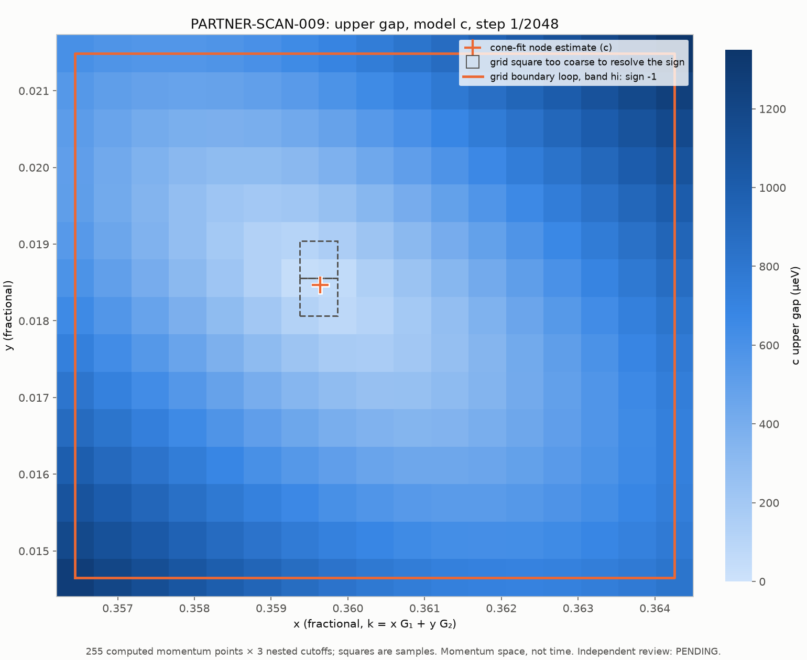

# PARTNER-SCAN-009: grid over region R1

- **Frozen implementation:** `b2f41038289ae0f0379e052f89476d3aa23e49a5`. The engine is identical to PARTNER-SCAN-007.
- **Producer:** Claude Code
- **Review:** PENDING

## What ran

The grid is 17×15 at step 1/2048 (x 730…746/2048, y 30…44/2048). Its boundary is the PARTNER-LOOPS-008 R1 loop.

- **Execution:** 255 points × a/b/c, 765 eigensolves in 13 jobs, longest job 7.3 s.
- **Checks:** the regression point (the first point of the R1 loop) matches exactly. Strict replay is byte-identical. The maximum eigenpair residual is 1.4e-12 meV.

## Results

- **One gap valley:** the sampled minimum is at (736, 38)/2048. It is 41.99 µeV in b and c and 42.17 µeV in a.
- **Signs:**
  - Every grid square whose sign can be resolved gives +1. Only the two squares touching the minimum cannot be resolved.
  - The grid-boundary loop gives −1 in all three cutoffs.
- **Location estimate:** a 3×3 gap² cone fit around the minimum gives a node estimate of (0.3596389, 0.0184654) for b and c.

`python materialize.py NEW_DIR --repo PATH` restores the bytes and runs a strict replay. `python analyze.py NEW_DIR` then produces the summary and figure.
