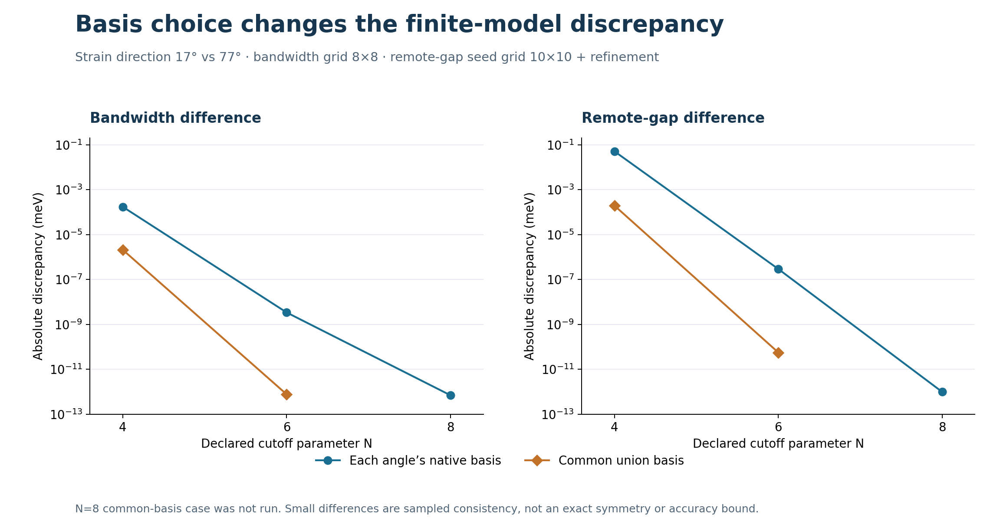

# v076p self-check review

**Keep the numerical diagnostics; the delivery checks are not yet an enforcing release gate.** Both unchanged producers reproduce their supplied results. The claimed README generator does not generate content, a failed metamorphic assertion does not fail the process, and the linter misses several simple invalid claims.

This folder preserves the original [partner_v076p.zip](partner_v076p.zip), records the review, and supplies a focused [Fable next pass](FABLE_NEXT_PASS.md). It adds no model or campaign change. The previously published [guarded APIs](../variant_guard_repairs/README.md) remain separate opt-in implementations.

## Useful numerical evidence

All nine supplied metamorphic rows and all five basis-diagnostic rows reproduce. Across **44 numeric leaves**, the maximum supplied-versus-replay difference is **0** in this environment; nonnumeric fields also match. Nine rows means **eight assertion rows plus one unconditional diagnostic**, MR6, which reports finite-cutoff reciprocal-periodicity error rather than asserting a tolerance.

The most useful result is the sensitivity to which reciprocal vectors are retained. At N=4, using a common basis for the tested 17°/77° models reduces the remote-gap discrepancy from **0.051379686 meV** to **0.00019573689 meV**, a factor of about **262.5**. The basis sizes change from 47/71 to 71/71 vectors. This is evidence of a finite-model sensitivity worth retaining.



| N | Basis policy | Vectors at 17° / 77° | Absolute bandwidth difference (meV) | Absolute remote-gap difference (meV) |
|---|---|---|---|---|
| 4 | native per angle | 47 / 71 | 0.00017263172 | 0.051379686 |
| 4 | common union | 71 / 71 | 2.0992003e-06 | 0.00019573689 |
| 6 | native per angle | 103 / 149 | 3.3906424e-09 | 2.929401e-07 |
| 6 | common union | 149 / 149 | 7.6383344e-13 | 5.5898397e-11 |
| 8 | native per angle | 183 / 269 | 6.9277917e-13 | 9.7877262e-13 |

The basis table uses an 8×8 bandwidth grid and a 10×10 remote-gap seed grid followed by the native refiner. MR2 instead uses 10×10 and 12×12. Its different bandwidth figures must not be substituted into this table. The review independently reconstructs bandwidths from retained eigenvalues, remote minima from retained successful refinement returns, and model pairings from their ordered basis records.

Interpret the result as a reduction in the tested discrepancy, not a derivation of exact C3 covariance. A common list of integer labels does not alone specify the symmetry's momentum/basis transformation. The diagnostic also tests 17°/77°; it does not directly reproduce the historical 0°/60° calculation mentioned in the partner README. No retroactive historical validation is added here.

## Delivery blockers reproduced

| Finding | Executed evidence | Consequence |
|---|---|---|
| G1 — failed relation exits successfully | A labeled runtime control adds 0.125 meV to one MR1 matrix. The unchanged suite records `holds=false`, prints one violation, then exits **0**. | A build relying on its exit status will pass the failed suite. |
| G2 — generator is a placeholder | A sentinel README remains byte-identical; the script exits 0 and prints “tables regenerated.” Source contains no README write or table emission. | The shipped script cannot reproduce the claimed generated tables. |
| G3 — claimed evidence can be unresolved or wrong | Seven invalid fixtures produce no linter findings, including a missing file and a wrong metric from the same JSON. | Filename proximity and number matching do not bind scientific claims to records. |
| G4 — the package fails its own linter | The unchanged README yields **6 findings**, exit status **1**, matching the included lint log. | The stated “no deliverable leaves” rule is not demonstrated by this deliverable. |

G1 is a synthetic harness-contract control, not an altered physical result. Its expensive unrelated scans are explicitly stubbed; the scientific replay is a separate unmodified run. G2 changes only a README inside a disposable extraction. The preserved input ZIP is untouched.

The linter has useful behavior too: it flags a plainly wrong bound value, accepts a correct value, and parses the tested Unicode scientific notation. These are small controls, not broad recall/precision measurements.

| Fixture | Expected | Observed | Assessment |
|---|---|---|---|
| `valid_value` | accept | no findings | as expected |
| `wrong_value` | flag violation | R2-number | as expected |
| `unbound_two_digit` | flag violation | no findings | missed invalid claim |
| `wrong_two_digit` | flag violation | no findings | missed invalid claim |
| `wrong_field_same_record` | flag violation | no findings | missed invalid claim |
| `missing_record` | flag violation | no findings | missed invalid claim |
| `backtick_as_evidence` | flag violation | no findings | missed invalid claim |
| `year_prefix_measurement` | flag violation | no findings | missed invalid claim |
| `tiny_value_drift` | flag violation | no findings | missed invalid claim |
| `correct_scientific_notation` | accept | no findings | as expected |

The missed cases come from explicit source rules: numbers with only two digits after punctuation removal are skipped; numeric prefixes 19/20 are treated as dates; values anywhere in the cited JSON may match an unrelated field; missing evidence files are silently ignored; a backticked identifier counts as evidence; and any two magnitudes below 10⁻¹² are considered matching. The last rule can hide many orders of magnitude of drift despite the stated relative tolerance.

Some findings on the partner README are method/input bookkeeping rather than false scientific results. One material binding error is its MR2 failure paragraph: it cites BASIS_DEPENDENCE.json while quoting the different-grid METAMORPHIC.json bandwidth value. Use explicit claim types and field/model bindings rather than broadening exemptions until the document passes.

## Bundled topology changes: credit and limits

The v076p archive also changes `topo.py` and `sparse_mode_v2.py` relative to v074p. Those changes are separate from its new linter/metamorphic files; [SOURCE.diff](SOURCE.diff) retains the exact differences.

| Previous issue | v076p result in this review |
|---|---|
| Negative loop start used the wrong base point | Fixed in the coordinate control: both start angles 0 and π have zero base-to-loop and transport-end-to-second-loop mismatch. |
| Unused Wilson external-gap threshold | A 2 meV gap is refused when 3 meV is required. |
| Highest pair omits its lower external gap | The 4-band control now reports the existing 2 meV lower gap. |
| Fractional Wilson pair index silently truncated | `lo=1.5` is refused. |
| Zero pair or single-band adjacent overlap accepted | Both reviewed zero-overlap controls are now refused; the smooth band passes after refinement. |
| k1 / final single-band sewing | Still missing acceptance gates: zero k1 closure returns normally, and a zero single-band final sewn overlap returns `(0, 2 meV)`. |
| Invalid threshold inputs | NaN gap tolerance returns normally; a negative overlap threshold permits a zero-overlap Wilson result. |
| Loop isolation and boundary single band | The nonisolated-loop routine returns a zero winding without refusal; the valid highest single band fails with an out-of-range eigensolver request. |

These are labeled synthetic software controls. The nonisolated loop returns winding zero, not an accepted unit-charge prediction; it does not show a mislabeled physical node. The coordinate control holds frames constant and makes no charge prediction. The new `pair_charges` still returns endpoint metadata rather than complete sampled arrays, although its uniform meshes are reconstructible from the returned parameters.

The new Wilson code checks M and Mᵀ for the k2 sewing link. Their singular values are identical, so this does not cover the independent k1 sewing direction. Root checks, full loop isolation, positive finite policy validation, and all required closure/transport gates remain important adoption boundaries. The public guarded implementation is not automatically used by these partner routines.

## Sparse change

The reviewed 2×2 matrix with eigenvalues −1,+1 now produces an **unavailable** inertia result instead of the old wrong count 0, because the row and column permutations differ. The positive symmetric kernel returns the expected count. All six native N4 review windows also agree with native absolute ordered bands; maximum observed energy error is **7.27e-12 meV**.

Those native comparisons were performed by this reviewer. The bundled `window` does not enforce a native dense comparison at every acceptance. Its `_fact` docstring promises a reconstruction-residual check that the source does not perform. Matching permutations and nonzero scaled pivots do not establish that additional numerical accuracy claim. The header still says “Closes F01–F06,” while its caveat says the checks do not close those contracts, and the window docstring still uses “proved.” This review does not add a general floating-point inertia certificate or demonstrate a new native window misclassification.

## Evidence and reproducibility

Base commit: `02bbe167f01b2197b07f6b52e388bb7b5946f481`. Input archive SHA256: `b3e1b362baf67423477a26170c78bddeb4d7a56b056d0bf9629f85e531231c21`.

- [PLAN.json](PLAN.json), [INPUT_MANIFEST.json](INPUT_MANIFEST.json), [SOURCE_COMPARISON.json](SOURCE_COMPARISON.json), [SOURCE.diff](SOURCE.diff): frozen scope, input identity and source changes.
- [REPLAY_METAMORPHIC.json](REPLAY_METAMORPHIC.json), [REPLAY_BASIS_DEPENDENCE.json](REPLAY_BASIS_DEPENDENCE.json), [SUMMARY.json](SUMMARY.json): fresh results and reconciliation.
- [CONTRACT_PROBES.json](CONTRACT_PROBES.json), [LINT_REPLAY.log](LINT_REPLAY.log): full fixture text, referenced values, process outcomes, topology controls and sparse review checks.
- [METAMORPHIC_EVALUATIONS.jsonl.gz](METAMORPHIC_EVALUATIONS.jsonl.gz), [BASIS_DEPENDENCE_CHECK_EVALUATIONS.jsonl.gz](BASIS_DEPENDENCE_CHECK_EVALUATIONS.jsonl.gz): 4,090 recorded eigensolves, measurement inputs/results and refinement returns. Higher-level measurement rows are not additional solves.
- [METAMORPHIC_MODELS.json](METAMORPHIC_MODELS.json), [BASIS_DEPENDENCE_CHECK_MODELS.json](BASIS_DEPENDENCE_CHECK_MODELS.json): 21 constructor records with complete defaults, ordered basis lists, hashes and the active ħv value.
- [EXECUTIONS.json](EXECUTIONS.json), the producer RUN/log files, [CLEAN_SMOKE.json](CLEAN_SMOKE.json), [CLEAN_EVIDENCE.zip](CLEAN_EVIDENCE.zip): execution status, environment, source binding and fresh-source contract-probe repeat.

The producers ran in separate fresh extractions with supplied result JSON removed only from those disposable copies. Instrumentation logs returned values and does not change numerical returns. Recorded producer times are 30.44 s and 301.03 s in this environment, including instrumentation; these are not speed benchmarks. Eigenvectors and full Hamiltonian matrices are not retained in these ledgers.

From this folder in a fresh disposable checkout, use Python 3.12 and [REQUIREMENTS.txt](REQUIREMENTS.txt):

```sh
python -m pip install -r REQUIREMENTS.txt
OPENBLAS_NUM_THREADS=1 OMP_NUM_THREADS=1 MKL_NUM_THREADS=1 python run_replays.py
OPENBLAS_NUM_THREADS=1 OMP_NUM_THREADS=1 MKL_NUM_THREADS=1 python contract_probes.py
python report.py
python clean_smoke.py
```

`run_replays.py` refuses an existing replay directory. The full producer budgets are 240 s and 600 s; any failures/timeouts are retained. For record reconciliation without rerunning producers, use `python reconcile.py`. For the targeted fresh-source repeat, use `python clean_smoke.py`; it does not repeat the full numerical scans.

**Scope remains finite-model numerical consistency and software-contract review.** No node inventory, continuous-path proof, physical validation, signed Euler relation, novelty claim or change to an earlier campaign is added.
