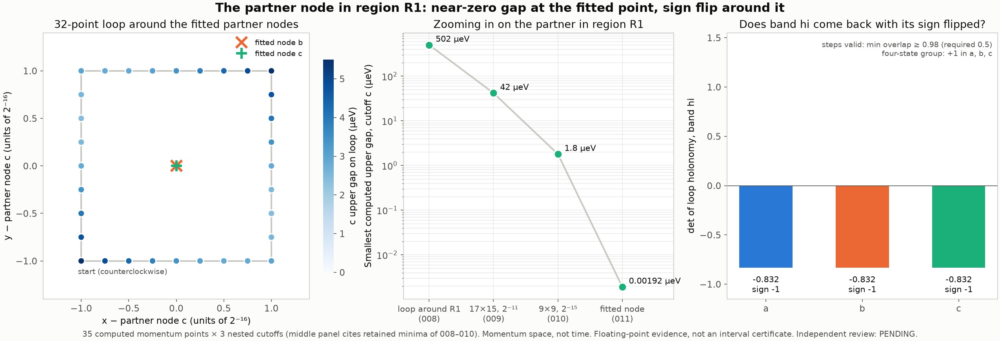

# PARTNER-WINDING-011: the partner node, tested directly

- **Frozen implementation:** `71847eac2f9f3100dd6b928001a3b26a051848a4`. The engine is identical to NODE-WINDING-006.
- **Producer:** Claude Code
- **Review:** PENDING

## What ran (35 points × a/b/c, 105 eigensolves, 6 jobs, longest job 2.6 s)

- **Fitted node points:** the NODE-LOCATE-010 cone-fit nodes for b and c, rounded to 2⁻³⁰. These are b (0.359638896, 0.018465265) and c (0.359638893, 0.018465265).
- **Regression point:** the 010 grid center. It matches exactly (0.0 meV).
- **Loop:** 32 points around both fitted nodes, half-width 1/65536, counterclockwise.

**Checks:** strict replay is byte-identical, and the maximum eigenpair residual is 1.2e-12 meV.

## Results

| Upper gap (µeV) | a | b | c |
|---|---:|---:|---:|
| at fitted node b | 0.202 | 0.00201 | 0.00242 |
| at fitted node c | 0.203 | 0.00152 | 0.00192 |
| smallest on the loop | 2.24 | 2.39 | 2.39 |

| Loop holonomy sign (det) | a | b | c |
|---|---:|---:|---:|
| band hi, band hi+1, selected pair | −1 (−0.832) | −1 (−0.832) | −1 (−0.832) |
| four-state group | +1 | +1 | +1 |

Every loop step has smallest singular value ≥ 0.983.

**Reading.**
- **The gap falls about 1,000× at the fitted points,** from 1.80 µeV at the 010 grid center to about 0.002 µeV. The −1 loop sign confirms an odd number of hi/hi+1 nodes inside this 2⁻¹⁵-wide loop, in every cutoff.
- **This is the partner of the NODE-WINDING-006 node,** at k ≈ (0.3596389, 0.0184653).
- **The remaining gap reflects the fit's precision, not a measured gap.** That precision (about 1e-3 of a 2⁻¹⁵ step) is also too coarse to resolve the tiny b/c node shift here. Cutoff a's partner node is displaced by about 1e-6 in fractional x, so a's gap at the b/c points is 0.2 µeV.

Claim ceiling: floating-point finite-cutoff evidence.

`python materialize.py NEW_DIR --repo PATH`, then `python analyze.py NEW_DIR`.
