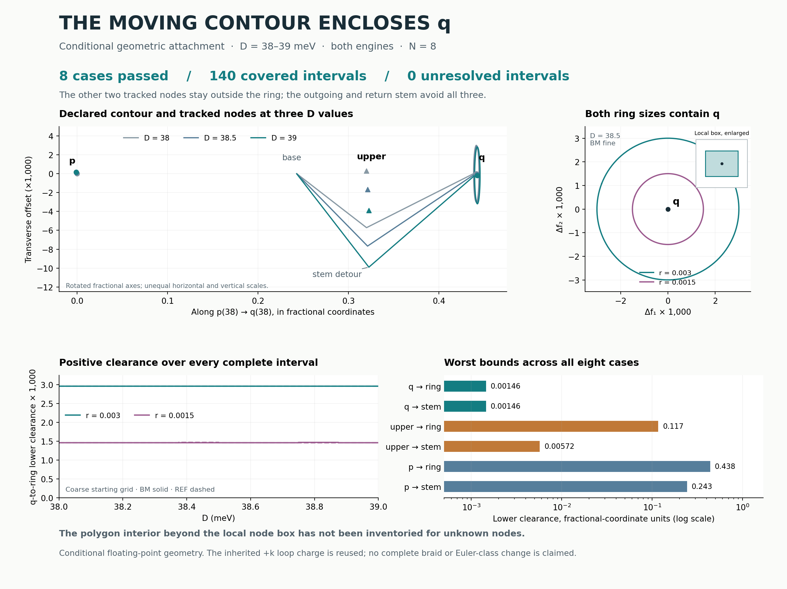

# R1: attaching the transported contour to continued nodes

**The declared moving polygon contains the continued q neighborhood throughout
D = 38–39 meV, while p and upper remain outside. Both stem segments avoid all
three tracked node neighborhoods.** All eight engine/mesh/radius cases pass.

This links the previously gapped contour deformation to the previously
continued local nodes. The result remains **conditional on floating-point
bounds**. Unknown nodes inside the polygon have not been excluded, and no
complete braid or Euler-class change is established.



## What was checked

The contour is exactly the one used in the
[temporal transport](../r1_temporal/README.md) and
[swept-surface isolation](../r1_surface/README.md) calculations. Its vertex
interpolation is checked against every retained surface-face corner. Node
neighborhoods come directly from the accepted
[local continuation tubes](../r1_continuation/README.md), with their outer radii
unchanged. The test uses a common partition containing every contour station
and every node-tube endpoint.

| Engine | Contour mesh | Radius | Accepted D intervals | Unresolved |
|---|---|---:|---:|---:|
| BM | Coarse: 8 station intervals, 64 ring edges | 0.003 | 17 | 0 |
| BM | Coarse: 8 station intervals, 64 ring edges | 0.0015 | 17 | 0 |
| BM | Fine: 16 station intervals, 128 ring edges | 0.003 | 17 | 0 |
| BM | Fine: 16 station intervals, 128 ring edges | 0.0015 | 17 | 0 |
| REF | Coarse: 8 station intervals, 64 ring edges | 0.003 | 18 | 0 |
| REF | Coarse: 8 station intervals, 64 ring edges | 0.0015 | 18 | 0 |
| REF | Fine: 16 station intervals, 128 ring edges | 0.003 | 18 | 0 |
| REF | Fine: 16 station intervals, 128 ring edges | 0.0015 | 18 | 0 |

Across the eight cases, **140 interval bounds**, **420 node/polygon tests** and
**840 node/stem tests** pass. No extra bisection was needed. BM and REF inherit
different accepted upper-node subdivisions; their original evidence is retained.

The calculation first bounds every nonincident vertex to the left of every
oriented polygon edge, establishing a simple convex counterclockwise polygon
throughout each interval. Quadratic polynomial bounds then put the entire q
box inside it and separate each p/upper box from it. Fixed projection bounds
separate each complete moving stem segment from each complete node box. These
are uniform interval tests, not endpoint-only classifications.

## Clearance margins

These are conservative lower bounds over both engines, both meshes and both
radii. Distances use the Euclidean metric of **fractional coordinates**, not
Cartesian reciprocal-space distances or experimental length scales. Displayed
values are rounded.

| Neighborhood and contour part | Minimum lower clearance |
|---|---:|
| q inside ring | 0.00145644 |
| q versus stem | 0.00145825 |
| upper outside ring | 0.116994 |
| upper versus stem | 0.00571932 |
| p outside ring | 0.437849 |
| p versus stem | 0.242739 |

The frozen acceptance margin is `1e-7` in the same fractional-coordinate metric.
All polygon convexity bounds are also strictly positive. The tightest convexity
area bound is `2.66e-10` in squared fractional-coordinate units.

The figure's overview uses a fixed rotated fractional basis with different
horizontal and vertical scales to make the stem detour visible. The right panel
shows both ring sizes at D38.5, with a separately enlarged local q box. The
small box is the region of inherited local uniqueness; it does not fill the
ring. The bottom panels show actual retained uniform bounds.

## Controls and reconciliation

**11 analytic/adversarial controls pass.** They include a polygon that contains
a node box at both D endpoints but excludes it midway, and a moving stem that
avoids a node at both endpoints but crosses it midway. Both interval tests
correctly reject. Controls also cover exact known clearances, parameter reversal,
a box straddling a boundary, endpoint separation, a self-intersecting star,
reversed orientation, a degenerate edge and nonfinite coordinates.

The independent report reconstructs the geometry and checks the side polynomials
in the power basis, including their analytic interior extrema. It checks the
retained Bernstein bounds and witnesses, directly enumerates box corners for
stem projections, and verifies complete interval coverage. The largest numerical
reconstruction discrepancy is about `1.20e-13`. All inherited source/record
hashes and acceptance conditions are checked.

This checkpoint makes **zero new Hamiltonian evaluations and zero new band-charge
measurements**. Its new work is the geometric calculation. Earlier spectral
isolation, continuation and charge results are explicitly reused and bound to
their sources, not counted again as new tests.

## What follows, and what remains open

Subject to the stated numerical assumptions, the full based contour has
**geometric winding +1 about q and 0 about p and upper** throughout D38–39.
The out-and-back stem avoids those node neighborhoods and contributes no net
geometric winding. This establishes which of the three tracked branches the
previously transported contour surrounds.

The inherited real-frame loop charge is `+k`. It is a different quantity from
geometric winding and is not remeasured here. **The interior outside the local
q box has not been inventoried for unknown nodes**, so this result does not
uniquely attribute the loop charge to q. That local interior inventory is a
remaining scientific gate before any stronger single-node interpretation.

The model remains N8 with fixed strain and constant tunnelling; D sets opposite
layer potentials `±D meV`, not a calibrated experimental displacement field.
Both Hamiltonian implementations share this diagnostic framework. There is no
global node inventory, complete braid, Euler-class change, novelty,
infinite-cutoff or experimental-validation claim.

## Files and reproduction

- [Frozen plan](PLAN.json), [derivation and numerical assumptions](METHOD.md),
  [geometric bounds](geometry.py), [inherited inputs](inputs.py).
- [Controls](CONTROLS.json), [complete interval records](RESULTS.json),
  [reconciled summary](SUMMARY.json), and their logs.
- [Runner](run.py), [independent report](report.py),
  [figure source](figure.py), [SVG figure](contour_attachment.svg),
  [file manifest](MANIFEST.json).

From this directory, with NumPy and Matplotlib installed:

```bash
OPENBLAS_NUM_THREADS=1 OMP_NUM_THREADS=1 python report.py
OPENBLAS_NUM_THREADS=1 OMP_NUM_THREADS=1 python figure.py
```

To repeat the geometric run, use a disposable checkout, move the retained
`RESULTS.json` aside, then run `controls.py`, `run.py`, `report.py` and `figure.py`
with the same settings. `run.py` refuses to overwrite retained results.

Parent commit: `b1501df66461fd721fda8aa03f95b51926ad403e`.
This checkpoint adds only this directory.
