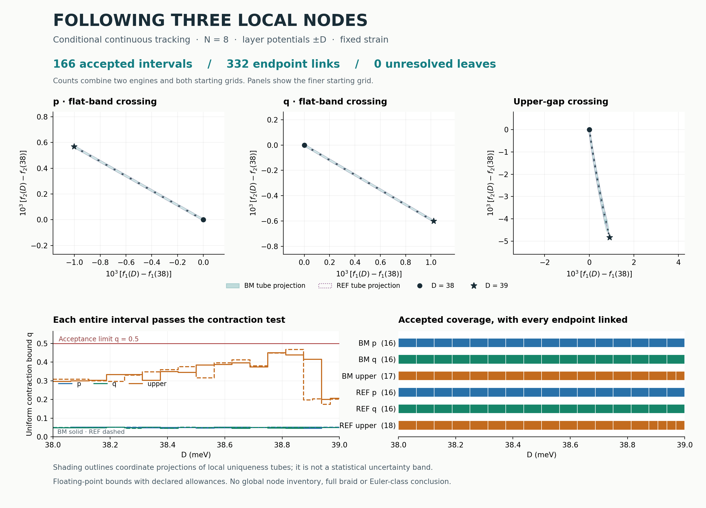

# R1: conditional local node continuation

**Both engines pass the declared local continuation test for nodes p, q and
upper over D = 38–39 meV at N = 8.** The calculation bounds a unique crossing
throughout each accepted moving neighborhood and links neighboring intervals
through separately bounded endpoint roots. This addresses a gap left by the
earlier sampled root tracks.

The conclusion is **conditional on floating-point norm, eigenvalue and frame
accuracy**. These are numerical bounds with declared allowances, not
outward-rounded interval certificates. No complete braid or Euler-class change
is established here.



## What the figure shows

The top panels show each node's momentum displacement from its D38 position.
Axes are fractional reciprocal coordinates multiplied by 1,000; the three
panels have different scales. Shading and dotted outlines project the accepted
moving boxes into momentum space. They are **local uniqueness neighborhoods,
not statistical error bars**. Dots are refined endpoint roots; lines inside the
tubes are not an additional measurement of charge.

The lower panels show uniform contraction bounds and complete parameter coverage
for the finer starting grid. Every displayed interval passes the bound over its
entire interior and has a separately verified endpoint link. The upper-gap node
needs additional subdivisions. BM and REF use 17 and 18 accepted upper-node
intervals respectively; both cover the same D interval. The componentwise bounds
depend on local frame choices, so matching subdivision patterns is not a gate.

## Retained evidence

| Engine | Starting intervals | Accepted p / q / upper intervals | Failed larger intervals retained |
|---|---:|---:|---:|
| BM | 8 | 8 / 8 / 17 | 9 |
| REF | 8 | 8 / 8 / 18 | 10 |
| BM | 16 | 16 / 16 / 17 | 1 |
| REF | 16 | 16 / 16 / 18 | 2 |

Across both engines and both grids:

- **188 interval attempts; 166 accepted leaves; 22 failed parents retained.**
  All failed parents are replaced by passing subdivisions under the frozen rule.
  There are no unresolved leaves.
- **178 point certificates and 332 endpoint-containment checks pass.**
  Mere overlap of outer boxes is never used to identify roots.
- **188 node-separation checks pass.** Momentum tubes for each pair of named
  nodes remain disjoint throughout every common parameter subinterval.
- **8 analytic/adversarial controls pass**, including an exactly known curved
  node path, insufficient tube radii, a closing complement, a singular momentum
  map and an overlapping-box example that correctly fails endpoint linking.
- **204 distinct centers** are reconstructed from retained frames. Original
  complex-model matrices and spectra are checked at every center.

The largest accepted contraction bound is **0.467819**, below the frozen 0.5
gate. The largest self-map bound is **0.717819**, below the 0.8 gate. The smallest
complement separation bound is **8.37798 meV**; this is a bound on the Schur
complement's eliminated block, not the full Hamiltonian's neighboring band gap.
Every endpoint enclosure is strictly inside both incident tubes, with minimum
coordinate margins of approximately `6.93e-6`, `3.48e-6` and `6.57e-4 meV` in
`(f1,f2,E)` respectively.

At the **101 shared node/D centers**, the largest BM/REF position discrepancy is
**1.59e-14** in the maximum norm of fractional coordinates. REF has two additional
upper-node centers due to its extra subdivision; those have their own native
checks and are not counted as paired comparisons. The maximum native residual
gap is **1.96e-12 meV**, and the maximum native/affine matrix-entry discrepancy is
**2.51e-12 meV**. These numerical discrepancies are not physical accuracy estimates.

## Why this supports continuity

The test fixes a real two-band frame and eliminates the complementary bands
through a Schur complement. Its three residual components vanish precisely at
a double eigenvalue, while a uniform complement bound fixes the band's index
and excludes a third band from that crossing. Momentum and crossing energy are
solved together. Uniform self-map and contraction bounds give local existence
and uniqueness across each interval, subject to the stated numerical conditions.

At shared endpoints, a separate, tighter root enclosure must fit inside both
neighboring tubes. This makes their unique roots coincide there and joins the
local branches. The full derivation, allowances and limitations are in
[METHOD.md](METHOD.md). It does not substitute a pointwise Newton derivative for
the required uniform derivative bound.

## Scope and remaining work

The inherited R1 model has twist angle 1°, strain 0.007 at angle 15°,
`w1 = 110 meV`, `w0 = 88 meV`, constant tunnelling and matrix dimension 596.
Strain stays fixed. The parameter is the opposite layer potential `±D meV`
(layer difference `2D`), not a calibrated experimental field.

The result concerns **one unique local double eigenvalue inside each declared
tube**. It does not inventory all nodes elsewhere in the Brillouin zone or extend
the continuation beyond D39. Both Hamiltonian implementations share this
diagnostic framework. There is no infinite-cutoff, experimental-validation or
novelty claim, and no new charge or Euler-class computation.

The earlier [surface-isolation result](../r1_surface/README.md) and
[frame-transport result](../r1_temporal/README.md) retain their own scopes.
A remaining scientific gate is to relate the moving node neighborhoods to the
declared contour deformation with explicit containment/exclusion checks before
promoting the combined evidence to any broader braid statement.

## Files and reproduction

- [Frozen plan](PLAN.json), [bound implementation](bounds.py),
  [controls](controls.py), [runner](run.py), [independent report](report.py).
- [Complete results and Newton histories](RESULTS.json),
  [retained midpoint frames](FRAMES.npz), [reconciled summary](SUMMARY.json),
  [control records](CONTROLS.json), and matching logs.
- [Figure source](figure.py), [SVG figure](node_continuation.svg),
  [manifest](MANIFEST.json).

From this directory, with NumPy, SciPy and Matplotlib installed:

```bash
OPENBLAS_NUM_THREADS=1 OMP_NUM_THREADS=1 python report.py
OPENBLAS_NUM_THREADS=1 OMP_NUM_THREADS=1 python figure.py
```

These reconstruct the retained result and render its figure. To repeat the
numerical run, use a disposable checkout, move the existing `RESULTS.json` and
`FRAMES.npz` aside, then run `controls.py`, `run.py`, `report.py` and `figure.py`
with the same thread settings. `run.py` refuses to overwrite retained results.
Source hashes bind the model, inherited records, frozen plan and executed code;
the manifest binds all files delivered in this directory.

Parent commit: `8b23a45adc0699fb7990dc28a181630d21cda659`.
This checkpoint adds only this directory.
