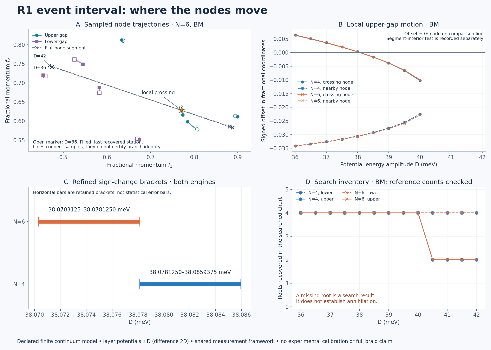

# R1 adjacent-node event interval

**The local upper-gap crossing is reproduced in both engines and both cutoffs, with refined D brackets below. Some upper-gap roots are subsequently not recovered; this is not an annihilation result.**



This follows the [endpoint validation](../r1_validation/README.md) and [R1 reproduction](../r1_reproduction/README.md). Their source and result files are unchanged. The same strained continuum model uses layer potentials ±D: D is an energy amplitude in meV, the layer-potential difference is 2D, and no experimental displacement-field calibration is supplied.

## Results

| Cutoff N | Engine/station rows | Coarse/fine inventory agreements | Rejected seed attempts / all adjacent attempts | Local crossing bracket D (meV) |
| --- | ---: | ---: | ---: | --- |
| 4 | 26 | 24/24 | 320/748 | 38.0781250–38.0859375 |
| 6 | 26 | 24/24 | 320/750 | 38.0703125–38.0781250 |

Each cutoff has 13 stations from D=36 to 42 in steps of 0.5 meV, evaluated in both engines. Coarse/fine inventory comparisons cover both gaps at six stations per engine. The two grid inventories share continuation seeds; agreement is correlated evidence and does not prove a complete inventory. Rejected attempts can be multiple failed starts near the same root or a positive local minimum, so their count is not a count of missing roots. Every attempted refinement is retained.

Both engines return the same inventory counts at every compared station: 0 count disagreements. Their largest matched-root coordinate difference is 3.62e-14 in the fractional chart. The engines share this solver and measurement framework, so agreement is internal numerical evidence.

The sampled records contain 4 signed-offset reversals in total: the same upper branch once per engine/cutoff, between D=38 and 38.5. All four reversals have interior segment coordinates and no flagged assignment ambiguity. No other reversal is observed on the retained sampled tracks, and there are no recorded image changes. This does not exclude an event between samples or on a root missed by the searches.

Previously tracked roots become unmatched over N=4: D=40–40.5; N=6: D=40–40.5. The tables in `SUMMARY.json` retain each affected track, gap and engine. No root absence, fold or annihilation is certified. Endpoint root counts and sampled tracks are finite-seed search outputs, not topological counts.

`SUMMARY.json` also lists every sampled signed-offset reversal, segment-interior test, ambiguous link and periodic-image change. A sign reversal is only compared within the same image lift. The targeted crossing refinement starts from the previously known D=38–39 bracket, bisects it seven times, and requires accepted flat/upper roots, interior segment coordinates and opposite retained endpoint offsets. Its bracket width is 0.0078125 meV. Differences between N=4 and N=6 remain cutoff dependence, not a statistical uncertainty estimate or demonstrated cutoff convergence.

## Search and identity rules

`PLAN.json` was frozen before these campaign runs, after the earlier endpoint and crossing results were known. This is a follow-up plan, not discovery preregistration. The search chart is [0,1]² in fractional momentum. Each station uses a 25×25 gap grid. D=36,38,39,40,41,42 also use 37×37 grids. Up to 12 local grid minima per gap seed bounded root searches, alongside continuation seeds and the two previously known upper roots at the first station. Grid arrays are preserved in `N4.npz` and `N6.npz`; each named array has axes f1, f2, gap (lower, upper), including both chart boundaries.

The solver recomputes the actual two-band eigenframe at every evaluation, aligns it to the seed frame using a polar decomposition, and solves its two real traceless Hamiltonian components. Acceptance requires successful optimization, residual gap below 1e-6 meV and minimum anchor overlap above 0.1. Searches remain within ±0.08 of their seeds and the chart. Roots are deduplicated within 1e-5; inventory matches use 1e-4. These are numerical gates, not root existence/uniqueness certificates.

Between adjacent D stations, global Euclidean assignment is thresholded at a 0.06 step. A row's alternative-neighbor distance margin below 0.002 is flagged as ambiguous; this is a heuristic, not a proof of unique assignment. New and unmatched tracks remain explicit. There is no periodic seam stitching. Geometry uses the same shortest-image flat-node segment as the earlier checkpoint; this coordinate choice does not assert exact finite-cutoff periodicity. Lines in the figure only connect sampled roots. No interpolation is used as evidence of continuous identity.

The affine real Hamiltonian evaluator is reused unchanged from the endpoint validation, with direct matrix and spectrum comparisons at every station. `test_tracking.py` checks permuted identities, a distant root that must remain unmatched, an ambiguous association, and a known actual-model root against the original complex Hamiltonian spectrum. Four controls pass; the log is preserved. Controls do not certify the entire research result.

## Reproduce and inspect

From the repository root, with NumPy, SciPy and Matplotlib installed:

```bash
OPENBLAS_NUM_THREADS=1 OMP_NUM_THREADS=1 python research/benchmarks/r1_events/test_tracking.py
OPENBLAS_NUM_THREADS=1 OMP_NUM_THREADS=1 python research/benchmarks/r1_events/track.py --N 4 --output replay_N4.json
OPENBLAS_NUM_THREADS=1 OMP_NUM_THREADS=1 python research/benchmarks/r1_events/track.py --N 6 --output replay_N6.json
python research/benchmarks/r1_events/report.py
```

The runner refuses to overwrite an existing JSON or grid archive. A computation or flat-root failure stops that cutoff and retains the partial report. Adjacent-root search failures are warnings and remain visible. `report.py` reads the preserved N4/N6 files, not replay filenames, and refuses incomplete runs. JSON reports bind source/plan hashes and software versions; `MANIFEST.json` binds the completed files except itself. The figure uses BM trajectories to avoid drawing duplicate engine traces; numerical engine comparisons are in the summary. SVG and PNG are generated from the same preserved data.

## What remains open

The apparent loss of the nearby upper pair needs a dedicated local study with smaller D steps, bidirectional continuation and a controlled local gap minimum/root-count analysis. Completeness outside the searched seeds, continuous branch identity, other possible events between stations and full campaign acceptance remain unresolved. This does not establish a complete braid, Euler-obstruction removal, a second braid, novelty or an experimental prediction. The separate Vafek-paper convention discrepancy remains open.
