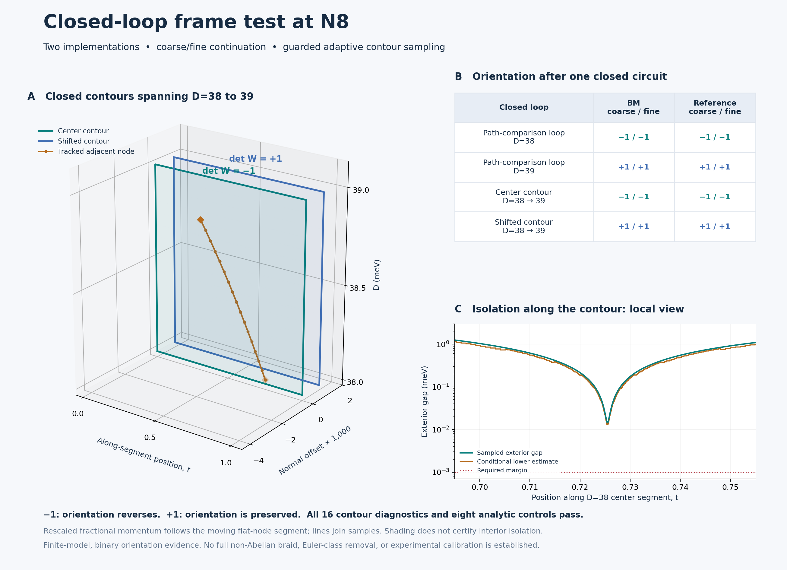

# R1 at N8: closed-loop frame orientation

**The isolated flat-band pair returns with reversed orientation around the center contour spanning D=38 to 39, and preserved orientation around a displaced contour. Both engines reproduce these signs on both tested meshes. All 16 physical contour diagnostics and eight analytic controls pass.**



This extends the [N8 path comparison](../r1_sequence/README.md). That checkpoint showed different relative-charge labels on two comparison paths at D=38. Here the measurement follows the two-band subspace around explicitly closed loops and checks its return orientation directly, without invoking the legacy winding/transport helpers. This adds a numerical orientation-holonomy check; it does not establish a full non-Abelian braid.

## The measured result

| Closed contour | BM, coarse / fine | Reference, coarse / fine |
|---|---|---|
| Between the two comparison paths at D=38 | −1 / −1 | −1 / −1 |
| Between the two comparison paths at D=39 | +1 / +1 | +1 / +1 |
| Center contour spanning D=38 to 39 | −1 / −1 | −1 / −1 |
| Displaced contour spanning D=38 to 39 | +1 / +1 | +1 / +1 |

The entries are determinants of the real two-band holonomy matrix: −1 indicates orientation reversal, and +1 orientation preservation. A +1 determinant does not require the entire holonomy matrix to be the identity. The binary orientation invariant is related to the first Stiefel–Whitney class on a closed curve; it is not an Euler-class calculation. This interpretation follows the real-bundle discussion in [Ahn et al., *Stiefel–Whitney classes and topological phases in band theory*, Sec. II.A](https://arxiv.org/abs/1904.00336).

## Which paths and which model?

Let p(D) and q(D) denote the two tracked flat-gap nodes. The center contour traverses p(38)→q(38), follows the sampled q trajectory to D=39, traverses q(39)→p(39), and returns along the sampled p trajectory. Every segment between stored vertices is affine in (f1,f2,D). The displaced contour adds (0.003,0) to every momentum vertex.

The fixed-D loops close the two earlier comparison paths using explicit end connectors. For d=wrap(q−p), lifted q=p+d, and r=0.003, their ordered vertices are p+(r,0), q+(r,0), q+1.5r d/‖d‖, p−1.5r d/‖d‖, then the initial point. Both connectors are included in the isolation and transport checks.

The model remains N8, ε=0.007, φ=15°, θ=1°, w1=110 meV, w0=88 meV, exact geometry, and `lab_nn_full` kinetics. Each engine has dimension 596. Strain is fixed; D varies the layer potentials ±D meV, whose difference is 2D. No mapping to a laboratory displacement field is supplied.

Figure A uses coordinates relative to the moving flat-node segment, with fractional normal displacement rescaled by 1,000. The orange line joins sampled adjacent-node roots. Shaded surfaces illustrate the contour geometry; their interiors are **not** claimed to be isolated. The holonomy calculation acts only on the recorded boundaries. Figure C shows a local portion of the fine center contour at D=38; the complete boundary data are retained.

## Continuation and numerical guards

The two continuation grids contain 9 and 17 D stations. Each grid carries the two flat-node seeds and one upper adjacent-node seed forward using the unchanged guarded root routine from `r1_events`. There are **156 accepted root refinements** across both grids and engines, including repeated evaluations at shared D stations; there are 17 unique D values per engine. The endpoint roots join the prior D=38/39 results. Flat-pair frames are carried along both grids and compared at all nine shared stations.

The largest root residual is 1.34e−12 meV, the largest coarse/fine root-coordinate difference is 3.74e−14, and the largest difference between engines is 5.33e−14 in fractional coordinates. The minimum temporal subspace overlap is 0.999998879. These are numerical consistency measurements, not physical error bars or a continuous-root-identity proof.

The Hamiltonian is constructed as an affine family in fractional momentum and D and checked against each native complex Hamiltonian at five states per engine. Both matrix entries and selected eigenvalues are compared. Each contour edge is adaptively subdivided. For an interval with Hamiltonian variation norm δ and endpoint exterior gaps g0 and g1, the conditional lower estimate is

```text
lower = min(g0, g1) − δ − 1e−7 meV.
```

This follows from the nearest-endpoint distance and Weyl's eigenvalue bound for an affine edge. Both exterior gaps are included; the two flat bands may cross internally. Every leaf must have `lower > 0.001 meV`. Coarse/fine sampling additionally requires δ/lower ≤ 0.25/0.125 and overlap ≥ 0.98/0.995, starting with 8/16 subdivisions per edge. Failed leaves would withhold an accepted sign. The derivative bounds are numerical and conditional on matrix/eigensolver accuracy, not interval-arithmetic certificates.

Across all contours, the smallest measured step overlap is **0.998491842**, and the smallest conditional isolation lower estimate is **0.011570787 meV**. All **16,044 recorded leaf intervals** pass; this count includes repeated paths in the two meshes and engines.

For consecutive eigenframes Fᵢ and Fᵢ₊₁, the algorithm multiplies the O(2) polar factors of FᵢᵀFᵢ₊₁, including exact closure. Reflections are retained; the determinant is never forced positive. Each result is checked against iterative projector transport, reversed traversal, and reproducible local O(2) rotations/reflections of every sampled frame. The largest matrix discrepancy in those checks is 1.05e−13. These are internal numerical cross-checks using shared eigenframes, not independent external validation.

## Controls, evidence and reproduction

Four analytic cases run at both meshes: an enclosed adjacent-band cone gives −1; an excluded cone gives +1; a cone internal to the selected pair gives +1; a contour passing through an adjacent-band degeneracy is rejected for failed isolation. The last case passes as a negative control only when no accepted holonomy sign is returned.

`PLAN.json` was frozen after the preceding path-comparison results and before these calculations. Predicted signs were recorded separately from numerical validity, so an unexpected sign would remain visible. All four predictions match the results. Earlier source files, results, and failed attempts remain unchanged.

The JSON files retain continuation roots, all adaptive samples and leaf bounds, overlap matrices, holonomies and diagnostics. Each NPZ contains 180 temporal or contour-vertex frame arrays. Interior sample frames can be recomputed from the recorded coordinates; they are not all stored in NPZ. The reconciliation script rechecks saved-frame orthogonality and coarse/fine orientation comparisons, reconstructs every link product and leaf bound, and verifies source, plan and NPZ hashes. `SUMMARY.json` gives the resulting metrics; `MANIFEST.json` binds every file in this folder except itself.

With NumPy, SciPy and Matplotlib installed, from the repository root:

```sh
# New outputs; existing evidence is preserved.
OPENBLAS_NUM_THREADS=1 OMP_NUM_THREADS=1 python research/benchmarks/r1_holonomy/sweep.py --engine bm --output replay_BM.json
OPENBLAS_NUM_THREADS=1 OMP_NUM_THREADS=1 python research/benchmarks/r1_holonomy/sweep.py --engine ref --output replay_REF.json

# Reconcile and plot the recorded BM.json / REF.json, not the replay filenames.
python research/benchmarks/r1_holonomy/report.py
```

The runner refuses to overwrite JSON or NPZ results and verifies its analytic-control source bindings. To rerun the analytic controls, use a separate working copy, move its existing `CONTROLS.json` aside, and run `controls.py`; the original remains preserved. Software versions are recorded in the engine reports.

## What this adds—and what remains open

The measured orientation reversal supports the interpretation of the earlier path-dependent charge comparison. It is a binary closed-contour result for the declared finite model. The calculation does not supply a full non-Abelian braid invariant, continuous root identity between every sampled state, a complete inventory of other nodes, global Euler-class removal, infinite-cutoff convergence, novelty, or experimental feasibility. The D≈40.387 local-merger calculation is a separate preserved checkpoint and is not rerun here.
