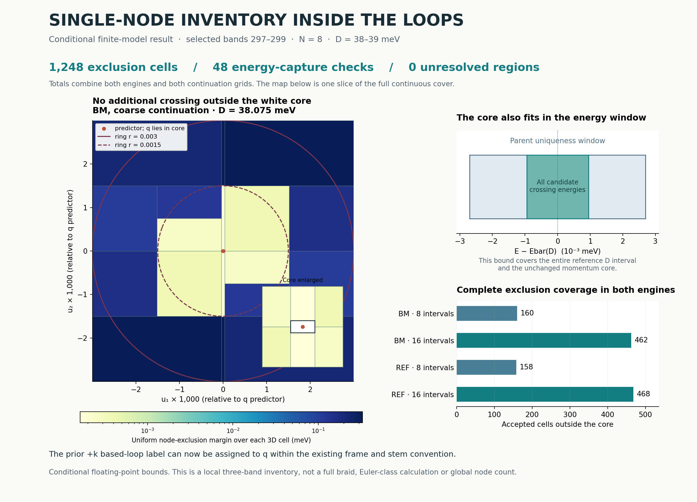

# A single-node inventory inside the moving loops

**Result:** within the isolated three-band block (zero-based bands 297–299),
the tested loop interiors contain the continued q crossing and no additional
crossing throughout **D = 38–39 meV**, at **N = 8**, in both Hamiltonian engines.
This is a **conditional floating-point result**: the bounds use declared
allowances rather than outward-rounded interval arithmetic.

The [previous checkpoint](../r1_attachment/) attached each moving loop to q
but left open whether other crossings could lie inside it. This calculation
closes that local interior-inventory gap. Combined with the inherited chart,
gapped contour and stem, it supports assigning the previously measured **`+k`**
based-loop label to q **in the existing frame and stem convention**. It does
not add a new charge measurement or establish a complete braid or Euler-class
change.



The map shows one D slice of the BM coarse-continuation cover. Cell colors
represent bounds valid over each cell's entire three-dimensional parameter
volume, not sampled gap values. The white rectangle is the unchanged inherited
uniqueness core; the red dot marks its affine predictor, not a newly solved
root at the displayed D. The two drawn polygons are the fine contour mesh at
radii 0.003 and 0.0015 in fractional momentum coordinates. Both original contour
meshes and both radii are included in every inventory campaign.

## What was checked

1. **Core energy capture.** The inherited uniqueness result applies in
   `(f1, f2, E)`, not automatically to its momentum projection. A Schur-complement
   trace bound places every candidate crossing in the momentum core inside
   the unchanged parent energy window, where uniqueness already applies.
2. **The surrounding interior.** Four strips tile a moving rectangle containing
   both loop interiors, outside that core. Weighted Schur bounds exclude any
   additional crossing of the flat pair throughout each accepted cell.
3. **The other gaps.** Uniform bounds keep the upper internal gap and both
   exterior gaps open over the entire containing rectangle. The inventory
   therefore accounts for crossings of the selected isolated three-band block.
4. **Independent reconstruction.** The report rebuilds the bounds from retained
   frames and Hamiltonians using a separate calculation of weighted norms and
   rectangle minima. It also checks every subdivision tree, domain containment,
   source hashes, and fresh native matrices and five-band spectra.

The [method and derivation](METHOD.md), [frozen plan](PLAN.json),
[retained results](RESULTS.json) and [reconciled summary](SUMMARY.json) specify
the calculation and its assumptions.

## Results

| Engine | Continuation intervals | Cell attempts | Accepted exclusion cells | Unresolved leaves |
|---|---:|---:|---:|---:|
| BM | 8 | 288 | 160 | 0 |
| BM | 16 | 860 | 462 | 0 |
| REF | 8 | 284 | 158 | 0 |
| REF | 16 | 872 | 468 | 0 |
| **Total** | **48** | **2,304** | **1,248** | **0** |

All **48 core energy-capture checks** passed. The **1,056 failed parent cells**
remain in the retained trees, each replaced by passing subdivisions. Maximum
depth was 7 against a frozen limit of 24. No core, path or threshold was changed
to force acceptance. Each of the four campaigns covers all four combinations
of contour mesh and radius for its engine; these are not additional independent
Hamiltonian implementations.

| Bound or check | Worst retained value | Requirement |
|---|---:|---:|
| Exclusion margin | 2.5247938 × 10⁻⁶ meV | > 10⁻⁷ meV |
| Energy-capture margin | 4.2560615 × 10⁻⁴ meV | > 0 |
| Other adjacent-gap lower bound | 5.3079175 meV | > 0.001 meV |
| Accepted resolvent perturbation ratio η | 0.4148332 | < 0.9 |
| Native matrix entry disagreement | 2.5012693 × 10⁻¹² meV | < 10⁻⁹ meV |
| Native five-band spectrum disagreement | 1.0587087 × 10⁻¹² meV | < 10⁻⁹ meV |

All **nine analytic and adversarial controls** passed, including a model with
a second known crossing: cells containing that crossing correctly remained
unresolved. Other controls reject an insufficient energy window, a complementary
gap closing within an interval, and an exhausted subdivision budget.

## Reproduce and inspect

To rerun from this directory, use a disposable checkout with the repository's
Python dependencies available. First move the retained `RESULTS.json` and four
NPZ archives aside: `run.py` refuses to overwrite them. Then run:

```bash
OPENBLAS_NUM_THREADS=1 OMP_NUM_THREADS=1 python controls.py
OPENBLAS_NUM_THREADS=1 OMP_NUM_THREADS=1 python run.py
OPENBLAS_NUM_THREADS=1 OMP_NUM_THREADS=1 python report.py
OPENBLAS_NUM_THREADS=1 OMP_NUM_THREADS=1 python figure.py
```

For an audit of the retained run, start with `report.py`; it reconstructs the
numerical bounds rather than trusting the saved pass flags. `figure.py` checks
the summary's source hashes before rendering. The four NPZ archives retain
every attempted cell, its parent and children, bounds and disposition. Column
names are declared in `inventory.py`. Logs record the completed executions;
`MANIFEST.json` binds the release files by SHA-256 and byte count.

Parent commit: `6930684fbdc0160cbf45d1a325060e9e89d9a655`.

## Scope

This is a local inventory of the selected three-band block in the declared
finite continuum model. It is not a global Brillouin-zone inventory or a count
of crossings among all 596 bands. The two engines share measurement machinery.
Their agreement and the separate reconstruction do not constitute physical
validation or a fully verified interval certificate.

The twist is 1°, strain is fixed at 0.007 with orientation 15°, and constant
tunnelling parameters are w₁ = 110 meV and w₀ = 88 meV. D means opposite layer
potentials ±D meV, with layer difference 2D; it is not a calibrated experimental
field. No novelty, experimental realization, infinite-cutoff convergence,
complete braid or Euler-class change is claimed. The next scientific question
is how these locally identified charges relate across the full proposed
braiding path under a consistently transported convention.
