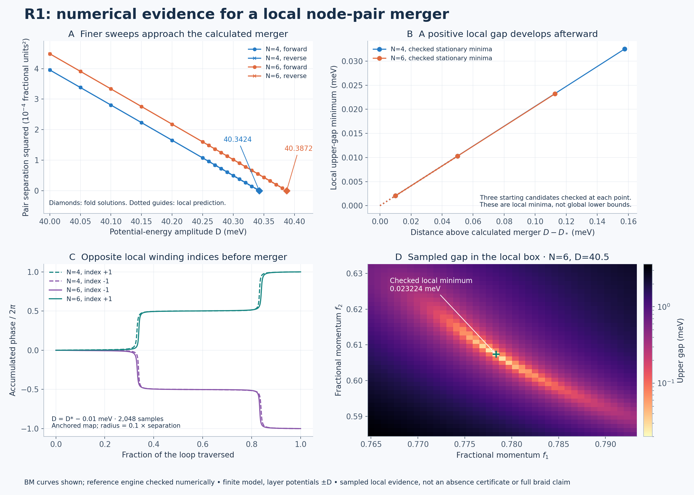

# R1 local upper-node merger study

**The finer sweeps, fold solutions, opposite local indices and positive stationary gap minima provide numerical evidence consistent with a local node-pair annihilation in the declared finite model. This is not a rigorous root-absence certificate or full braid acceptance.**



This follows the [event-interval inventory](../r1_events/README.md). It examines the two upper-gap roots that were recovered at D=40 but not at D=40.5. Earlier checkpoint sources/results remain unchanged. The model still uses ε=0.007, φ=15°, θ=1°, w1=110 meV, w0=88 meV and uniform layer potentials ±D. D is a potential-energy amplitude; the layer difference is 2D. There is no laboratory displacement-field calibration.

## What changed

| Cutoff N | Last pair / first unrecovered station, D (meV) | Calculated local fold D* (meV) | BM/reference D* difference (meV) | Checked local gap at D=40.5 (meV) |
| --- | --- | ---: | ---: | ---: |
| 4 | 40.34–40.35 | 40.3423890 | 1.6e-12 | 0.032527434 |
| 6 | 40.38–40.39 | 40.3872311 | 1.6e-12 | 0.023224213 |

There are 216 sweep rows: 27 D stations, two directions, two engines and two cutoffs. All 108 forward/reverse inventory comparisons agree under the declared coordinate tolerance; the maximum matched coordinate difference is 1.25e-12. Missing roots remain failed searches; their absence is not the argument for annihilation. The added evidence is the local fold calculation, opposite local map indices and positive stationary gap minima beyond that fold.

All 12 fold trials meet the declared numerical criteria. They solve the two real components of the actual upper two-band Hamiltonian together with a vanishing momentum-Jacobian determinant. Each engine/cutoff repeats this using momentum derivative steps 1e-5, 5e-6 and 2.5e-6. The largest D* spread across those steps is 1.18e-10 meV. This finite-difference agreement is not a formal error bound. The N4-to-N6 shift is **0.044842 meV**; cutoff convergence is not established.

At the calculated fold, one Jacobian singular value is small while the other remains nonzero. In the left/right null directions, the measured parameter and quadratic momentum coefficients are nonzero and have the sign predicting two local roots below D*. These diagnostics support a generic local fold conditional on the smooth isolated two-band description. They do not prove a global root count.

## Initial failures and their targeted resolution

The original `N4.json` and `N6.json` runs retain unresolved-check status. Near D*−0.01, the 128/256-point loops yielded nominal ±1 indices but exceeded the frozen maximum phase increment; the initial 128-point enclosing loop also failed its phase-step check. In addition, 13 of the 36 Nelder-Mead attempts hit their iteration limit. Such outputs were not promoted to successful checks.

After these issues were observed, `REFINEMENT_PLAN.json` declared a separate supplement. The original reports, thresholds and failed attempts were preserved. Near-fold node loops and the affected enclosing loop were reevaluated at 1,024 and 2,048 points. **40/40 refined loop checks pass**, retaining opposite ±1 node indices and zero net enclosing index. The maximum refined phase step is 0.411290 radians, below π/4. The zero enclosing index alone cannot rule out an unresolved opposite-index pair.

The supplement also checks each candidate minimum using the exact eigenvalue first derivative of the affine Hamiltonian, then numerical Hessians at two step sizes. **36/36 stationary-minimum checks pass**: positive gap, small gradient, positive Hessian, agreement under derivative refinement and a small displacement from the original candidate. Maximum gradient norm is 1.25e-08 meV per fractional-coordinate unit. This directly checks stationarity without changing a failed Nelder-Mead termination flag. The candidates share the original searches, so these are distinct local diagnostics, not independent global searches.

The smallest sampled two-band/anchor overlap over both stages is 0.952886; the smallest sampled exterior-band gap is 16.250226 meV. These are sampled conditioning measurements, not bounds everywhere in momentum and D.

## Definition and scope of the local calculation

The local box is f1∈[0.765,0.793], f2∈[0.585,0.632]. The two-band anchor is at f=(0.779,0.6075), D=40.25. At every evaluation the actual eigenpair subspace is recomputed and aligned to that anchor using a polar decomposition. Its two real traceless components are (h11−h22, 2h12); their Euclidean norm is the upper gap. The reported indices are windings of this common anchored component map. Individual signs depend on the anchor orientation and can reverse between engines/cutoffs; the opposite-index relation is the comparison target. They are not a computed global Euler class.

The Hamiltonian family is affine in fractional momentum and D. Its precomputed matrices are checked against each engine's original complex Hamiltonian at the box corners/center and both D endpoints, including direct spectrum comparisons. Neither engine source is edited. Both engines share this local solver, analysis and diagnostics; their agreement is internal numerical evidence.

The sweep uses the union of 40–40.5 in 0.05 steps and 40.25–40.45 in 0.01 steps. Both directions begin with the two known D=40 seeds, retaining the last accepted pair across failures. Thus the reverse run tests recovery while decreasing D; it does not presume roots above the event. Local searches and branch matching are finite and do not certify identity between samples.

For fold interpretation, let a be the left-null projection of the D derivative and b the left-null projection of the second derivative in the null momentum direction. The local expansion is a(D−D*) + bq²/2. Its leading prediction for pair separation squared is −8a(D−D*)/b. The dotted guide in panel A uses those measured coefficients; it is not a fitted discovery result. Panel B's dotted guide uses |a|(D−D*). Plotted solid lines connect computed points. Panel D shows a 41×41 sampled local gap map; it is not an exclusion bound. The exact checked stationary point is overlaid separately.

## Provenance and reproduction

`PLAN.json` was frozen before the original local study; the parent event results were already known. `REFINEMENT_PLAN.json` was frozen after the initial numerical warnings and before the supplement. Neither is a discovery preregistration. Both original and refined JSON reports record hashes; all failed attempts and logs are preserved. `SUMMARY.json` and the figures derive from those saved reports. `MANIFEST.json` covers this directory's completed files except itself.

Four initial controls check an analytic fold, opposite map indices, an analytic post-fold Hessian and a known native-model root. A fifth control compares the eigenvalue gradient with a direct finite difference of the native-model gap. All five pass; both test logs are retained.

With NumPy, SciPy and Matplotlib installed, from the repository root:

```bash
OPENBLAS_NUM_THREADS=1 OMP_NUM_THREADS=1 python research/benchmarks/r1_merger/test_study.py
OPENBLAS_NUM_THREADS=1 OMP_NUM_THREADS=1 python research/benchmarks/r1_merger/test_refine.py
OPENBLAS_NUM_THREADS=1 OMP_NUM_THREADS=1 python research/benchmarks/r1_merger/study.py --N 4 --output replay_N4.json
OPENBLAS_NUM_THREADS=1 OMP_NUM_THREADS=1 python research/benchmarks/r1_merger/study.py --N 6 --output replay_N6.json
OPENBLAS_NUM_THREADS=1 OMP_NUM_THREADS=1 python research/benchmarks/r1_merger/refine.py --N 4 --output replay_REFINED_N4.json
OPENBLAS_NUM_THREADS=1 OMP_NUM_THREADS=1 python research/benchmarks/r1_merger/refine.py --N 6 --output replay_REFINED_N6.json
python research/benchmarks/r1_merger/report.py
```

Runners refuse to overwrite existing outputs. The refinement reads the preserved `N4.json`/`N6.json`, not replay filenames; its recorded parent hash identifies the input. The report builder likewise reads the preserved source reports. The NPZ files hold arrays [f1 index, f2 index, (gap, exterior gap, overlap)] for each named engine/D map, with both box endpoints included.

## Remaining limits

A rigorous local root-count or absence certificate, broader cutoff convergence, continuous identity/isolation over the full path and the historical campaign's remaining acceptance gates are still open. This checkpoint concerns the local upper pair; it does not establish global Euler-obstruction removal, a complete or second braid, experimental feasibility or novelty. The earlier D≈38.08 segment crossing is a separate event. The projected-THF/Vafek-paper convention discrepancy is unchanged.
