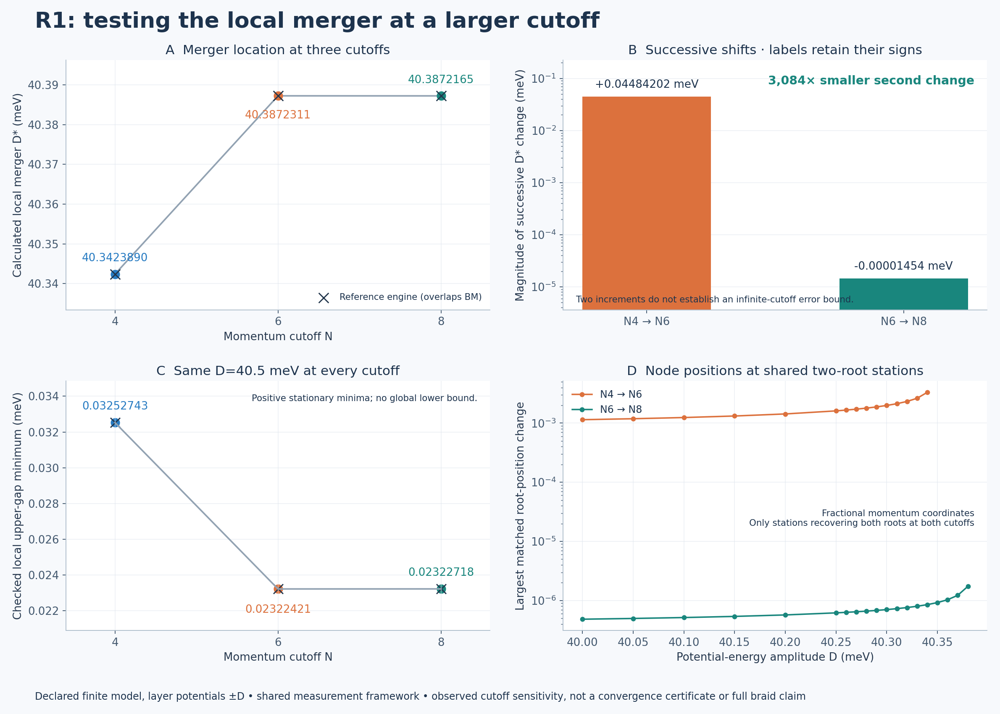

# R1 local merger: N=8 cutoff follow-up

**The local merger signature persists at N=8 in both engines. The merger-location change from N6 to N8 is much smaller than from N4 to N6, with a small reversal in direction. These are finite-cutoff numerical observations, not an infinite-cutoff convergence certificate.**



This extends the [local merger study](../r1_merger/README.md). Only the model's momentum cutoff changes. The local box, anchor and numerical acceptance thresholds are unchanged. The model retains ε=0.007, φ=15°, θ=1°, w1=110 meV, w0=88 meV and layer potentials ±D. D is an energy amplitude; the layer-potential difference is 2D. No experimental displacement-field calibration is supplied.

## Comparison

| Cutoff N | Calculated local fold D* (meV) | Checked local gap at D=40.5 (meV) | Last pair / first unrecovered station, D (meV) |
| --- | ---: | ---: | --- |
| 4 | 40.3423890453 | 0.0325274343 | 40.34–40.35 |
| 6 | 40.3872310691 | 0.0232242130 | 40.38–40.39 |
| 8 | 40.3872165286 | 0.0232271812 | 40.38–40.39 |

The table shows BM results; the reference-engine values and every signed difference are retained in `SUMMARY.json`. N4 and N6 are read from the preserved parent reports, not rerun. The signed D* changes are **+0.0448420238 meV** for N4→N6 and **-0.0000145405 meV** for N6→N8. The second magnitude is about **3,084 times smaller**. The sign reversal means this is not a demonstrated monotone approach. No limiting value, asymptotic fit or error bar is inferred from the two increments.

The N8 engines differ in D* by 4.12e-13 meV, and their largest matched-root difference over the sweep is 3.56e-13 in fractional momentum coordinates. Both engines share the measurement framework; agreement is internal numerical evidence. Decimal digits identify the computed outputs and do not imply equivalent physical accuracy.

The fixed-D local gap and the local root positions are compared as additional observables. Panel D compares only stations where both cutoffs recover two accepted roots. It does not conceal the intervening root-count differences: every station's counts and unmatched comparison are present in the summary. A failed root search remains a failed search, not a proof of absence.

## N8 checks

Each engine uses 596 Hamiltonian dimensions (149 retained reciprocal-grid points, four internal components per point). There are **108 new sweep rows**, covering 27 D stations in both directions for both engines. All 54 forward/reverse inventory comparisons agree under the unchanged 1e-5 coordinate tolerance. The same local fold conditions pass at three derivative steps per engine, giving six passing fold trials. The final fold spectrum is additionally checked against each engine's original complex Hamiltonian.

**40/40 loop checks pass**, retaining opposite local node indices before the merger and zero net enclosing index at D=40 and D=40.5. Individual winding signs depend on the anchor orientation; only the opposite-index relation is compared across engines/cutoffs. Near D*−0.01, both radii are checked at 1,024 and 2,048 points. At D=40 the individual-node checks retain the parent's 128/256 points. The enclosing checks use 1,024/2,048 points at D=40 and 128/256 points at D=40.5, following the parent study and its successful refinement. No coarse near-fold mesh is promoted after failing a phase-step test.

**18/18 stationary-minimum checks pass** at D*+0.01, D*+0.05 and D=40.5, with three starting candidates per station/engine. The minimum conditions reuse the exact eigenvalue gradient, positive Hessian, Hessian refinement, gap, conditioning and displacement checks from `r1_merger/refine.py` without edits.

Candidate generation is explicitly different from the parent's initial Nelder-Mead stage: bounded least squares on the actual two-component map supplies candidate minima. Above the merger these outputs have positive gaps and are recorded as rejected roots. Their separate stationary-minimum checks determine whether they meet the minimum criteria. All candidate optimizer flags, gaps and final checks are retained. This avoids reusing the parent's stalled simplex termination as evidence; it does not turn an unsuccessful root search into a root or a global exclusion result.

The maximum gradient norm in the accepted minimum checks is 8.21e-09 meV per fractional-coordinate unit. The minimum sampled anchor overlap is 0.981146, and the minimum sampled exterior-band gap is 16.902652 meV. These conditioning measurements are sampled, not uniform bounds between all samples. Native/affine matrix and spectrum checks are retained in each engine report.

## Provenance and reproduction

`PLAN.json` was frozen before the N8 runs, after the N4/N6 results were known. This is follow-up validation, not discovery preregistration. The prior engine and diagnostic sources remain unchanged and are imported directly. Both new engine reports bind the plan, source files, N6 seed report and software versions. The summary also hashes all N4/N6/N8 result inputs. `MANIFEST.json` covers every completed file in this directory except itself. Earlier checkpoints and their failed attempts remain intact.

With NumPy, SciPy and Matplotlib installed, from the repository root:

```bash
OPENBLAS_NUM_THREADS=1 OMP_NUM_THREADS=1 python research/benchmarks/r1_n8/run.py --engine bm --output replay_BM.json
OPENBLAS_NUM_THREADS=1 OMP_NUM_THREADS=1 python research/benchmarks/r1_n8/run.py --engine ref --output replay_REF.json
python research/benchmarks/r1_n8/report.py
```

The runner refuses to overwrite a report and preserves partial outputs on failure. The report builder reads the preserved `BM.json` and `REF.json`, not replay filenames. `cutoff.png` and `cutoff.svg` derive from the same saved data. The inherited analytic and native-model controls are documented in the parent study; this run adds direct checks at N8.

## Remaining limits

The smaller increment supports numerical stabilization of this local event across the three tested cutoffs. It does not bound the truncation error, certify exclusion of other roots, or establish uniform subspace isolation/continuous identity along the whole path. The earlier D≈38.08 comparison-segment crossing and D=36/42 relative-charge endpoint checks are not rerun at N8 in this checkpoint. Full braid acceptance, global Euler-obstruction removal, a second braid, experimental feasibility and novelty remain unestablished. The separate Vafek-paper convention discrepancy is unchanged.
