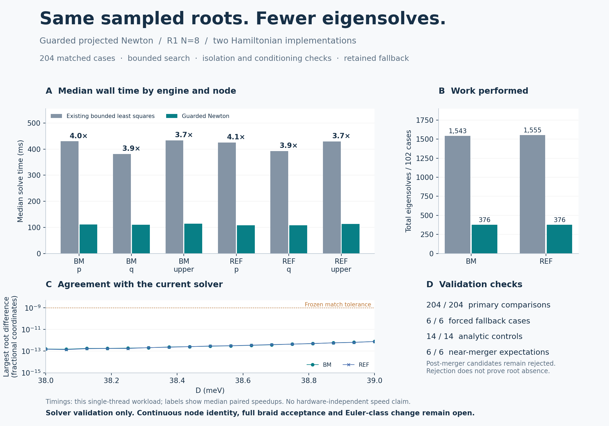

# R1: guarded Newton solver variant

**The new variant matches all 204 sampled N8 root comparisons in both engines.** Median per-case speedups over the current bounded least-squares solver are 3.84× (BM) and 3.93× (reference) on this single-thread workload. Median eigensolve counts fall from 14 to 4 in both engines. This is a solver-validation batch, not a new topology measurement.

## What was implemented

The variant adapts the partner study's projected-derivative Newton idea to the **existing real affine R1 Hamiltonians**. It adds a bounded search, trust-limited backtracking on the actual gap, finite/real/symmetric coefficient checks, pair isolation and anchor-overlap checks, and final Jacobian rank/conditioning gates. A guarded bounded least-squares fallback retains the original seed anchor and box.

The original exhausted-iteration position/gap mismatch is fixed in the new implementation: every returned pair points to its exact saved evaluation. The supplied partner implementation is preserved unchanged for a regression comparison and attribution.

**Callers must check `accepted`.** A small gap or optimizer-success flag alone does not accept a root. The precise API and its thresholds are in [METHOD.md](METHOD.md); the implementation is [solver.py](solver.py).

## Measured comparison

| Engine | Primary cases | Existing eigensolves | Variant eigensolves | Median paired speedup | Primary fallbacks |
|---|---:|---:|---:|---:|---:|
| BM | 102 | 1,543 | 376 | 3.84× | 0 |
| REF | 102 | 1,555 | 376 | 3.93× | 0 |

The primary cases cover 17 D stations from 38 to 39 meV, roots p/q/upper, two seed choices, and both engines. The current solver and candidate receive identical seeds. Counts include reference evaluations for numerical Jacobians; timings include candidate guards and recording. Common family construction and subsequent native checks are outside the timed solver calls. These are local measurements, not general speed guarantees.

The maximum root-coordinate difference from the current solver is **7.82e-13**, below the frozen 1e-9 fractional-coordinate tolerance. The largest native-complex-Hamiltonian residual gap is **3.53e-11 meV**; the maximum native/affine four-band spectrum discrepancy is 1.2e-12 meV. Small numerical differences are not physical error bars.

## Guard and fallback evidence

- **14/14 analytic controls pass.** They include basis/sign covariance, the original failure-record bug, corrected exhaustion behavior, successful fallback, singular/ill-conditioned roots, isolation rejection, bounded search and invalid matrices/inputs.
- **6/6 forced fallback cases pass** with Newton disabled, covering all three N8 roots at D38 in both engines.
- **6/6 near-merger behavior checks match expectations.** Both engines recover the two tested roots at D40.38. Both reject the candidate search at D40.40; its positive gap is about 0.00263135 meV and the final Jacobian gate also fails. Rejection is a failed local search, not proof of absence.
- Independent reconciliation checks **987 saved evaluations**, 584 Newton trials, case coverage, acceptance gates, derivative-step equations, local boxes and returned-position/gap consistency. It freshly diagonalizes every final primary/fallback/stress position and recomputes projected Jacobian singular values.

## Scope and next use

The result supports using this **explicitly declared solver variant** for further sampled R1 continuation with the existing scientific acceptance checks. Its projected Jacobian is a local frozen-frame linearization; it is not inserted as the Jacobian of the fallback's changing anchored residual. Exact Hamiltonian derivatives and rapid root convergence do not supply the uniform uniqueness neighborhoods needed for continuous node identity.

Strain is fixed, layer potentials are ±D meV, and N=8 has dimension 596. There is no new charge or Euler-class calculation, full braid acceptance, experimental calibration, infinite-cutoff conclusion or independent physical validation. Both Hamiltonian implementations share this diagnostic. The current [surface-isolation checkpoint](../r1_surface/README.md) retains its separately stated numerical meaning.

## Sources and reproduction

- [Frozen plan](PLAN.json), [method and commands](METHOD.md), [runner](run.py), [independent report](report.py), [figure source](figure.py).
- [Complete measurements and histories](RESULTS.json), [reconciled summary](SUMMARY.json), [controls](CONTROLS.json), and their logs.
- [Original partner study ZIP](partner_engine_study.zip) and byte-identical [partner fast-engine source](partner_fast_engine.py). Credit: the partner study supplied by Alan Fuller. The original archive includes its own measurements against older solver paths; those speedups are distinct from this comparison.
- [Manifest](MANIFEST.json) binds the delivered files. The results additionally bind the current sources, frozen plan and inherited model/measurement inputs.

Parent commit: `0a8561d63524925f85e3a2c71e79b6553fb4df17`. The new checkpoint lives entirely in this directory; historical evidence remains available at its original paths.
