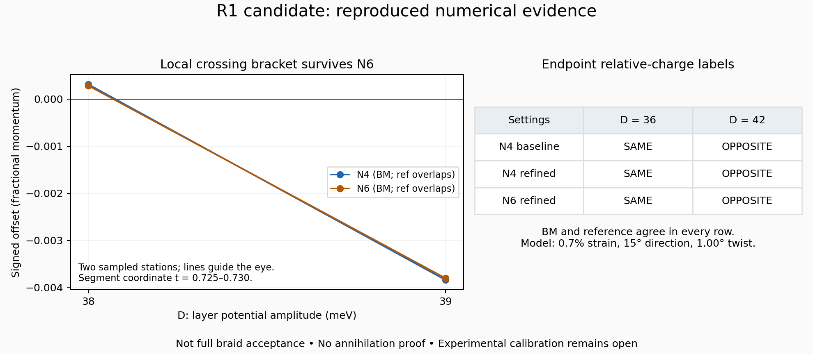

# R1 candidate: reproducible endpoint and crossing checks

**Status: the endpoint labels and local crossing bracket reproduce at N4 and N6 in both engines. Full braid acceptance remains open.**



This is a fresh, explicit-parameter followup to `twistronics_R1_realizable_knobs_draft.zip`. The original ZIP is preserved byte-for-byte as `incoming_draft.zip`; its claims are historical input, not this checkpoint's conclusions. This work does not resolve the separate off-axis discrepancy in the projected THF/Vafek-paper benchmark.

## Fresh results

| Settings | D=36 meV, BM / ref | D=42 meV, BM / ref |
|---|---|---|
| N4, baseline radii and mesh | SAME / SAME | OPPOSITE / OPPOSITE |
| N4, half radii and double mesh | SAME / SAME | OPPOSITE / OPPOSITE |
| N6, refined settings | SAME / SAME | OPPOSITE / OPPOSITE |

Twelve fresh engine/station/settings measurements passed the frozen endpoint diagnostic criteria. Individual charge signs depend on frame orientation; compare the relative label, not an absolute sign across separate runs.

A separate local-root followup reproduced the candidate upper-gap node on opposite sides of the segment at D=38 and 39 meV:

| Cutoff | Offset at D=38 | Offset at D=39 | Segment coordinate t |
|---|---:|---:|---|
| N4 | +0.000310506 | −0.003842517 | 0.725021 → 0.729685 |
| N6 | +0.000282012 | −0.003803750 | 0.725020 → 0.729634 |

Both engines agree on these local observations. These two stations bracket a candidate crossing; no refined crossing-field uncertainty is claimed. The node is followed locally from a declared seed, not found by an exhaustive inventory.

The largest N4-to-N6 endpoint root coordinate shift is approximately 0.000831 in fractional coordinates. This is appreciably larger than the matched-engine root differences (below 2e-12), so engine agreement is not cutoff convergence. The smallest sampled exterior gap across the baseline transport paths and loops is approximately 0.140 meV. At refined settings it is approximately 0.266 meV at N4 and 0.263 meV at N6. Different radii mean different paths: these minima are not monotone bounds on the same continuum path. All isolation statements here concern sampled points, not certified global lower bounds.

## Explicit model and corrections

- Strain `eps=0.007`, direction 15 degrees, twist 1.00 degree; `w1=110 meV`, `w0=88 meV`, constant tunnelling, exact geometry and `lab_nn_full` kinetic convention. BM cutoff padding is 1e-6 inverse angstrom; reference padding is 1e-9.
- `Dfield` is a **potential-energy amplitude**: the two layers receive +D and −D meV. Their potential-energy difference is 2D. It is not a calibrated laboratory displacement field. The D=38–39 interval corresponds to a 76–78 meV layer-energy difference.
- The original BM runners inherit a different strain/direction unless environment variables override them. `run.py` explicitly sets all candidate parameters and does not read those environment defaults.
- The two engine files are unchanged copies from the upload. The missing `braid.py`, `euler.py`, `gate.py`, and `knobs.py` dependencies are unchanged copies from repository `research/v054/engines` at base commit `26d8bda837621e2d5c6249ce067ef9f0c86dba5d`. They are declared dependency choices, not proof of the original run environment. Legacy exploratory calls explicitly opt in to exploratory mode.
- Frame instrumentation in `run.py` diagonalizes four neighboring bands to record reality, Hermiticity and exterior-gap diagnostics on the actual charge-loop and transport samples. It supplies the middle two eigenvectors to the existing winding/transport methods. The charge methods differ between engines; the runner and parts of the measurement infrastructure are shared. This is internal reproducibility, not external validation.
- The original JSON and prose disagree about D bounds and stop rules. This checkpoint freezes a new reproduction task after seeing the original candidate; it does not retroactively preregister its discovery or justify expanding physical bounds.

`PLAN.json` was written before the endpoint runs. `CROSSING_PLAN.json` was written after endpoint results and before the targeted crossing followup. Every report records its plan/source hashes. `INPUT_HASHES.json` binds the incoming archive and copied dependencies. No numerical run in this checkpoint failed; it preserves all run outputs and logs.

## Reproduce

Use Python with NumPy, SciPy and Matplotlib (`requirements.txt`; actual numerical versions are recorded in the JSON). From the repository root, execute stages in order. Advance only if the preceding report says `ENDPOINT_DIAGNOSTICS_PASS_NOT_BRAID_ACCEPTANCE`; the script does not automatically enforce cross-file stage order.

```sh
OPENBLAS_NUM_THREADS=1 OMP_NUM_THREADS=1 python research/benchmarks/r1_reproduction/run.py --stage N4_baseline --output replay_N4_baseline.json
OPENBLAS_NUM_THREADS=1 OMP_NUM_THREADS=1 python research/benchmarks/r1_reproduction/run.py --stage N4_refined --output replay_N4_refined.json
OPENBLAS_NUM_THREADS=1 OMP_NUM_THREADS=1 python research/benchmarks/r1_reproduction/run.py --stage N6_refined --output replay_N6_refined.json
```

The driver refuses to overwrite an output. For `crossing.py`, use a fresh working copy and rename its existing `CROSSING.json` before rerunning; it also refuses to overwrite. `render.py` regenerates the figure from the saved baseline reports without running eigensolvers. Numerical comparisons should allow eigenframe sign changes while preserving relative labels.

## Remaining scientific work

The next acceptance work is independent radius and mesh trials, monitored overlap conditioning throughout transport, adaptive isolation checks, and a fuller adjacent-node inventory through the event interval. The current combined radius/mesh test does not isolate either source of error. The reference method records fixed-frame loop overlaps; this runner does not yet record every transport-step overlap singular value. No disappearance/annihilation claim, complete braid certificate, Euler-obstruction removal, second braid, experimental prediction, or novelty claim follows from this checkpoint. Sparse strain searches also cannot establish absence of braiding throughout a continuous parameter region.
