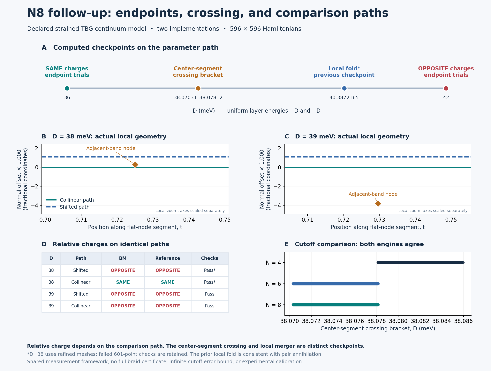

# R1 at N=8: endpoint charges and the comparison path

**Both implementations retain SAME relative charges at D=36 and OPPOSITE at D=42 across all four endpoint trials. They also reproduce the center-segment crossing in D ∈ [38.0703125, 38.078125] meV, the same bracket found at N6 at this resolution.**



The additional intermediate checks make the path convention explicit. **At D=38, both engines give SAME on the collinear path and OPPOSITE on the shifted path after transport-mesh refinement. At D=39, both paths give OPPOSITE.** The D=38 contrast survives two refined meshes with all declared diagnostics passing. This is a numerical path dependence within the declared model, not an engine disagreement or a claim of new physics.

## What was calculated

The declared model holds strain and twist fixed: ε=0.007, φ=15°, θ=1°, w1=110 meV, w0=88 meV, exact geometry and `lab_nn_full` kinetics. The varied parameter is the uniform layer-energy amplitude D, with layer potentials +D and −D. Their difference is 2D. D is **not** a calibrated laboratory displacement field. N8 retains 149 reciprocal-grid points and a 596-dimensional Hamiltonian in each engine.

| Calculation | New evidence at N8 | Interpretation |
|---|---|---|
| D=36 and D=42 endpoints | 16/16 trials pass; four trials per endpoint and engine | Endpoint labels survive the original separate radius, loop-mesh and transport-mesh changes |
| Upper adjacent node crossing the flat-node center segment | Both engines give [38.0703125, 38.078125] meV; nine D evaluations per engine | Targeted geometric crossing bracket, with accepted roots and bounded continuation steps |
| Identical comparison paths at D=38 and D=39 | Four D=39 checks pass at 601 points; eight D=38 checks pass at 4,801/9,601 points, with four failed original 601-point checks retained | A relative charge classification must specify its comparison path |
| Local upper-node pair merger | Prior N8 checkpoint: D ≈ 40.38721653 meV | Previously obtained local fold evidence, consistent with local pair annihilation; not recalculated here |

The [endpoint validation](../r1_validation/README.md), [event tracking](../r1_events/README.md) and [N8 local merger](../r1_n8/README.md) checkpoints supply the comparison data. They remain unchanged. The crossing brackets at N4, N6 and N8 are respectively [38.078125, 38.0859375], [38.0703125, 38.078125] and [38.0703125, 38.078125] meV. The bracket width is 0.0078125 meV; agreement at that resolution is not a bound on the infinite-cutoff error.

## Why the comparison path matters

Let p and q be the two flat-gap nodes, let d be the wrapped fractional displacement q−p, and use the lift q=p+d. The two explicitly shared path definitions are:

| Path | Start | End |
|---|---|---|
| Shifted | p+(r,0) | q+(r,0) |
| Collinear | p−1.5r d/‖d‖ | q+1.5r d/‖d‖ |

Both engines use r=0.003 and 192 loop points for these intermediate checks. The original endpoint checks keep their earlier engine-specific radii and path conventions; they are not silently replaced. Only relative SAME/OPPOSITE labels are compared, since individual winding signs depend on frame orientation.

| D (meV) | Comparison path | BM label | Reference label | Passing transport meshes |
|---|---|---|---|---|
| 38 | Shifted | OPPOSITE | OPPOSITE | 4,801 and 9,601 |
| 38 | Collinear | SAME | SAME | 4,801 and 9,601 |
| 39 | Shifted | OPPOSITE | OPPOSITE | 601 |
| 39 | Collinear | OPPOSITE | OPPOSITE | 601 |

Figure panels B and C show actual calculated node coordinates near the comparison segment, expressed as along-segment position t and signed normal offset. At D=38 the selected adjacent-band node lies between the two paths; at D=39 it lies below both. The views are local zooms with different horizontal and vertical scales, not full Brillouin-zone inventories. The center-segment crossing is a geometric event; it is not automatically the switching point for a displaced comparison path. The figure's line connecting parameter checkpoints does not establish continuous node identity between them at N8.

## A failed mesh check and its refinement

The initial 601-point D=38 transport checks failed the unchanged minimum singular-overlap criterion of 0.9 in **both engines and on both paths**. Their minimum transport overlaps were approximately 0.790839 for the shifted path and 0.412183 for the collinear path. The adaptive exterior-isolation checks passed, and the loop conditioning checks passed. The resulting labels were therefore retained as provisional, not accepted on the strength of apparent engine agreement.

`BM.json` and `REF.json` preserve those four failures and their original `UNRESOLVED_CHECKS_RETAINED` statuses. After observing the first BM failures, `REFINEMENT_PLAN.json` froze transport meshes of 4,801 and 9,601 points for D=38 in both engines. D=39 would also have been included if either engine's original matched-path diagnostics failed there; both passed, so that condition was not triggered. The model, roots, path geometry, loop radius, loop mesh and diagnostic thresholds stayed fixed. The original plan was not edited.

**All eight refinement checks pass**, with the same relative labels across engines and both meshes. The minimum refined transport overlap is 0.962541391; the lowest conditional exterior-isolation estimate on the refined paths/loops is 0.001700592 meV. The original failed statuses remain unchanged. `SUMMARY.json` separately reports `all_planned_diagnostics_pass: false` for the original batch and `resolved_followup_criteria_pass: true` after the frozen refinement.

| Engine | Path | Transport points | Label | Minimum transport overlap |
|---|---|---|---|---|
| BM | Shifted | 4801 | OPPOSITE | 0.995299045 |
| BM | Shifted | 9601 | OPPOSITE | 0.998820634 |
| BM | Collinear | 4801 | SAME | 0.962541391 |
| BM | Collinear | 9601 | SAME | 0.990028027 |
| REF | Shifted | 4801 | OPPOSITE | 0.995299045 |
| REF | Shifted | 9601 | OPPOSITE | 0.998820634 |
| REF | Collinear | 4801 | SAME | 0.962541391 |
| REF | Collinear | 9601 | SAME | 0.990028027 |

The endpoint and matched-path isolation calculation adaptively subdivides each actual transport segment and each circular loop. It bounds the variation of the exterior gaps using the affine Hamiltonian derivative and Weyl's inequality, with a 0.001 meV margin and a 1e−7 meV floating allowance. These are numerical lower estimates conditional on eigensolver and matrix-norm accuracy. They are not interval-arithmetic certificates, full-Brillouin-zone bounds, or uniform bounds over all D.

Across the 16 endpoint trials, the minimum conditioning diagnostic is 0.973303122 and the minimum conditional isolation lower estimate is 0.004706671 meV. Across the four native flat-node stations in both engines, the maximum root residual is 3.54e-10 meV and the largest matched-coordinate difference is 1.98e-12 in fractional coordinates. These small implementation differences are not physical error bars.

## Provenance and reproduction

`PLAN.json` was frozen before the new calculations, after the earlier N4/N6/N8-local-merger results were known. This is a follow-up study, not a discovery preregistration. `sequence.py` imports the unchanged model, endpoint orchestrator and crossing routine. Its new `matched_trial` uses the original winding and transport functions with explicit shared path endpoints. `refine.py` changes only the in-memory transport sample count and writes separate refinement reports.

The two engines are separately coded, but they share frame monitoring, isolation bounds and other measurement infrastructure. Their agreement is internal numerical evidence, not independent external validation. Every original report records the frozen plan hash, relevant source hashes and software versions. Refinement reports additionally hash their original input reports. `SUMMARY.json` records all comparison inputs; `MANIFEST.json` covers every file in this folder except itself.

To regenerate the summary and PNG/SVG from the saved results, with NumPy, SciPy and Matplotlib installed, run from the repository root:

```sh
python research/benchmarks/r1_sequence/report.py
```

For a fresh numerical replay, copy `research/benchmarks` to a separate working directory, and move that copy's four result files (`BM.json`, `REF.json`, `REFINED_BM.json`, `REFINED_REF.json`) into a preservation subfolder. The runners refuse to overwrite an existing result. From the copied benchmarks directory, run:

```sh
OPENBLAS_NUM_THREADS=1 OMP_NUM_THREADS=1 python r1_sequence/sequence.py --engine bm
OPENBLAS_NUM_THREADS=1 OMP_NUM_THREADS=1 python r1_sequence/sequence.py --engine ref
OPENBLAS_NUM_THREADS=1 OMP_NUM_THREADS=1 python r1_sequence/refine.py --engine bm
OPENBLAS_NUM_THREADS=1 OMP_NUM_THREADS=1 python r1_sequence/refine.py --engine ref
python r1_sequence/report.py
```

The original runners return a nonzero exit status for retained failed diagnostics; this is expected for the recorded 601-point D=38 results. Run both original engines to completion before the separately planned refinement. Do not chain these commands with `&&`, which would stop at the intentionally retained original failure. Each report is checkpointed, and exceptions are preserved.

## What remains open

This checkpoint establishes the stated numerical diagnostics on the sampled states and specified paths. It does not establish a full braid, continuous N8 identity through every intervening D value, exclusion of other roots, global Euler-obstruction removal, a second braid, novelty, or experimental feasibility. The earlier local fold evidence and the separate Vafek-paper convention comparison retain their own stated limitations. Decimal digits identify computed outputs and do not imply equivalent physical accuracy.
