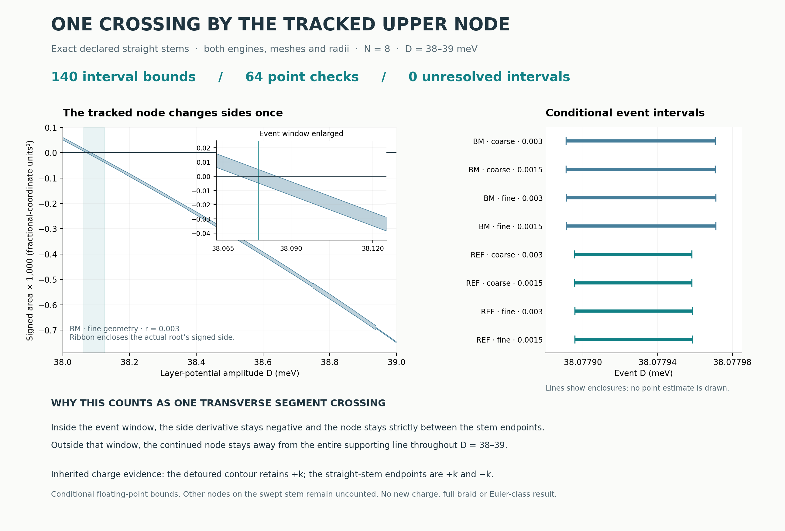

# One transverse crossing by the continued upper node

**Both engines support exactly one crossing of each declared straight comparison
stem by the already continued upper-gap node over D = 38–39 meV.** All eight
engine/mesh/radius cases pass. The crossing is transverse and lies strictly
between the segment endpoints.

The combined enclosure across the cases is contained in
**D ∈ [38.0778908, 38.0779710] meV**, rounded outward for display. This is a
**conditional floating-point bound**, not a calibrated physical uncertainty
or an outward-rounded interval certificate.



This identifies a specific obstruction to carrying the straight comparison
stem through the parameter path. The earlier detoured contour remains gapped
and carries its established `+k` label. No charge was remeasured here.

## What changed

The [temporal checkpoint](../r1_temporal/) already found a numerical crossing
near D = 38.0779 and rejected a stem through it. That locator used a normalized
direction formed from interpolated p and q coordinates. Here we use **exactly
the inherited piecewise-affine base and ring-anchor vertices**. Those two
constructions need not coincide between stations.

The new calculation bounds the **count and location** of crossings by the
continuously identified upper node. It uses the inherited root tubes plus a
new bound on the actual node velocity, obtained by differentiating the Schur
equation. A fitted trajectory or the projected Newton Jacobian alone is not
used as continuity or transversality evidence.

| Gate | Result |
|---|---|
| D38–39 coverage | 140 accepted interval checks; 0 unresolved |
| Outside D38.0625–38.125 | Strict separation from the whole supporting line |
| Inside that window | Strictly negative signed-side derivative in every case |
| Finite segment | Along-segment parameter stays at least 0.392 from either endpoint |
| Event existence | Independently enclosed endpoint sides have opposite signs |
| Event uniqueness | Uniform transversality makes the side strictly decreasing |
| Location refinement | Every case meets the frozen 0.0001 meV enclosure-width target |

These conditions establish exactly one segment crossing **by this tracked node**.
They do not inventory other nodes on the swept straight stem.

## Case enclosures

Bounds below are rounded outward to seven decimal places. Endpoint digits
identify numerical enclosures; they do not imply physical accuracy.

| Engine | Contour mesh | Radius | Lower D (meV) | Upper D (meV) |
|---|---|---:|---:|---:|
| BM | Coarse | 0.003 | 38.0778909 | 38.0779708 |
| BM | Coarse | 0.0015 | 38.0778908 | 38.0779708 |
| BM | Fine | 0.003 | 38.0778911 | 38.0779710 |
| BM | Fine | 0.0015 | 38.0778911 | 38.0779710 |
| REF | Coarse | 0.003 | 38.0778954 | 38.0779583 |
| REF | Coarse | 0.0015 | 38.0778954 | 38.0779583 |
| REF | Fine | 0.003 | 38.0778956 | 38.0779585 |
| REF | Fine | 0.0015 | 38.0778956 | 38.0779585 |

The widths differ because the bounds and interval-Newton contractions differ;
the displayed interval midpoints are not root estimates. The geometries also
differ slightly by mesh and radius. The union, rather than an intersection
treated as a shared event, is reported across these distinct path definitions.

## Evidence and checks

There are **46 distinct newly evaluated root centers** and **64 point checks**;
cases reuse shared centers. Each new point certificate fits strictly within
the appropriate inherited full `(f1,f2,E)` uniqueness tube, identifying the
same continued root. The 140 interval checks reuse inherited tubes with new
geometric and velocity inequalities. No additional subdivision was needed;
there are no failed production parent cells in this run.

The nine initial analytic/adversarial controls pass. They include required
rejection of tangency, two crossings hidden by equal endpoint signs, a
supporting-line crossing outside the segment, complementary-gap closure and
incorrect root identity. A separately frozen **post-production supplement**
adds two intervals of an analytically curved multiband root, checking the
nonlinear velocity contribution throughout each interval. Both pass. The
original controls and production data remain unchanged.

The independent report reconstructs new center primitives, native matrices
and spectra, root certificates, velocity bounds, polynomial extrema, identity
containment, full interval coverage and every event-enclosure step. Its largest
recorded reconstruction discrepancy is about **2.14 × 10⁻¹⁵**, an algebraic
consistency check rather than a model-error bar. Maximum native matrix-entry
disagreement is **2.51 × 10⁻¹² meV**; maximum four-band spectrum disagreement
is **8.52 × 10⁻¹³ meV** (rounded upward).

The [method](METHOD.md) derives the bounds. The [frozen plan](PLAN.json),
[production records](RESULTS.json), [reconciled summary](SUMMARY.json),
[initial controls](CONTROLS.json), [supplemental plan](VELOCITY_CONTROL_PLAN.json)
and [supplemental results](VELOCITY_CONTROLS.json) retain the evidence and sequence.
`FRAMES.npz` stores each newly evaluated center frame. The figure uses saved
results and checks their source hashes before rendering. Its ribbon is a
conditional enclosure of signed side, not a plot of sampled band gaps.

## Scope and next gate

Together with the [single-node q inventory](../r1_inventory/), this links the
transported local charge to q and identifies a transverse upper-node obstruction
on the straight comparison stem. The inherited endpoint charge conjugation is
consistent with that obstruction. **Other nodes crossing the swept straight
stem have not been excluded**, so this checkpoint does not uniquely assign the
entire endpoint sign change to this one event.

A further gate is isolation/inventory on the rest of that swept comparison
surface, followed by the full proposed path and its Euler-class argument. No
complete braid, Euler-class change, novelty, infinite-cutoff convergence or
experimental realization is claimed here.

The model remains N8, dimension 596, with fixed θ = 1°, strain 0.007 at 15°,
and constant w₁ = 110 meV, w₀ = 88 meV. D is the opposite layer potential
amplitude ±D meV, with difference 2D. Both separately coded Hamiltonians share
the diagnostic framework. Floating-point allowances are not certified numerical
error enclosures.

## Reproduction

With NumPy, SciPy and Matplotlib installed, from this directory:

```bash
OPENBLAS_NUM_THREADS=1 OMP_NUM_THREADS=1 python report.py
OPENBLAS_NUM_THREADS=1 OMP_NUM_THREADS=1 python figure.py
```

For a new production run, use a disposable checkout and move `RESULTS.json`
and `FRAMES.npz` aside first; the runner refuses to overwrite them. Run
`controls.py`, `run.py`, `velocity_control.py`, `report.py` and `figure.py`,
in that order with the same thread settings. Logs preserve the completed
executions. `MANIFEST.json` hashes every release file except itself.

Parent commit: `becb9a666e23350f8c03c722be6fcf517691c030`.
