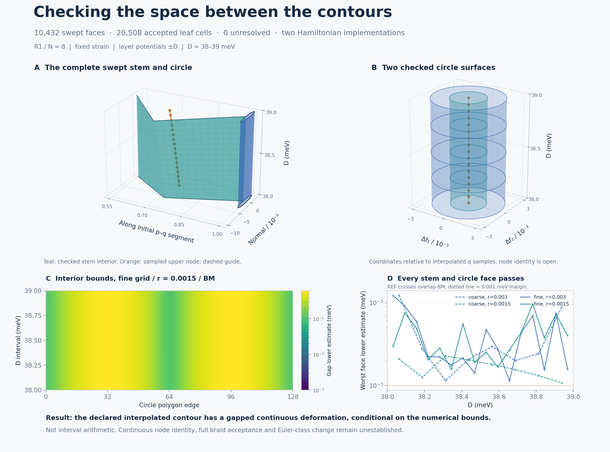

# R1: full swept-contour surface isolation

**Both Hamiltonian implementations pass every declared swept face on both meshes and at both radii.** The previous checkpoint checked grid edges; this one checks their intervening interiors with adaptive gap bounds. All 10,432 faces are covered by 20,508 accepted leaf cells, with **0 unresolved leaves**. Seven new analytic controls pass, including degeneracies hidden inside gapped boundaries.

## What this adds

The moving contour is now supported as a **gapped continuous deformation of the explicitly defined piecewise bilinear surface**, conditional on numerical operator norms and eigensolutions. It inherits the preceding fixed three-band chart and carried base-frame convention. The earlier transported **+k** result and endpoint conjugation are reused, not remeasured here.

This does **not** establish continuous node identity or a full braid. It is not an Euler-class computation, an interval-arithmetic proof, an infinite-cutoff result or an experimental calibration. Strain is fixed; D sets layer potentials ±D meV. The two Hamiltonian engines share the diagnostic framework.

## Numerical evidence

| Engine | Geometry | Radius | Faces | Leaf cells | Minimum gap lower estimate (meV) | Unresolved |
|---|---|---:|---:|---:|---:|---:|
| BM | coarse | 0.003 | 528 | 1,623 | 0.001143878 | 0 |
| BM | coarse | 0.0015 | 528 | 1,662 | 0.001077322 | 0 |
| BM | fine | 0.003 | 2,080 | 3,467 | 0.001139559 | 0 |
| BM | fine | 0.0015 | 2,080 | 3,502 | 0.001579134 | 0 |
| REF | coarse | 0.003 | 528 | 1,623 | 0.001143878 | 0 |
| REF | coarse | 0.0015 | 528 | 1,662 | 0.001077322 | 0 |
| REF | fine | 0.003 | 2,080 | 3,467 | 0.001139559 | 0 |
| REF | fine | 0.0015 | 2,080 | 3,502 | 0.001579134 | 0 |

The acceptance margin was frozen at **0.001 meV**. The smallest lower estimate is **0.001077322 meV**. These conservative estimates are not measured minimum physical gaps; the smallest evaluated center gap is 0.186778 meV. The algorithm refines until the bound clears the fixed margin, so a lower estimate close to the margin is expected.

The report reconstructs all 30,584 recorded cell evaluations, parent/child partitions, complete parameter-square coverage, interior bounds, parent chart containment and source bindings. It also checks selected spectra against the native Hamiltonian and compares the two affine engines at common coordinates. Maximum native spectrum discrepancy: 8.31e-13 meV. Full details are in [SUMMARY.json](SUMMARY.json).

## Node identity remains open

The earlier continuation contains 156 accepted root samples across the engines and two meshes; shared stations are counted repeatedly. Their largest residual gap is 1.34e-12 meV and smallest recorded numerical Jacobian singular value is 30.6935 meV per fractional-coordinate unit. These are **sampled diagnostics**, not uniform invertibility or uniqueness bounds between stations. Node traces in the figure are guides connecting samples.

The next substantive requirement is controlled continuation with overlapping uniqueness neighborhoods for the relevant nodes, alongside the inventory and isolation requirements for a full braid claim.

## Inspect and reproduce

- [Frozen plan](PLAN.json), [method, limits and commands](METHOD.md).
- [Surface bound implementation](surface.py), [sweep](sweep.py), [independent report](report.py), [figure source](figure.py).
- [Seven analytic controls](CONTROLS.json); complete engine records [BM.json](BM.json) and [REF.json](REF.json), with eight companion NPZ files containing every evaluated cell and full subdivision trees.
- [Root-identity audit and reconciliation](SUMMARY.json); [file hashes](MANIFEST.json).
- [Parent temporal checkpoint](../r1_temporal/README.md), unchanged.

The recorded result concerns R1 at N=8 and D=38–39 meV. It should not be conflated with the historical ratio/perturbation campaign. No parent code or results are changed.
