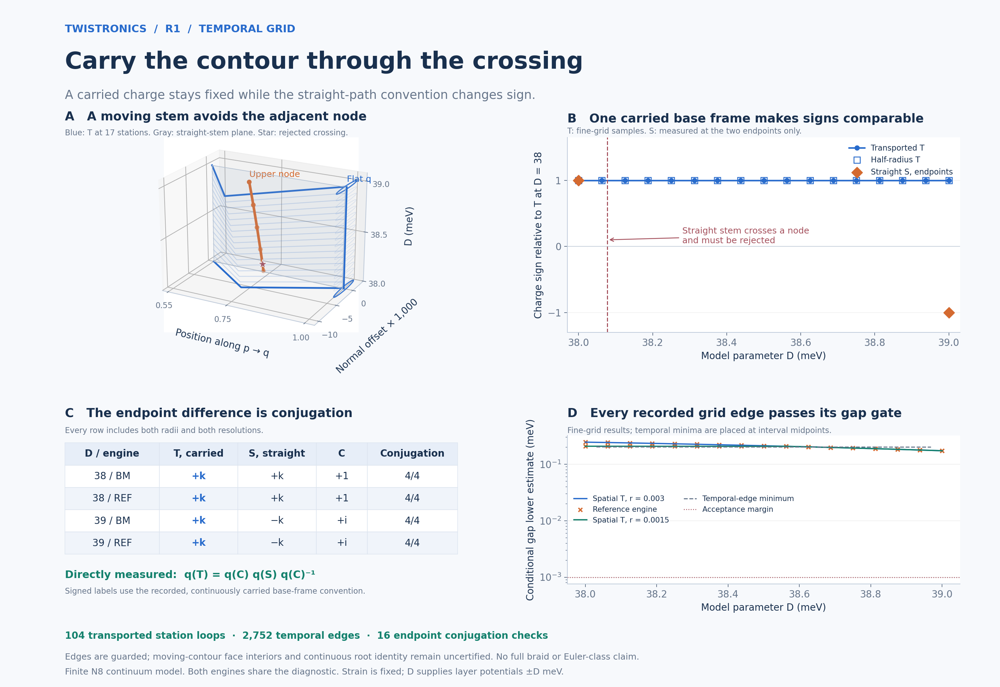

# R1: sampled temporal transport and charge conjugation

**Both engines reproduce the predicted relation in the carried base-frame
convention.** The transported contour T retains +k throughout both sampled
D grids. The nominal straight-path charge is +k at D38 and −k at D39.
The comparison loop C changes from +1 to +i, and direct traversal of
C S C⁻¹ reproduces T. Both loop radii and both resolutions agree.

**This is a guarded temporal-grid result, not full braid acceptance.** The
intervening two-dimensional moving-contour faces and continuous root identity
are not certified. No Euler-class change is computed. The two Hamiltonian
implementations share the diagnostic and its assumptions.



## What the comparison means

T follows a stem that moves with a fixed offset below the sampled adjacent
node, goes around flat node q, and retraces that stem. S uses a straight
stem. Both use the same basepoint and the same local polygon at each station.
C traverses T's outgoing stem and returns along S's stem. All endpoint
charges use the base eigenframe carried from D38. The measured relation is

q(T) = q(C) q(S) q(C)⁻¹.

| D / engine | T, carried | S, straight | C | Conjugation cases |
|---|---|---|---|---|
| 38 / BM | +k | +k | +1 | 4/4 |
| 38 / REF | +k | +k | +1 | 4/4 |
| 39 / BM | +k | −k | +i | 4/4 |
| 39 / REF | +k | −k | +i | 4/4 |

Each row includes radii 0.003 and 0.0015 and both resolutions. Signed i/k
labels refer to the recorded base-frame convention. These symbols label
quaternion elements, not momentum coordinates.

The nominal straight stem crosses the upper node at
**D = 38.0779067372 meV**, using the fine-track interpolation specified in
the plan. Both engines locate this crossing, and the diagnostic rejects the
stem there. It therefore receives no accepted charge at that event. The
nominal endpoint sign change is not presented as continuously gapped
transport along the straight convention.

## Numerical checks

- 104 transported station loops pass across the two engines, two radii,
  and 9/17-station D grids. There are 17 unique original D stations per
  engine; coarse and fine runs repeat shared stations.
- 2,752 temporal grid-edge checks pass, plus 48 base-frame transport edges.
  Base and kink connections are repeated across the radius grids. These
  counts include reused samples and are not independent experiments.
- 16 endpoint conjugation comparisons pass. Each includes S, C and
  the explicitly concatenated C S C⁻¹ path.
- Ten new analytic control cases pass, including imposed eigenvector
  sign changes and required rejection of a degenerate transport edge.
  Eight core cases are supplemented by two explicit D-axis degeneracy
  rejection cases. Source bindings of eighteen parent analytic controls are verified;
  those eighteen control results are reused, not rerun here.
- Both adaptive box covers pass exterior-band isolation and reference-chart
  checks. The smallest conditional exterior-gap lower estimate is
  7.255603 meV; the smallest chart singular-value lower estimate
  is 0.60038976, above the 0.6 gate.
- The smallest conditional spatial-path gap lower estimate is
  0.012585141 meV. The corresponding temporal/base-edge minimum is
  0.20071193 meV. Both exceed the 0.001 meV margin.
- Independent reconstruction checks saved bounds, coordinates, base-frame
  signs, quaternion-to-frame rotations, and SU(2) conjugation products.
  The largest dimensionless frame/conjugation matrix discrepancy is 2.45e-14. Small algebraic
  discrepancies are not physical error bars.

The volume checks concern the triple's exterior gaps and chart rank.
The grid-edge checks additionally cover both internal gaps. **Exterior
isolation over the volume does not certify the two internal gaps in the
unmeasured moving-contour face interiors.** All bounds are conditional on
floating-point eigensolutions and matrix norms, not interval arithmetic.

## Model and method

The R1 Hamiltonians are unchanged: θ = 1°, strain magnitude 0.007, strain
angle 15°, w₁ = 110 meV, w₀ = 88 meV, exact geometry, `lab_nn_full`, N8,
149 reciprocal vectors and dimension 596. Bands 297–299 use zero-based
energy ordering. Strain remains fixed. D supplies layer potentials ±D meV;
no calibration to laboratory displacement field is supplied.

The p, q and upper-node station coordinates come from
[r1_holonomy](../r1_holonomy/README.md). The unchanged lift and adaptive-edge
routines come from [r1_three_band](../r1_three_band/README.md), parent commit
`d32b6f728afabc4a80b71389f99e77f69548e723`. The new code supplies a single
three-dimensional chart, carried base frames, moving paths, temporal edges
and the crossing control. [METHOD.md](METHOD.md) derives the construction,
bounds and conventions and links the scientific basis.

[SURVEY.json](SURVEY.json) retains the preliminary geometry survey with an
initial-base reference. [PLAN.json](PLAN.json) was then frozen before the
temporal charge calculations and specifies the production reference at the
containing box center. Predictions remain separate from numerical validity.

## Evidence and reproduction

`BM/REF.json` retain every adaptive volume leaf, station contour, temporal
edge, base-transport check, endpoint comparison and crossing evaluation.
`BM/REF.npz` retain the fixed reference, carried base frames, sampled
coordinates, five-band eigenvalues, projected eigenframes, anchor overlaps
and quaternion paths. `SUMMARY.json` and the logs record reconciliation.
`MANIFEST.json` binds all delivered files except itself.

With NumPy, SciPy and Matplotlib installed, run these commands from this
folder in a working copy where recorded BM/REF JSON and NPZ files have first
been moved aside. The sweep refuses to overwrite those evidence files.

```bash
OPENBLAS_NUM_THREADS=1 OMP_NUM_THREADS=1 python controls.py
OPENBLAS_NUM_THREADS=1 OMP_NUM_THREADS=1 python temporal_axis_controls.py
OPENBLAS_NUM_THREADS=1 OMP_NUM_THREADS=1 python sweep.py --engine bm
OPENBLAS_NUM_THREADS=1 OMP_NUM_THREADS=1 python sweep.py --engine ref
OPENBLAS_NUM_THREADS=1 OMP_NUM_THREADS=1 python report.py
python figure.py
```

The figure uses saved results only. Panel A shows sampled paths in coordinates
relative to each station's p–q segment; the gray plane is a geometric guide.
Panel B shows T on the fine grid and S at the endpoints only. Panel D places
temporal minima at their interval midpoints. No data are generated for
unmeasured face interiors.

The remaining acceptance gap is control of the entire moving-contour
surface and continuous node identity, followed by connection to the full
braiding and Euler-class argument. This checkpoint establishes neither
novelty, an infinite-cutoff result, nor experimental feasibility.
