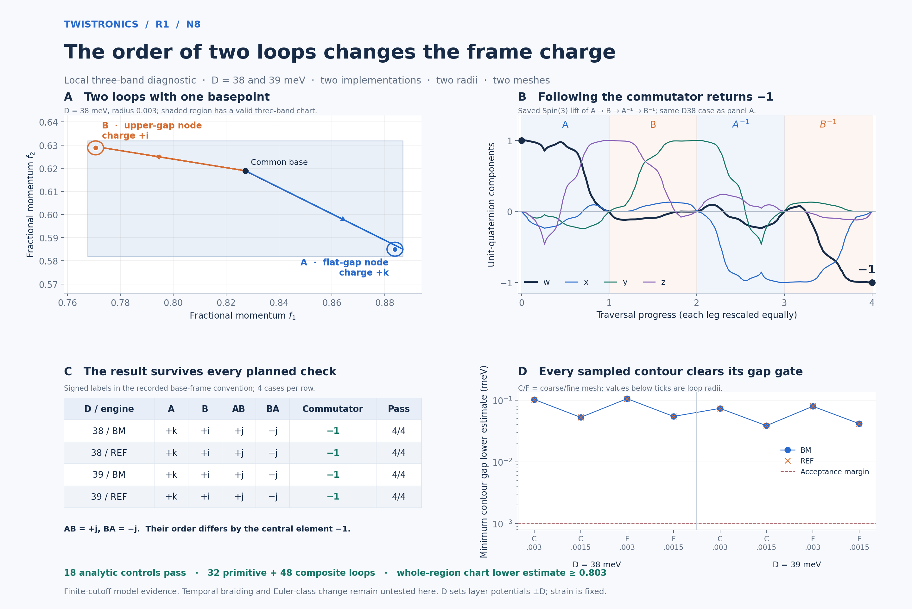

# R1: local three-band frame charges

**Both continuum-model implementations recover the expected noncommuting
local loop charges in this N8 calculation.** Traversing a flat-node loop A
then an upper-node loop B gives +j; reversing their order gives −j in the
recorded base-frame convention. Directly traversing the commutator
ABA⁻¹B⁻¹ gives −1. All planned radius and mesh checks agree at D = 38 and
39 meV.

This is a local frame-charge checkpoint. **It does not establish a temporal
braid or an Euler-class change.** The two Hamiltonian implementations share
the measurement code. Agreement is internal numerical evidence within the
declared model.



## Reading the result

A and B are closed momentum-space paths with a common basepoint. Each has
a straight stem, a counterclockwise polygon surrounding a selected root,
and the retraced stem. Their ordered eigenframes are expressed in one
continuous three-band reference chart and lifted from SO(3) to Spin(3).
The symbols i, j and k label quaternion elements; they are not momentum
coordinates. The value −1 is the central quaternion element.

| D (meV) | Engine | A | B | AB | BA | ABA⁻¹B⁻¹ | Cases passing |
|---|---|---|---|---|---|---|---|
| 38 | BM | +k | +i | +j | −j | −1 | 4/4 |
| 38 | Reference | +k | +i | +j | −j | −1 | 4/4 |
| 39 | BM | +k | +i | +j | −j | −1 | 4/4 |
| 39 | Reference | +k | +i | +j | −j | −1 | 4/4 |

Each row covers radii 0.003 and 0.0015 in fractional momentum and both mesh
levels. Signed imaginary labels depend on the initial eigenframe convention.
The formal comparisons between engines, radii and meshes use conjugacy
classes. AB and BA are compared within the same base frame.

The four figure panels show the actual based paths, the saved commutator
lift, all sixteen cases, and the minimum conditional contour gap estimates.
Panel B rescales each traversal leg equally for display; its horizontal
axis is not time or experimental control evolution. The figure uses saved
numerical data and is reproducible with `figure.py`.

## What was checked

- **18 analytic control cases pass.** Known π, 2π and 4π frame rotations,
  an affine model with adjacent-gap nodes, and required rejection of a
  node-crossing contour and a rank-deficient reference chart are included.
- **32 primitive and 48 composite loop diagnostics pass**, organized into
  16 parameter/resolution cases. Composite paths reuse the primitive samples;
  these are not 80 independent model calculations.
- **The full containing rectangles pass the three-band isolation and chart
  checks**, on both 8×8 and 16×16 cell covers. The smallest conditional
  exterior-gap lower estimate is **15.9886977 meV**. The smallest conditional
  chart singular-value lower estimate is **0.8030584**, above the 0.6 gate.
- **All contours pass the internal and exterior gap checks.** The smallest
  conditional lower estimate over the four gaps is **0.03854456 meV**,
  above the 0.001 meV margin. Adaptive refinement also limits Hamiltonian
  variation and the rotation between adjacent projected eigenframes.
- **Reversal, eigenvector-sign changes, constant reference rotations and
  two lift constructions agree.** The maximum reported lift cross-check
  error is 3.60×10⁻¹⁵; the largest distance to a quaternion-group element
  is 3.06×10⁻¹⁵. These small errors concern discrete algebraic consistency,
  not a bound on continuum-model error.
- **Saved evidence reconciles.** `report.py` checks source hashes, all saved
  interval and rectangle bounds, contour coordinates, quaternion norms,
  frame rotations and chronological products through a separate 2×2 SU(2)
  matrix representation. The largest reconstruction discrepancy is
  7.53×10⁻¹⁵.

The chart construction and conditional bounds are derived in
[METHOD.md](METHOD.md). Numerical matrix norms and eigensolutions use
floating-point arithmetic; these are not interval-arithmetic certificates.
The retained [design survey](FEASIBILITY.json) preceded the
[frozen charge plan](PLAN.json) and did not compute charge labels.

## Model and provenance

The Hamiltonians are unchanged from the R1 reproduction: θ = 1°, ε = 0.007,
strain angle 15°, w₁ = 110 meV, w₀ = 88 meV, exact geometry and `lab_nn_full`
kinetics. N8 retains 149 reciprocal vectors and a 596-dimensional Hamiltonian.
The selected triple is bands 297–299, using zero-based energy ordering.
Both neighboring bands are included when checking its exterior gaps.

Strain is fixed. D supplies layer potentials ±D meV, with layer difference
2D; it is not a calibrated experimental displacement field. The flat q and
upper roots are reused from the fine continuation in the parent
[closed-contour checkpoint](../r1_holonomy/README.md), commit
`0c855a80e8f654b96491af98a00255e73168f862`. This checkpoint does not claim
new root finding or a complete node inventory.

The scientific basis and convention are referenced in METHOD.md. The
earlier two-band orientation calculation is a different diagnostic; its
Wilson-loop determinant is not used as a quaternion charge here.

## Reproduction and files

Use Python with NumPy, SciPy and Matplotlib. From this folder, the following
commands target a working copy where the recorded `BM.json`, `REF.json`,
`BM.npz` and `REF.npz` have first been moved aside. The sweep refuses to
overwrite those evidence files.

```bash
OPENBLAS_NUM_THREADS=1 OMP_NUM_THREADS=1 python controls.py
OPENBLAS_NUM_THREADS=1 OMP_NUM_THREADS=1 python sweep.py --engine bm
OPENBLAS_NUM_THREADS=1 OMP_NUM_THREADS=1 python sweep.py --engine ref
OPENBLAS_NUM_THREADS=1 OMP_NUM_THREADS=1 python report.py
python figure.py
```

`frame.py` contains the chart, adaptive paths and lift. `BM/REF.json` retain
all contour intervals, rectangle cells and accepted labels.
`BM/REF.npz` store base reference frames, all primitive projected eigenframes,
coordinates, five-band eigenvalues, anchor overlaps and every quaternion
path. `CONTROLS.json`, `SUMMARY.json` and the logs document the checks.
`MANIFEST.json` hashes every delivered file except itself. PNG and SVG
versions of the figure are included.

## Remaining scientific question

The next unresolved task is to transport a common base frame and its based
contours through the parameter path and test the predicted temporal charge
conjugation. Recovering the same local noncommuting algebra at two fixed D
slices does not accomplish that task. This checkpoint also does not establish
Euler-class removal, novelty, an infinite-cutoff limit, or an experimentally
realizable braiding protocol.
