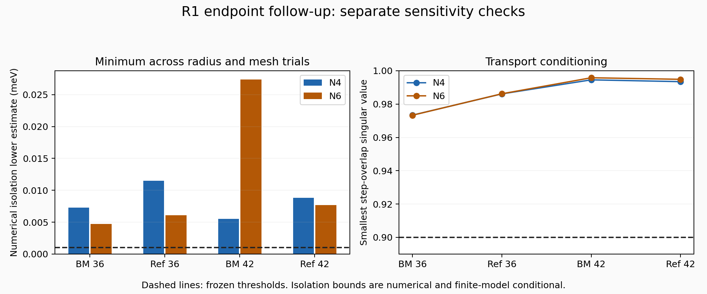

# R1 endpoint validation follow-up

**All 32 endpoint trials pass the frozen follow-up criteria. This is not full braid acceptance.**



This adds separate radius, loop-mesh and transport-mesh checks to the [R1 reproduction checkpoint](../r1_reproduction/README.md), whose files remain unchanged. The model and D=36/42 meV stations are unchanged. Both separately coded engines share this diagnostic runner; agreement is internal evidence, not outside scientific validation.

## Results

| Cutoff | Passed/completed trials | Minimum transport overlap | Minimum numerical isolation bound (meV) |
|---|---:|---:|---:|
| N4 | 16/16 | 0.973363 | 0.005534 |
| N6 | 16/16 | 0.973302 | 0.004727 |

All completed passing trials retain SAME at D=36 and OPPOSITE at D=42. Each cutoff has two engines, two stations, and four trials: baseline, radius-only, loop-mesh-only, transport-mesh-only. Baseline BM/reference radii are 0.006/0.005 in fractional coordinates, with 96/72 loop samples and 301 transport points. Radius-only halves those radii. Loop-mesh-only doubles loop samples; transport-mesh-only uses 601 points. The radius also determines the frame-base offsets, so changing it moves the associated comparison path according to the existing method.

The smallest singular value is monitored between successive two-band subspaces, including loop closures and frame-to-loop initialization. The reference method additionally checks fixed-frame overlap around each loop. The threshold is 0.9. Orientation-dependent individual winding signs can differ between runs; the relative labels are the comparison target.

## Isolation between sample points

The finite continuum Hamiltonian used here is affine in momentum. Along a parameterized path, let L_H bound its operator-norm derivative. Weyl's eigenvalue perturbation bound then gives an exterior-gap Lipschitz bound L=2 L_H; taking the smaller of the upper and lower exterior gaps preserves that bound. For any interval of width h, every interior point is within h/2 of an endpoint. We use

`lower estimate = min(endpoint gaps) - L*h/2 - 1e-7 meV`.

If that estimate is not above 0.001 meV, the interval is bisected. Any sampled gap below the margin or unresolved interval at the depth limit rejects the path. Every adaptive sample and accepted/unresolved leaf is retained in the JSON reports. This bounds the actual straight transport path and both circular node loops at each endpoint station; it does not establish whole-Brillouin-zone isolation or isolation throughout the D sweep.

For a line, L_H is the norm of its constant Hamiltonian derivative. For a circle f(t)=c+r(cos(2πt),sin(2πt)), the triangle inequality gives L_H <= 2πr(||dH/df1||+||dH/df2||). Those derivative norms are computed numerically from the explicit affine matrices. A declared 1e-7 meV allowance accounts for small numerical error, but no interval-arithmetic certificate is provided: the estimates are conditional on eigenvalue/norm accuracy and this finite declared model.

The frame evaluator uses precomputed real affine matrices. At three momenta per engine/station it agrees with the direct Hamiltonian within the frozen 1e-9 meV entrywise tolerance; an additional four-band spectrum comparison passes 1e-8 meV. These checks support the implementation, not physical fidelity. Original source files are unchanged.

## Provenance and reproduction

`PLAN.json` was frozen before either cutoff run. The original candidate and first checkpoint were already known: this is a follow-up validation plan, not discovery preregistration. `N4.json` and `N6.json` record source/plan hashes, versions, roots, winding labels, overlap minima and adaptive isolation evidence. Logs are retained. `SUMMARY.json` and this figure are derived solely from those reports. No numerical threshold was relaxed.

Three analytic controls in `test_isolation.py` verify that the adaptive method accepts an avoided crossing, rejects a true crossing missed by the initial grid, and rejects an unresolved depth limit. The test log is retained. These tests do not certify the complete research calculation.

From the repository root (NumPy, SciPy and Matplotlib required):

```sh
OPENBLAS_NUM_THREADS=1 OMP_NUM_THREADS=1 python research/benchmarks/r1_validation/test_isolation.py
OPENBLAS_NUM_THREADS=1 OMP_NUM_THREADS=1 python research/benchmarks/r1_validation/validate.py --N 4 --output replay_N4.json
OPENBLAS_NUM_THREADS=1 OMP_NUM_THREADS=1 python research/benchmarks/r1_validation/validate.py --N 6 --output replay_N6.json
python research/benchmarks/r1_validation/report.py
```

The runner refuses to overwrite an existing report and stops that cutoff at the first failed criterion. The report builder reads the preserved N4/N6 reports, not replay filenames. Failure outputs must be retained under distinct names. `MANIFEST.json` binds all files in this follow-up directory except itself.

## Remaining work

The D=38–39 local crossing bracket remains evidence from the prior checkpoint; this follow-up does not rerun or refine it. A fuller adjacent-node inventory, continuous identity tracking through the event region, treatment of other possible crossings and the historical campaign acceptance checks remain open. There is no annihilation proof, Euler-obstruction removal, completed second braid, novelty claim or experimental prediction. The potential-energy amplitude ±D still needs an experimental calibration; it is not a laboratory displacement-field value. The separate projected-THF/Vafek-paper convention discrepancy also remains unresolved.
