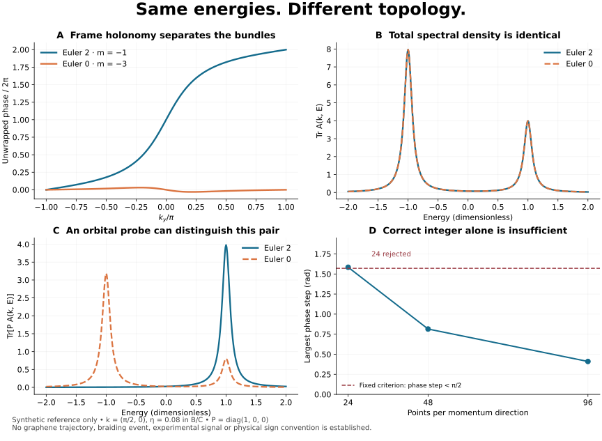

# Research questions 001: topology, spectra and probe conventions

This is the first concrete research pass following the five expert emails. It
uses small reference models and three fixed points of the retained projected
benchmark. It does **not** establish a new graphene braid or validate a device
measurement. The v078 implementation repairs remain with Fable.

## What this pass establishes

| Outreach question | Result here | Remaining work |
|---|---|---|
| Bouhon: can transport conventions create misleading charge interpretations? | SO(2) gauge, base-point, loop-reversal and orientation-reversal controls behave as required for an isolated reference doublet. | Apply an adapter to the actual transport routine, then use a split-band multigap braid reference. |
| Yang: what must hold for an Euler interpretation? | Degree and Wilson holonomy recover oriented Euler numbers 2 and 0; a gapped Möbius control is correctly refused as nonorientable. | Establish reality, orientability, external isolation and boundary sewing for the actual target band subspace. |
| Yacoby: are gap/spectral maps enough? | Two topologically different reference bundles have exactly the same pointwise energies and total spectral density. | Choose and model a physically specified local probe; ordinary spatial LDOS need not equal an unweighted band trace. |
| Ilani: what does a probe need beyond energies? | A chosen orbital weight distinguishes this reference pair; changing basis requires transforming the probe too. | Add the tip, tunneling kernel, bias/gates, momentum selection, temperature and lifetimes before claiming conductance. |
| Vafek: can an observable choose the sign convention? | The retained same-Q gap discrepancy persists. Q-symmetric trace spectra coincide, while an untransformed fixed probe need not. | Resolve the paper's intended convention and the physical embedding of the probe. Both hypotheses stay explicit. |



## Reference model and analytic expectation

For periodic coordinates `kx,ky` in `[-pi,pi)`, define

```
d = (sin kx, sin ky, m + cos kx + cos ky)
n = d / |d|
H = 2 n n^T - I_3
```

We use `m=-1` and `m=-3`. The spectrum is exactly `(-1,-1,+1)` wherever `n`
is defined. These are dimensionless reference energies. The lower rank-two
plane is `n^perp`, the pullback of the tangent bundle of the sphere. With base
orientation `dkx wedge dky` and frame orientation `e1 cross e2 = n`, its Euler
number is `2 degree(n)`.

This expectation has an analytic check independent of the discretized sum:
for `m=-1`, the north pole has the single regular preimage `(0,0)`, with
positive Jacobian, hence degree +1. For `m=-3`, `d_z<0` everywhere, so the map
lies in a contractible hemisphere and has degree zero. The normal is singular
only at the relevant critical parameter/momentum combinations; the flattened
H is **undefined** there, rather than a well-defined matrix with a closing
flat gap. A rejected `m=-2,k=(0,0)` input tests that boundary.

This is our explicit instantiation of a sphere-map bundle reference, motivated
by the literature below; it is not a reproduction of a published braiding
trajectory. The doublet is degenerate throughout momentum space, so there are
no isolated internal nodes to track. A nonzero Euler number obstructs a global
nowhere-zero section and therefore a smooth global frame. Local frames and
their transitions are required.

`n -> -n` leaves H unchanged but reverses the declared plane orientation and
the signed Euler number. It is not a physical topological transition. The
unoriented distinction in this pair is `|e|=2` versus `|e|=0`.

## Measured results and resolution

The completed run returned exit 0 with **47/47 enforcing predicates passed**.
These include expected refusals and identities, not 47 independent scientific
results. [RESULTS.json](RESULTS.json), [RUN.log](RUN.log), and
[RUN_RECEIPT.json](RUN_RECEIPT.json) retain outcomes and process status.

| Model | Mesh | Euler from solid angles | Wilson winding | Maximum phase step |
|---|---:|---:|---:|---:|
| m=-1 | 48 by 48 | 1.999999999999996 | 2 | 0.814409 rad |
| m=-1 | 96 by 96 | 1.999999999999993 | 2 | 0.410211 rad |
| m=-3 | 48 by 48 | approximately 0 | 0 | 0.068556 rad |
| m=-3 | 96 by 96 | approximately 0 | 0 | 0.035155 rad |

Two triangle diagonals give the same degree. Wilson matrices use polar factors
of complete closed-loop overlaps, preserving O(2) determinants. We track the
oriented rotation angle instead of sorting a pair of eigenphases. Local chart
changes are included in those overlaps. An explicit north/south sphere-chart
transition has winding 2; this is not a separately retained inventory of all
Brillouin-zone chart-boundary windings.

The **24 by 24 pilot failed** the fixed `max phase increment < pi/2` criterion:
1.584037 rad, despite returning the expected integer. Its source snapshot,
results and exit-1 receipt remain in [pilot_rejected](pilot_rejected/). We did
not loosen the threshold. The accepted run uses 48 and 96 and includes an
explicit rejection of that coarse case. This documents finite-resolution
behavior, not a general proof that any mesh passing this bound cannot alias.

The separate loop `n(t)=(cos(t/2),sin(t/2),0)` has a periodic projector but an
antiperiodic normal. The lower-plane holonomy determinant is **-1**, even though
its external gap is 2. The SO(2) phase routine refuses it. This tests the
distinction between isolation and orientability.

## Observables: what spectra discard and what a probe restores

We define the illustrative broadened spectral matrix

```
A_eta(k,E) = sum_j eta/[pi ((E-E_j)^2+eta^2)] |u_j><u_j|
S_P(k,E) = Tr[P A_eta(k,E)]
```

At `k=(pi/2,0)`, `eta=0.08`, the two reference trace spectra differ by at most
`2.23e-14` on the retained energy grid. Analytically they are identical for
every k and E because the energies and multiplicities are identical.
With `P=diag(1,0,0)`, the maximum contrast is **3.178014** in these dimensionless
spectral-density units. This is sensitivity to a projector difference, not a
unique topology measurement. The entire pointwise unweighted spectrum can
therefore fail to distinguish Euler topology. This does not rule out
matrix-element-sensitive LDOS or interference measurements.

Two qualifications to [Claude's design review](https://github.com/alanfuller15/Twistronics/pull/2#issuecomment-5789536505)
are important:

1. The trace covariance identity holds **pointwise for k-dependent U(k)** as
   well as constant U: transform both `H -> U H U^dagger` and
   `P -> U P U^dagger`. The tested residual is `3.06e-16`. Holding P fixed in
   the changed representation instead produces a contrast of `0.343241`.
   For a nonlocal operator or a tunneling kernel, transform its two momentum
   legs consistently. A passive representation change is not an assertion
   that an arbitrary U(k) is a physical device operation. Derivative-based
   geometry also requires the transformed connection/boundary sewing and,
   for real topology, the real structure and orientation.
2. A diagonal orbital weight discards relative phases in that basis, but a
   **coherent projector can detect them**: states `(1,1)/sqrt(2)` and
   `(1,-1)/sqrt(2)` have identical diagonal probabilities, yet projection onto
   the first state gives probabilities 1 and 0. A single such measurement
   still does not reconstruct an entire bundle or its topology.

A realistic weak-tunneling forward model involves an energy/momentum integral
of `Tr[A_sample T A_tip T^dagger]` with occupation differences. Tip dispersion,
tunneling form factors, twist and reciprocal shifts, electrostatics,
temperature and broadening must be specified. This is a schematic requirement,
not a fitted QTM model, and this pass computes no tunneling current or spatial
LDOS. In a projected model, a physical probe also needs its embedding, e.g.
`P_eff(k)=W(k)^dagger P_phys W(k)`; it cannot simply be named by a projected
matrix index.

## Retained paper-model convention check

The existing `vafek_2025/model.py` is imported unchanged and its SHA-256 is
bound in RESULTS. Three fixed momenta, both Q signs (`+/-0.5`), and one
declared spectral energy per momentum test the existing identity

```
U H_literal(k,Q) U^dagger = H_direct(k,-Q), U = tau_x tensor sigma_x.
```

At the inherited witness `(0.23,-0.17)`, the same-Q adjacent-gap difference
remains **1.5320713556 meV**. Q-symmetric trace spectral densities agree. A
Q-symmetric **fixed probe** need not agree; equality is restored when its
matrix is conjugated too. Thus the earlier blanket statement about all
Q-symmetric observables needs this qualification. The probe in this check is
an abstract projector in the implemented four-component representation, not
an identified experimental layer/sublattice selector. No sign hypothesis is
chosen and no trajectory is computed.

## Sources, review and reproducibility

- Ahn, Park and Yang, [arXiv:1808.05375v5](https://arxiv.org/abs/1808.05375v5),
  Sec. III A, Eqs. (4)-(5): real Euler connection, orientation and transition
  functions. Primary PDF text was accessible and those passages were read.
- Bouhon and Slager, [arXiv:2203.16741v2](https://arxiv.org/abs/2203.16741v2):
  motivates the sphere-map and multigap benchmark direction. Abstract accessed;
  full PDF retrieval was inconsistent and exact model equations are not
  asserted to have been transcribed. Our reference derivation is above.
- Inbar et al., [arXiv:2208.05492v1](https://arxiv.org/abs/2208.05492v1): QTM
  experimental context. Abstract and available PDF text accessed; no numerical
  device parameters or instrument kernel have been adopted.
- Claude's review above is algebra/design review, **not independent primary
  source retrieval**. Its reported calculations were not supplied as a
  committed executable artifact. This package retains Codex's separate run;
  neither AI review nor agreement establishes physical validation.

Run from the repository root with NumPy 2.3.5 and SciPy 1.17.0:

```
python research/benchmarks/research_questions_001/reproduce.py --output NEW_OUTPUT_DIRECTORY
python research/benchmarks/research_questions_001/render.py
```

The first command refuses an existing output directory and exits nonzero on
a failed predicate. It writes fresh data there; rendering uses the committed
retained data, verifies its producer-source binding and requires PASSED. Python
and library versions, tolerances and individual predicates are retained.
Matplotlib 3.10.8 generated the SVG. The manifest binds package files; it is
not an independent scientific acceptance gate. No production transport
function has yet been calibrated by these new tests.

## Next bounded work

1. Connect the actual frame-transport routine to this known-answer suite,
   preserving declared orientation and Brillouin-zone sewing. Do not substitute
   a new reference implementation for a test of the production routine.
2. Add a separately specified split-band reference to test charge conversion
   and multigap braiding. This degenerate-bundle suite cannot answer that part.
3. Define a physical probe and its projected embedding, then compute both
   convention hypotheses before a tunneling forward model. Author clarification
   and the corrected v078 bundle remain outstanding inputs.

The five emails were sent before this pass. No additional outreach is made by
this package, and it remains a draft research branch with no merge.
