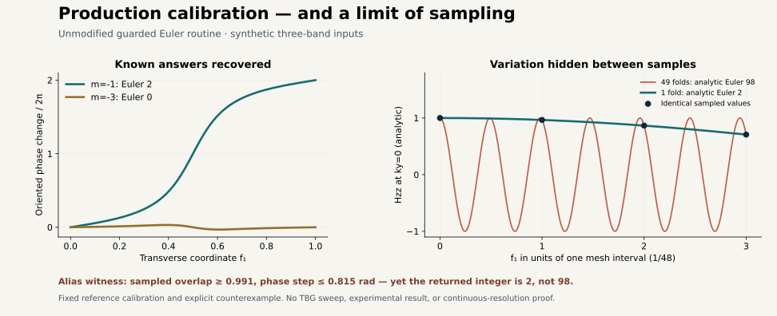

# Research questions 002: calibrating the actual guarded Euler routine

The unchanged `guarded_topology.euler_wilson` from the retained v078p archive
recovers the known Euler magnitudes **2 and 0** on two mesh sizes. Its sampled
guards reject the intended failure controls. A deliberately aliased texture
also passes those guards while returning 2 instead of its analytic value 98.
Both outcomes are part of the result.

This is a synthetic calibration of an existing production API. It is not a
graphene calculation, a repair of Fable's consumer/verifier, or physical
validation. No historical sources or results were modified.



## What ran

[calibrate.py](calibrate.py) verifies and extracts the original
`migration_contract_review/partner_v078p.zip` into a private temporary directory.
It imports **the original production module**, including its original nested
engine imports, and calls `Sampler.frame`, `Sampler.link`, and `euler_wilson`.
The latter owns the grid, links, sewing checks, orientation checks and winding.
There is no replacement eigensolver or copied implementation of that routine.

The input adapter supplies three-dimensional reference Hamiltonians from
[the first package](../research_questions_001/README.md), with coordinates
`k = 2*pi*f - pi`. It declares the real basis `U=I_3` and periodic sewing
matrices `I_3`. For the two explicit gauge controls, a subclass changes only
the orthonormal frame basis **after** the original eigensolver returns it.
The raw cases do not change those frames.

The identity basis/sewings are correct for these synthetic models. This does
**not** test the BM-specific `realify` branch or the finite-cutoff TBG
`shift_matrix` embeddings. Production API energies are expressed in meV here
only as a chosen synthetic scale; no material parameters were fitted.

The source identities, fixed cases and expected orientation relation were
recorded in [PLAN.json](PLAN.json) before execution. The process exited 0 in
14.53 seconds, with **26/26 predicates satisfied**, including the two explicit
sampling-limit predicates. That count does not mean 26 independent scientific
results or that every evaluated model was correctly classified.

## Calibration results

| Reference | Mesh | Raw production winding | Declared oriented Euler | Minimum link overlap |
|---|---:|---:|---:|---:|
| m=-1 | 48 × 48 | -2 | 2 | 0.9914448614 |
| m=-1 | 96 × 96 | -2 | 2 | 0.9978589232 |
| m=-3 | 48 × 48 | approximately 0 | approximately 0 | 0.9917291166 |
| m=-3 | 96 × 96 | 0 | 0 | 0.9978771237 |

The external gap is 2 up to floating-point error. The inherited reference
code, with an added link-quality wrapper, also returns 2 and 0 on these meshes.

**Sign convention:** production loops along coordinate 2 and scans coordinate
1, whereas the first reference loops along x and scans y. With the declared
base orientation `dkx wedge dky` and plane orientation `e1 cross e2 = n`,
`oriented_euler = -base_orientation * raw_winding`. This relation was fixed in
the plan, not selected after observing a sign. An explicit frame reflection
changes raw winding from -2 to +2 and base orientation from +1 to -1. The
oriented result stays 2. A periodic SO(2) frame change preserves raw winding.
The magnitude comparison supplies the orientation-independent calibration.

## Link and phase guards

The archived production policy **already** has `overlap_min=0.5`. Claude's
finding concerned the first reference harness, whose singularity check was
only `1e-8`. The new `strict_loop` wrapper enforces the production floor before
calling that unchanged reference multiplication. For orthonormal frames this
limits the largest sampled principal angle to at most `pi/3`; it is a local
quality rule, not a bound on motion between sample points.

The production run uses its default policy except for the stricter reference
phase ceiling `pi/2` instead of its default `3*pi/4`. This is declared in the
plan and result. No threshold was adjusted to obtain a pass.

| Control | Observed rejection |
|---|---|
| 5 × 48 coarse links along axis 1 | `overlap` (first witness 0.448441 < 0.5) |
| 48 × 5 coarse links along axis 2 | `overlap` (first witness 0.4999999999999999 < 0.5) |
| 24 × 24 transverse phase resolution | `phase_resolution` (1.584037 > pi/2) |
| Möbius bundle along axis 1 | `nonorientable_axis1` |
| Möbius bundle along axis 2 | `nonorientable_axis2` |
| Hermitian Hamiltonian with an imaginary off-diagonal term | `matrix_precondition` |
| Zero external gap | `external_gap` |
| Incorrect sewing matrix | `sewing_loss` (0.078939 > 0.05) |
| Node winding requested on the exactly degenerate doublet | `loop_internal_gap` |

The axis-2 first witness is at the threshold within roundoff. The same coarse
grid also contains the links at `f1=1/2`, `f2=0 -> 1/5`, whose exact minimum
singular value is `cos(2*pi/5)=0.30901699`; its rejection is not dependent on
roundoff at the first witness. The first package's 24-mesh rejection remains
unchanged and preserved. The new reference wrapper separately refuses a
5-point within-loop mesh and a 24-point transverse phase scan.

## A concrete limit: all sampled checks can pass an aliased model

Replace `kx` by `49*kx` in the m=-1 texture:

```
d = (sin(49*kx), sin(ky), -1 + cos(49*kx) + cos(ky)).
```

Precomposition by this 49-fold map of the torus multiplies the degree by 49,
so the oriented Euler number is **98**. Its normal never vanishes, and its
flat external gap remains 2. This is an analytic property of this constructed
model, not a numerical determination at high resolution.

At every point of the 48-interval grid, including both endpoints, this model
has exactly the same Hamiltonian as the once-folded reference in exact
arithmetic. The measured maximum matrix difference is `6.62e-14`. Production
returns **1.999999999999997** after orientation conversion, with minimum
overlap **0.9914448614** and largest phase increment **0.814409 rad**. Every
sampled link, gap and phase guard therefore passes.

The two `sampling_limit` predicates intentionally record this mismatch. They
are **not** a claim that the 98 texture has been successfully measured as 2.
Even large sampled overlaps cannot prove resolution without further control
of unsampled variation. This counterexample concerns a deliberately chosen
synthetic model; it is not evidence that retained graphene labels are wrong.
No finite-cutoff or continuous-path claim is added.

## Reproduce and inspect

From the repository root, with the first package's pinned NumPy/SciPy versions:

```
OPENBLAS_NUM_THREADS=1 OMP_NUM_THREADS=1 MKL_NUM_THREADS=1 \
  python -B research/benchmarks/research_questions_002/calibrate.py --output NEW_DIRECTORY
python research/benchmarks/research_questions_002/render.py
```

The numerical script refuses an existing output directory. Results, log and
the process receipt are retained here. Each case records complete Wilson
phases, rejection records, counts and selected diagnostic extrema. The full
frame/link stream is hashed but **not** retained; its hash is not independent
attestation. The manifest binds files and source identities, not physical
truth. Rendering reads the retained results and adds explicitly labelled
analytic curves; it does not rerun the production routine.

This pass closes the additive reference link-floor item and completes a
bounded calibration of the actual guarded Euler API. It does not close the
v078 consumer/verifier corrections or validate the whole TBG workflow.

The next useful extensions are to test nontrivial finite-cutoff boundary
sewing and to introduce a separately specified split-band reference for node
charges and braiding. Stronger resolution evidence must compare refinements
or impose justified variation bounds; the alias example prevents treating
the overlap floor alone as a certificate.

Partner review context: [Claude's findings](https://github.com/alanfuller15/Twistronics/pull/2#issuecomment-5789678063)
and [Codex's qualification](https://github.com/alanfuller15/Twistronics/pull/2#pullrequestreview-5287309815).
The present code/results have been prepared for a new partner review; the
earlier 47-check reproduction must not be described as review of this pass.
