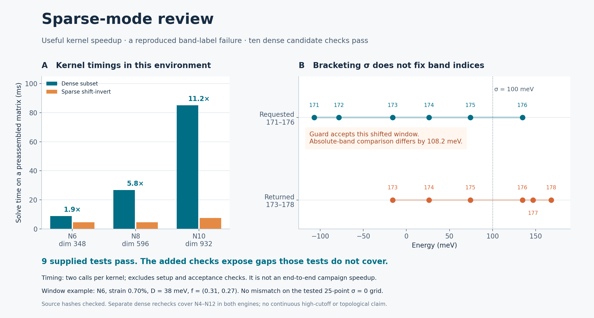

# Sparse-mode review: useful acceleration, guards still incomplete

**The supplied N10/N12 event candidates survive dense rechecking, and the five-cutoff follow-up passes in both Hamiltonian implementations.** All nine supplied tests pass. The sparse kernel is faster in the supplied probe, but the claim that its window guard prevents band relabeling is too strong. A shifted-window counterexample and several locator defects are retained below. The production acceptance path has not been switched to this sparse engine.



This review builds on the [conditional local continuation](../joint_mapping_continuation). It adds sampled higher-cutoff checks at one strain. It does not extend continuous tracking to N8–N12 or establish a braid, Euler-class change or complete node inventory.

## Contribution and source review

The [v071p archive](partner_v071p.zip) is preserved byte for byte, SHA-256 `5d7799246b0dd7fcf7021c63e22c38498836380fe159501dce69527ce9b49e38`. It contains 16 files. The [manifest](INPUT_MANIFEST.json) binds each member. [SOURCE_COMPARISON.json](SOURCE_COMPARISON.json) compares it with the preceding partner mapping archive.

The useful new pieces are explicit fixed reciprocal-index arguments in both native engines and a sparse matrix pattern that updates only the kinetic blocks. `fast_engine.py` is unchanged from the earlier partner version, including its unguarded Newton behavior. The two native-model changes are confined to accepting and constructing the explicit basis; the integer-index physics assembly is otherwise unchanged. Existing team adapters already support a declared common basis.

Inspection found no network calls, subprocess launches or deletion operations in the imported path. `solver_probe.py` performs numerical work at import/top level and was executed deliberately as a separate process. The `locate_event.py` CLI reads `/home/claude/joint/seeds_legA.json`, which is absent from the archive, and overwrites `locate_event_results.json`; that CLI was not run. Legacy charge/Euler calculations were not used as evidence. Extraction verifies all input hashes and never patches the partner files.

## Dense candidate checks

State: strain 0.0071 (0.71%), strain angle 15°, twist 1°, P=1, exact geometry, `lab_nn_full`, constant w₁=110 and w₀=88 meV. D means opposite layer potentials ±D in meV, without experimental calibration.

Each cutoff uses the union of native index sets at the seven declared sampled strains 0.0068, 0.0070, 0.0071, 0.0072, 0.0074, 0.0076 and 0.0078. The full sorted sets are saved in [BASIS.json](BASIS.json). A union over these samples is not a proof that it contains every radial basis at every intervening strain.

| N label | Fixed vectors | Dimension | Rechecked D, BM (meV) | Both engines |
|---:|---:|---:|---:|---|
| 4 | 37 | 148 | 38.82977658 | pass |
| 6 | 89 | 356 | 38.82262851 | pass |
| 8 | 149 | 596 | 38.82263675 | pass |
| 10 | 237 | 948 | 38.82263675 | pass |
| 12 | 335 | 1340 | 38.82263675 | pass |

The largest BM/REF event-D difference is 2.88 × 10⁻¹² meV, rounded upward. Final native complex spectra have crossing gaps below 3.00 × 10⁻¹¹ meV and matrix-entry disagreement below 3.19 × 10⁻¹² meV relative to the affine-real matrices. Agreement at displayed digits is sampled cutoff stability, not an infinite-cutoff error bound or physical precision.

**This N6 basis is not the 87-vector basis of the preceding continuous branch.** It adds `(-5,4)` and `(5,-4)`, giving dimension 356 instead of 348. The sampled table must not silently replace that branch's finite model. The timing probe also uses native radial bases, giving N10 dimension 932 rather than this event check's fixed-union dimension 948.

Only N10 and N12 rows are present in the supplied results JSON; the five-row table in the partner note is not backed by five retained JSON rows in this archive. The absent seed file also prevents an exact replay of its CLI. Our declared follow-up uses the supplied N10 coordinates/D to seed N4–N10 and the supplied N12 record for N12, with model parameters taken explicitly from the note and frozen in [PLAN.json](PLAN.json).

For each engine/cutoff, the published guarded dense solver constrains all three roots to fixed ±0.02 coordinate boxes. A Brent solve stays within ±0.03 meV of the supplied D, uses one unchanged signed-offset gate of 10⁻⁹, and explicitly retrieves the measurement at the returned D. Every accepted measurement checks native ordered-band spectra, finite-segment interior, root separation, periodic images and the coordinate domain. These sampled checks do not certify continuous identity or uniqueness between scalar evaluations.

All ten cases pass. Production retained 868 root/native spectral evaluations and took 119.9 seconds here; reporting repeats 60 final native/affine spectral evaluations. The two engines share an adapter and diagnostics, so this is numerical consistency checking, not physical validation. The report uses published methods and is not an independently coded proof.

## Sparse window: a real counterexample, with its limits

At N6, strain 0.007, D=38 meV and f=(0.31,0.27), construction passes its default probe check. A subsequent call with **σ=100 meV** accepts the following window:

| Meaning | Absolute band indices, zero based |
|---|---|
| Central six bands assumed by `frame_band` and `newton_node` | 171–176 |
| Six eigenvalues actually returned near σ=100 | 173–178 |

The accepted values straddle σ and have a small eigenvector residual, but differ from the requested ordered window by as much as **108.2 meV**. Thus accurate eigenpairs plus straddling the shift do not establish absolute band indices. The API explicitly accepts a caller-selected σ; the counterexample does not claim that the supplied zero-shift event computations used σ=100.

On the frozen **25-point grid at σ=0**, no ordered-window mismatch was found. That finite negative result is retained, and it is not a global guarantee. All supplied event candidates also passed the separate dense checks. The review does not infer that those candidates are false.

This behavior is consistent with [SciPy's `eigsh` contract](https://docs.scipy.org/doc/scipy/reference/generated/scipy.sparse.linalg.eigsh.html): shift-invert selects eigenvalues near a shift, rather than assigning requested absolute indices. A valid acceptance path needs a justified index count/window identity and eigenpair quality checks. Dense ordered-band comparison at accepted states is a conservative interim check; its cost must be included in any throughput claim.

## Other reproduced and source-level findings

[REGRESSIONS.json](REGRESSIONS.json) retains the real-matrix checks and explicitly labeled test doubles. Test doubles exercise contracts, not physical counterexamples.

| Finding | Evidence | Consequence / correction |
|---|---|---|
| Certification is confined to the construction probe | An instrumented successful measurement calls `certify` only at (0.31,0.27); `RECERT=8` is unused | Implement and enforce checks at actual solve states; do not call this periodic path certification |
| `certify()` returns an error number without refusing disagreement | At σ=100 it returns about 108.2 meV without raising | A caller must enforce a finite error threshold; construction alone only checked its own probe |
| Upper node has no movement-box check | A test double moves it by 0.2 with declared box 0.03 and still passes segment acceptance | Apply bounded, evaluated root checks to every tracked root |
| Cumulative sparse counts are repeatedly added | An instrumented real measurement reports 19 sparse solves for 9 calls; a minimal test double reports 15 for 7 | Count deltas or one final total; count the dense certification solve separately |
| Returned D is paired with `last['r']` | A test double returns an earlier evaluated D=0.2 after evaluating 0.21; the locator emits an accepted mixed record | Retrieve or recompute the measurement at the exact returned D; this is not asserted to have occurred in the supplied run |
| Fractional indices are silently truncated | Both constructors turn ±1.9 into ±1 | Reject noninteger, nonfinite or malformed index sets before assembly |
| Exhausted sparse Newton returns a stale gap | One iteration returns a new coordinate with reported gap 0.0249588 meV, while its fresh ordered-band gap is 0.0000308006 meV | Return diagnostics evaluated at the returned coordinate; this case has `converged=False` and is rejected by the current locator |

The locator also uses carried seeds and checks flat-node movement relative to the preceding evaluation, rather than a frozen full-run box. Root steps are only norm-limited, without the published solver's backtracking/overlap safeguards. Source inspection found no explicit all-root unit-square/image-change checks, and no declared positive flat-pair separation gate beyond the geometry calculation. Those observations are distinguished from the reproduced cases above. More frequent samples by themselves would not supply the continuous-branch argument already developed elsewhere.

## Timing result

The supplied probe was run unchanged, with one BLAS thread, two calls per kernel, at one preassembled matrix per cutoff. Its retained rounded output is [SOLVER_PROBE.log](SOLVER_PROBE.log); parsed values are in [TIMINGS.json](TIMINGS.json).

| Native N / dimension | Dense subset | Sparse shift-invert | Observed ratio |
|---|---:|---:|---:|
| 6 / 348 | 8.9 ms | 4.6 ms | 1.9× |
| 8 / 596 | 26.7 ms | 4.6 ms | 5.8× |
| 10 / 932 | 85.1 ms | 7.6 ms | 11.2× |

This reproduces a useful kernel speed advantage. The probe's sparse solve excludes CSR construction, dynamic assembly, model setup and acceptance checks. It is not a timing of a guarded end-to-end campaign or a scaling forecast. Its matrix is first assembled densely and then converted to CSR; the separately supplied sparse update implementation is covered by the matrix-equality test, not by this kernel timing. Performance does not establish a cutoff error bound relative to event spacing.

## Reproduction and handoff

Use the full branch, not this folder alone. Python, NumPy, SciPy, Matplotlib and pytest are required. Production used Python 3.12.14, NumPy 2.3.5 and SciPy 1.17.0. Supplied tests ran under pytest 9.1.1 with plugin autoload disabled. The first test invocation found pytest missing; [SUPPLIED_TESTS_INITIAL_SETUP.log](SUPPLIED_TESTS_INITIAL_SETUP.log) is that setup failure, and [SUPPLIED_TESTS.log](SUPPLIED_TESTS.log) records the subsequent **9 passed** after installing the dependency. This was not a failed scientific assertion or a changed test.

To reconcile the retained candidate records and regenerate the figure:

```bash
OPENBLAS_NUM_THREADS=1 OMP_NUM_THREADS=1 python report.py
OPENBLAS_NUM_THREADS=1 OMP_NUM_THREADS=1 python figure.py
```

For a fresh review, use a disposable checkout and move retained generated records/logs aside. Then run:

```bash
OPENBLAS_NUM_THREADS=1 OMP_NUM_THREADS=1 python regressions.py
OPENBLAS_NUM_THREADS=1 OMP_NUM_THREADS=1 PYTEST_DISABLE_PLUGIN_AUTOLOAD=1 python -m pytest -q -p no:cacheprovider original/test_sparse_engine.py original/test_fixed_basis.py --junitxml=SUPPLIED_TESTS.xml > SUPPLIED_TESTS.log
OPENBLAS_NUM_THREADS=1 OMP_NUM_THREADS=1 python original/solver_probe.py > SOLVER_PROBE.log
python review_metadata.py
OPENBLAS_NUM_THREADS=1 OMP_NUM_THREADS=1 python check_candidates.py
OPENBLAS_NUM_THREADS=1 OMP_NUM_THREADS=1 python report.py
OPENBLAS_NUM_THREADS=1 OMP_NUM_THREADS=1 python figure.py
```

The candidate runner refuses to overwrite `CANDIDATES.json`. Source and plan hashes bind numerical records. The report reconstructs native final spectra and audits retained boxes, geometry, costs and returned-D binding. `MANIFEST.json` hashes each release file except itself. The original archive is extracted into ignored `original/` only after validation. Regenerated timing/artifact bytes may differ across environments.

The next useful software step is to integrate sparse assembly into the existing guarded solver with explicit ordered-band validation and corrected event/accounting contracts, then measure the complete guarded path. The candidate and performance evidence here justifies that work; it does not waive those gates.

Parent commit: `d963faf0b114751045c49c6f28d711593b49ce47`. Changes are confined to `research/benchmarks/sparse_mode_review`.
