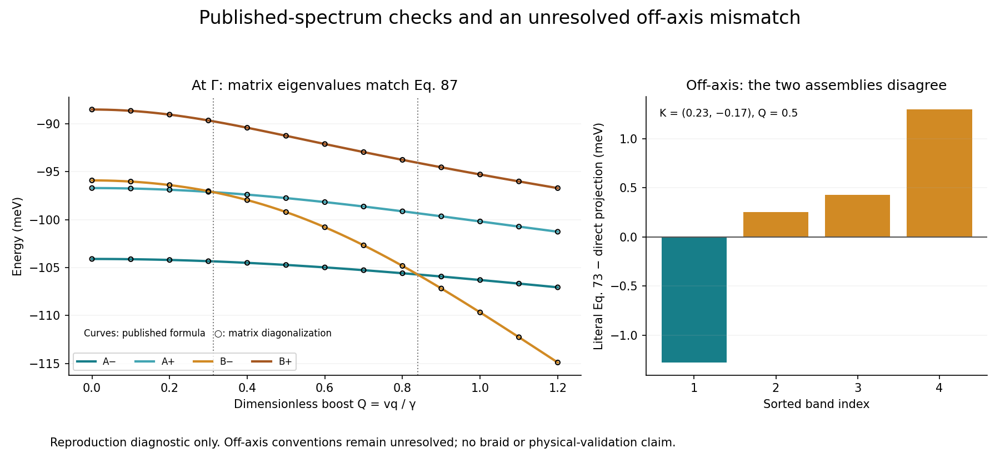

# Vafek paper benchmark: first reproducible checkpoint

**Status: spectral checks pass; the off-axis node benchmark remains unresolved.**

This checkpoint audits the uploaded v067 package and implements a separate four-band, one-spin projected model from [Herzog-Arbeitman et al., arXiv:2502.08700v2](https://arxiv.org/html/2502.08700v2). It does not extend or validate the archived v067 continuum calculation.



## Results

| Check | Observed result | Interpretation |
|---|---:|---|
| Γ spectrum versus HTML Eq. 87 | maximum error 1.28e-13 meV | Reference-formula comparison passes |
| Unboosted kx-axis spectrum versus Eq. 77 | maximum error 8.53e-14 meV | Reference-formula comparison passes |
| Γ crossing Qn | 0.3134046484 | Root of the full projected-spectrum branch equality |
| Γ crossing Qg | 0.8389599968 | Root of the full projected-spectrum branch equality |
| Eq. 23 approximations | Qn=0.3321819194; Qg=0.9216693269 | Deviations 5.99% and 9.86% for these rounded parameters |
| Two assemblies at K=(0.23,-0.17), Q=0.5 | maximum sorted-spectrum difference 1.2986822493 meV | Convention/implementation discrepancy remains open |
| Archived v067 evidence | 47 frozen external hashes, all runner hashes, ten checkpoint/frame bindings match | Internal consistency only |
| Archived tests | 107 retained JUnit cases; artifact hashes match | Historical tests were not rerun |

Momentum is dimensionless: K=vk/gamma, Q=vq/gamma. Energy is meV; v=-4300 meV Å and gamma=-24.8 meV. The specified strain is 0.15%, with epsilon_minus=-0.00087. This uses rounded published parameters and the declared projected approximation, not a pixel-exact reproduction of Figure 5.

## What is unresolved

`Model.h` combines the literal HTML Eq. 73 kinetic term with the projected Eq. 74 interaction. `Model.direct_projection` independently assembles the earlier 12-component Hamiltonian and projects it using the flat-band columns. Both implementations were written here, so they are not independent external validation.

In the chosen fixed basis, the c–f strain block in Eq. 35 produces a scalar term with the opposite sign to the one printed in Eq. 73. The two assemblies agree at Γ and on ky=0, so those passing tests cannot resolve the off-axis discrepancy. This is a reproducible convention/implementation question, **not an author-confirmed correction or a claim that the paper is wrong**.

A dense local search within radius 0.12 finds 0→2 adjacent-gap nodes across Qn for the direct assembly, versus 0→0 for the literal assembly. Both show 2→0 lowest-gap nodes across Qg at the probed stations. These are finite local observations, not a complete non-Abelian braid calculation. Details and all candidate roots are retained in `ASSEMBLY_COMPARISON.json`.

The first run also failed a search-refinement assertion: enlarging the search region and refining its grid found additional roots. Its initial global node-count hypothesis was our assumption, not a published assertion. `attempt1.zip` retains that runner, plan and failed log. The current runner records these unresolved outcomes instead of discarding all measurements. Its zero exit status means report generation completed; **the authoritative status in RESULTS.json is unresolved, not PASS**.

The HTML appendix's Eq. 92 also differs from the main-text approximation. This checkpoint reports Eq. 23 separately from numerical branch crossings; it does not silently substitute one formula for another. For zero strain, direct algebra of Eq. 87 gives Qg²=2J(J+4M)/[U1(J+2M)], matching our numerical branch solve to 2.34e-15 in Q.

## Reproduce and review

With Python and the packages in `requirements.txt`, from the repository root:

```sh
OPENBLAS_NUM_THREADS=1 python research/benchmarks/vafek_2025/run_benchmark.py
OPENBLAS_NUM_THREADS=1 python research/benchmarks/vafek_2025/compare_assemblies.py
python research/benchmarks/vafek_2025/render.py
```

The first two commands solve small matrices and perform bounded root searches; they overwrite only their benchmark JSON reports. Rendering overwrites the PNG. They do not import the archived project or run a continuum/Hartree-Fock campaign. `RESULTS.json` records source hashes, versions and all 61 sampled boost states. `PLAN.json` preserves the initial hypothesis; `SOURCES.json` states provenance and conventions. `AUDIT.md` contains the ranked actions, scope and findings; `audit-layer1.json` retains the full scanner ranking.

Review acceptance: inspect the unresolved status, reproduce the two spectral residuals, then check the off-axis matrices and local roots with independently derived conventions. Hash agreement and self-tests do not settle the scientific interpretation. No Euler-class computation, quaternion-charge transport, self-consistent Hartree-Fock or experimental prediction is claimed.

## Next scientific gate

Resolve the off-axis convention against the published Hamiltonian and an independently checked basis transformation, then freeze one interpretation. Only after that should the existing frame-transport machinery be tested on the full node sequence. The relation to v067 model controls, and any distinct contribution beyond this published mechanism, remains unestablished.
