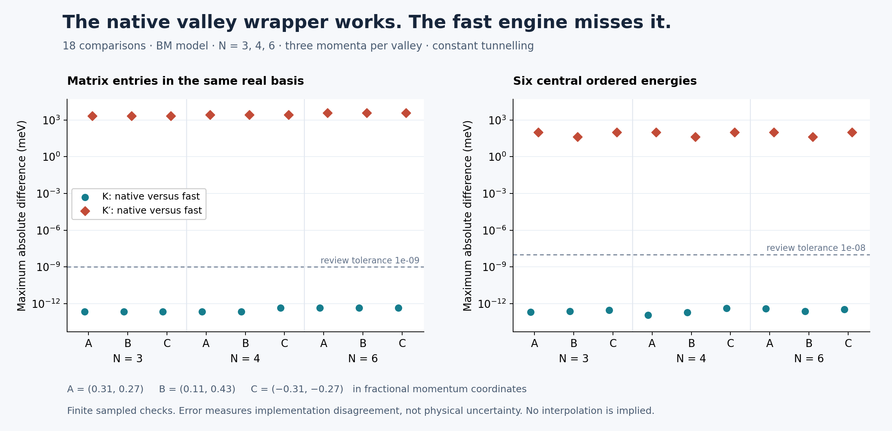

# v073p review — useful native controls, incomplete valley integration

The native opposite-valley definition passes its exact time-reversal check, and the five supplied tests pass. The unchanged fast engine does **not** support that valley: it still assembles the K-valley Hamiltonian. Across nine K′ samples, its six central energies disagree with the native model by **43.25–100.19 meV**. Integration of the claimed unchanged downstream support is withheld.

The unchanged control runner completes and largely reproduces its recorded native results. Its claimed fully mirrored charge comparison is not generated by the supplied code. These are exploratory controls; the earlier sparse integration findings remain open and the previous numerical campaigns are unchanged.



All 18 comparison rows are retained in [PROBES.json](PROBES.json). A, B and C identify the three declared momenta, not a continuous path. These differences measure implementation disagreement, not physical uncertainty. [Vector figure](valley_review.svg) · [Plotting source](figure.py) · [Source binding](FIGURE.json).

## What reproduces

| Check | Retained result | Scope / evidence |
|---|---|---|
| Supplied tests | 5 passed | Unchanged `test_valley_chiral.py`; [log](SUPPLIED_TESTS.log) and [JUnit](SUPPLIED_TESTS.xml). Tests exercise native BM, not the fast K′ engine. |
| Native K′ time reversal | Exact matrix equality at all 9 review points | `H_K′(k) = conj(H_K(-k))`; [PROBES.json](PROBES.json). This is an algebraic wrapper check, not a second independently coded valley model. |
| K fast versus native | Maximum matrix error 4.57×10⁻¹³ meV; energy error 4.37×10⁻¹³ meV | 9 positive controls at N=3,4,6. |
| Chiral N6 control | Wilson estimate −1, closure 0.99304; two discovered nodes near (0,0), (1/3,1/3); SAME label | [Unchanged-run log](PARTNER_REPLAY.log) and [regenerated record](REPLAY_CHIRAL_CONTROL.json). Node discovery is not a complete inventory. No new mesh-refinement or global isolation certificate is supplied. |
| Strained native N4 controls | Baseline Wilson magnitudes 1 in both valleys; endpoint signs match | [Regenerated valley record](REPLAY_VALLEY_MIRROR.json). Signs of Euler estimates remain convention-dependent. |

Review model for the fast-engine comparison: default θ=1.05°, ε=0.003, `kinetic='lab_nn_full'`, `geometry='exact'`, default constant w₁=110 meV and w₀/w₁=0.8. Fractional momenta are (0.31,0.27), (0.11,0.43), (−0.31,−0.27). Ordered reciprocal bases have 29, 49 and 113 vectors at N=3,4,6, giving dimensions 116,196,452. [BASIS.json](BASIS.json) retains every index in order and its hash; [PLAN.json](PLAN.json) fixes thresholds and budgets before execution.

## Findings to correct

| ID | Finding | Evidence and required next action |
|---|---|---|
| V01 — integration blocker | Fast engine ignores `valley` | `RealEngine` reads static and kinetic fields directly and never uses the new `BM.H` wrapper. Every K′ review sample fails both declared comparison tolerances, while its fast matrix matches K at the same k. Reject unsupported K′ requests or implement and test the complete transformed matrix, derivatives and frame path. Sparse support is not established by this archive. |
| V02 — reproducibility gap | Fully mirrored result has no supplied producer | Replay retains K=OPPOSITE, K′=SAME at B=−0.30. It removes four fields from the supplied valley JSON, including `braid_-0.3_-1_fully_mirrored`. `pair_charges` always starts at +r and uses the same circle parameterization. Supply executable mirrored seeds, images, offsets, loops and transport paths. A missing producer does not prove the manually reported corrected label is false. |
| V03 — missing guard / mislabeled diagnostic | `min_det` is the minimum determinant of polar factors of entire Wilson products | It is not a plaquette determinant, an overlap singular value or an isolation bound. A synthetic rank-zero Wilson product returns `min_det=1`, closure=1 without rejection. That synthetic example has Euler estimate 0; it does not reproduce or disprove the physical magnitude-one controls. Retain singular values, sewing loss, reality/isolation checks and refinement evidence. |
| V04 — missing guard | Band sign helper discards the imaginary part without enforcing reality | Native BM with mass=1 meV has a real-basis imaginary residual ≈1 meV. `real_frame` rejects it; `band_sign_holonomy` returns ≈0.999998. Enforce the real-model precondition and nondegenerate-band/overlap checks. This negative control does not invalidate the supplied massless endpoint samples. |
| V05 — API defect | `euler_wilson(lo=...)` ignores `lo` | It always calls the central-pair helper. A labeled synthetic probe returns normally even for `lo=999`. Implement band selection or explicitly restrict the interface. |
| V06 — signed claim needs correction | “sum +2 = 2e₂” contradicts the retained e₂=−1 | Saved winding sum is 1.998876316; 2e₂ is −2. Ahn–Park–Yang use total winding **−2e₂** in their convention. Align the actual frame/loop conventions before claiming a signed match; magnitude agreement alone is narrower. |
| V07 — incomplete benchmark provenance | The bandwidth scan is inherited, not recomputed | `run_controls.py` loads the old chiral JSON and replaces only `chiral_euler`. It does not compute the N6/N8 bandwidth scan or the saved symmetry residual. The last supplied test checks one chosen α near 0.586; it neither locates nor brackets a minimum. Supply scan rows, the momentum grid, producer and refinement protocol. |

Numerical and synthetic findings are separated in [PROBES.json](PROBES.json). [SUMMARY.json](SUMMARY.json) reconciles all retained spectrum differences and gives the complete before/after JSON field comparison. The chiral replay agrees apart from two last-digit winding changes (less than 4×10⁻¹⁶). Four chiral metadata fields are explicitly classified as inherited rather than recomputed.

## References and interpretation

[Tarnopolsky, Kruchkov and Vishwanath, arXiv:1808.05250](https://arxiv.org/abs/1808.05250) study the chiral continuum model and give the first magic coupling approximately 0.586, supported by analytic and numerical analysis. The decimal is not an exact analytic constant. A minimum on a coarse angle grid is a sampled minimum; without additional reasoning it is not a certified numerical bracket.

[Ahn, Park and Yang, arXiv:1808.05375](https://arxiv.org/abs/1808.05375) relate total node winding to −2e₂ with their conventions. The comparison requires compatible orientation conventions and the assumptions for an isolated real two-band system. This review adds no claim of novelty, experimental validation, complete inventory or continuous topological certification.

## Fable handoff

[RESPONSE_TO_FABLE.md](RESPONSE_TO_FABLE.md) gives specific next deliverables. [FABLE_SPARSE_REQUIREMENTS.md](FABLE_SPARSE_REQUIREMENTS.md) preserves the earlier F01–F08 brief. v073p describes a different exploratory contribution: absence of those fixes is **not** labeled a regression. None of the sparse integration blockers is closed here.

## Reproduce

Use Python 3.12 and [REQUIREMENTS.txt](REQUIREMENTS.txt). Run from a fresh checkout/copy of this folder; the full runner writes new output records locally. The preserved partner ZIP is never modified. No private seed paths or network access are needed once dependencies are installed.

```bash
python -m pip install -r REQUIREMENTS.txt
python run_review.py
python report.py
python figure.py
```

`run_review.py` verifies and extracts the original archive, runs the five tests, runs the 18 comparison rows and three contract probes, then executes the unchanged partner runner in a disposable directory. It enforces one BLAS thread and timeouts of 180, 120 and 300 seconds respectively. A pre-existing replay directory causes explicit refusal; use a fresh copy for another full run. Do not run the partner entrypoint directly against preserved source records: it overwrites its JSON files.

For a quick reconciliation without rerunning numerics:

```bash
python report.py
```

For only the targeted numerical probes, in a disposable copy:

```bash
python probes.py
```

[EXECUTIONS.json](EXECUTIONS.json) retains process exit status and elapsed time. The full replay took 192.64 s with profiling; its 8,660 native-H calls and 8,660 SciPy eigensolver calls are separately counted in [REPLAY_CALLS.json](REPLAY_CALLS.json). These are function-entry totals, not a per-evaluation spectral ledger or a performance benchmark. No speedup is claimed. [CLEAN_SMOKE.json](CLEAN_SMOKE.json) records a fresh-copy repeat of the supplied tests, targeted probes and reconciliation.

Base commit: `f9b7219091eb23b8ea7423611cea4f8e88438ceb`. Original v073p archive SHA256: `5144c4d01620720a882d90ac191dff684b76d68213532cb1c741e08c2c60d382`. [INPUT_MANIFEST.json](INPUT_MANIFEST.json), [SOURCE_COMPARISON.json](SOURCE_COMPARISON.json) and [SOURCE.diff](SOURCE.diff) bind input identity and changes from v071p. The original archive retains all partner sources and claims unchanged.
