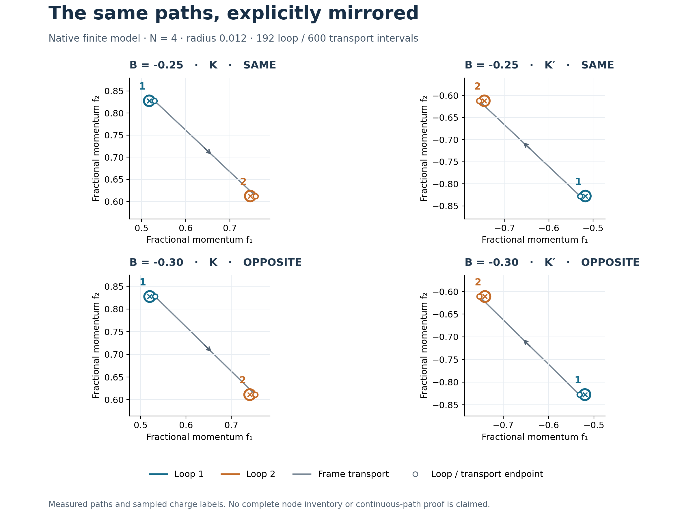

# Guarded variant measurements

This branch implements the focused corrections identified in the [v074p response review](../variant_response_review/README.md). The new opt-in APIs use explicit mirrored coordinate arrays, enforce sampled topology gates, and require a native dense comparison for every accepted sparse window. Historical producers and input archives remain unchanged.

**38 regression tests pass.** The bounded run contains 16 pair measurements, six Wilson meshes, sixteen sign cycles and twelve sparse requests. The tables below are generated from retained records by `report.py`; they are not manually transcribed verdicts.



The figure shows the recorded fine-mesh paths at radius 0.012. Centers, circles, their starts, and the connecting transport segment all undergo the same coordinate inversion. Colored circles identify the two nodes; signed winding depends on the arbitrary base-frame orientation. These are momentum-coordinate paths, not a movie of nodes braiding in parameter space.

## What changed

| Contract | Implemented behavior | Scope |
|---|---|---|
| Loop/base agreement | Explicit closed circles and full transport arrays; mismatched endpoints are refused. K′ uses the exact negative of every K coordinate. | Unwrapped finite-model comparison; no periodic-image substitution. |
| Root checks | Both centers are evaluated natively and must meet the frozen gap threshold. | Uses retained K seeds; no new root search or inventory. |
| Topology acceptance | Native reality, Hermiticity, both available external gaps, pair/single-band overlap, phase increments, and both endpoint sewing directions are enforced. | Sampled gates; no unsampled lower bounds. |
| Wilson product | Gate each link, then multiply its polar factor. Actual endpoint frames separate sewing from the last finite mesh step. | Finite-cutoff sewing is approximate; estimates need not be exact integers. |
| Sparse acceptance | Bind the candidate matrix to the native matrix, solve native absolute ordered bands, then check candidate energies, residuals, orthogonality and subspace agreement. | Conservative dense-assisted window mode; no speedup or root/event claim. |
| Work records | Disjoint component durations and counts; separately named inclusive attempt times; failures retained. | Counts for these APIs, not an audit of all historical consumers. |

The old LU diagonal “inertia proof” is **not used** by the new mode. General pivoted LU remains only as an inverse operator for ARPACK. Its row/column permutations do not supply an inertia certificate. Small residuals alone never authorize a band-window label.

## Mirrored pairs

N=4; θ=1.05°; ε=0.003; φ=0°; A=0.2; `lab_nn_full`; exact geometry; w₁=110 meV and w₀/w₁=0.8. The perturbation is B times the declared sine σz harmonic. The ordered basis is frozen before each model is constructed; complete defaults, harmonics and indices are in [MODELS.json](MODELS.json).

Each row covers radii 0.012 and 0.008 and loop/transport interval counts 96/300 and 192/600. Paths stay at their actual unwrapped coordinates; no modulo operation moves a K′ node to a different finite-cutoff Hamiltonian.

| B | Valley | Passed / attempted | Relative label | Minimum link singular value | Minimum sampled external gap (meV) |
|---|---|---|---|---|---|
| -0.25 | K | 4/4 | SAME | 0.998029 | 2.90057 |
| -0.25 | K′ | 4/4 | SAME | 0.998029 | 2.90057 |
| -0.30 | K | 4/4 | OPPOSITE | 0.996846 | 1.56731 |
| -0.30 | K′ | 4/4 | OPPOSITE | 0.996846 | 1.56731 |

Largest evaluated center gap: **1.53e-10 meV**, against 10⁻⁶ meV. Largest entrywise native difference in H_K′(−k) versus conjugate(H_K(k)) over every retained loop/transport/center coordinate: **0 meV**. This equality is also built into the native valley wrapper; it is an implementation consistency check, not an independently coded K′ model.

All four loop/radius refinement comparisons and all eight valley-pair comparisons are retained in [SUMMARY.json](SUMMARY.json). Their pass flags must be consulted if regenerating this report. Earlier producer labels remain historical results; this measurement changes their geometrical implementation rather than silently replacing their evidence.

## Wilson meshes with enforced gates

The strained baseline has A=0, B=0, N=4 and the same strain/kinetic settings as above. The chiral control has N=6, θ=1.06°, ε=0, w₀=0 and `kinetic=none`. No bandwidth scan is rerun.

| Model | Intervals k₁ × k₂ | Euler estimate | Minimum link singular value | Maximum endpoint sewing loss | Minimum sampled external gap (meV) |
|---|---|---|---|---|---|
| baseline_v1 | 24 × 40 | -1.000051593 | 0.748131 | 0.000617827 | 5.249126 |
| baseline_v1 | 48 × 80 | -1.000051490 | 0.900533 | 0.000617827 | 5.017501 |
| baseline_v-1 | 24 × 40 | +0.999520308 | 0.749614 | 0.00602109 | 5.284422 |
| baseline_v-1 | 48 × 80 | +0.999520347 | 0.902071 | 0.00602109 | 5.060995 |
| chiral_N6 | 18 × 30 | -1.000000000 | 0.988177 | 6.66134e-16 | 101.834333 |
| chiral_N6 | 36 × 60 | -1.000000000 | 0.997011 | 6.66134e-16 | 101.834333 |

The grid includes both endpoints: (n₁+1)(n₂+1) native frame evaluations. Sewing loss is max |1−σᵢ| for the overlap between the actual endpoint frame and the sewn starting frame. It no longer includes a missing last mesh step. The small noninteger offsets for strained models persist under refinement and must not be presented as cutoff accuracy or an exact topological certificate. Only magnitudes are compared across arbitrary frame orientations. No signed Euler/total-node relation is asserted; see the [reference qualification](../variant_response_review/REFERENCES.md).

## Single-band endpoint cycles

The endpoint uses N=4, ε=0.003, φ=80°, A=−0.30, ratio=0.88, plus the declared −0.40 and layer-antisymmetric −1.8 sine σz harmonics. Both 80- and 160-interval runs are retained; this table shows the latter. Mesh comparisons are in SUMMARY.json.

| Valley | Band | Axis | Sign / refusal | Minimum sampled isolation gap (meV) |
|---|---|---|---|---|
| +1 | flat1 | 0 | -1 | 24.8262 |
| +1 | flat1 | 1 | +1 | 17.4929 |
| +1 | flat2 | 0 | +1 | 4.52327 |
| +1 | flat2 | 1 | +1 | 39.816 |
| -1 | flat1 | 0 | -1 | 24.7878 |
| -1 | flat1 | 1 | +1 | 17.4964 |
| -1 | flat2 | 0 | +1 | 4.50821 |
| -1 | flat2 | 1 | +1 | 39.8201 |

## Sparse windows: accept or refuse

These twelve requests use six absolute central bands, a fixed 14-eigenpair ARPACK request, and both shifts 0 and 100 meV. A shift does not define an absolute band index. A missing target window is refused without retry or silent fallback. Every accepted window includes a native dense solve, so this is not a sparse performance benchmark.

| Valley | Fractional coordinate | Shift (meV) | Outcome |
|---|---|---|---|
| +1 | [0.31, 0.27] | 0 | ACCEPTED_DENSE_CHECKED |
| +1 | [0.31, 0.27] | 100 | ACCEPTED_DENSE_CHECKED |
| +1 | [0.11, 0.43] | 0 | ACCEPTED_DENSE_CHECKED |
| +1 | [0.11, 0.43] | 100 | ACCEPTED_DENSE_CHECKED |
| +1 | [-0.31, -0.27] | 0 | ACCEPTED_DENSE_CHECKED |
| +1 | [-0.31, -0.27] | 100 | ACCEPTED_DENSE_CHECKED |
| -1 | [0.31, 0.27] | 0 | ACCEPTED_DENSE_CHECKED |
| -1 | [0.31, 0.27] | 100 | ACCEPTED_DENSE_CHECKED |
| -1 | [0.11, 0.43] | 0 | ACCEPTED_DENSE_CHECKED |
| -1 | [0.11, 0.43] | 100 | ACCEPTED_DENSE_CHECKED |
| -1 | [-0.31, -0.27] | 0 | ACCEPTED_DENSE_CHECKED |
| -1 | [-0.31, -0.27] | 100 | ACCEPTED_DENSE_CHECKED |

The regression suite also injects exact eigenpairs from the wrong absolute window and checks their refusal despite good residuals. The former 2×2 LU counterexample remains in the suite: signed U-diagonal count 0, actual negative eigenvalue count 1. The new mode makes no inertia claim.

## Evidence and reproduction

- [PLAN.json](PLAN.json): thresholds and finite run matrix frozen before the first test; SHA256 `6f14b5b29040df977c2aae5f9caf3d00a354439a1d2f1089f0ec2d244d697a8b`.
- [RESULTS.json](RESULTS.json), [SUMMARY.json](SUMMARY.json), [EVALUATIONS.jsonl.gz](EVALUATIONS.jsonl.gz): every attempt, native spectra, gaps, links, phase increments, comparison checks and work records.
- [PATHS.json.gz](PATHS.json.gz), [MODELS.json](MODELS.json): full coordinate arrays and ordered basis/model identities.
- [TESTS.log](TESTS.log), [TESTS.xml](TESTS.xml): regression outcomes. [CLEAN_SMOKE.json](CLEAN_SMOKE.json) and [CLEAN_EVIDENCE.zip](CLEAN_EVIDENCE.zip): fresh-source tests and four targeted repeated requests, without inherited result files.
- [NEGATIVE_CONTROLS.json](NEGATIVE_CONTROLS.json): structured refusal records for six synthetic controls and the retired 2×2 inertia counterexample, generated by `record_controls.py` after the numerical campaign.
- [partner_v074p.zip](partner_v074p.zip), [INPUT_MANIFEST.json](INPUT_MANIFEST.json): byte-preserved partner input. [SOURCE.diff](SOURCE.diff) records this branch's added implementation sources. No original source is patched.
- [FABLE_HANDOFF.md](FABLE_HANDOFF.md): precise adoption boundary and remaining work.

The ledger retains native selected spectra and transport diagnostics, **not all eigenvectors**. Reconciliation independently rebuilds gaps and windings from those records; rerunning source is required to recompute overlaps. Root convergence is not newly demonstrated: retained candidate roots are re-evaluated at their exact coordinates.

From a fresh disposable checkout of this folder, using Python 3.12:

```sh
python -m pip install -r REQUIREMENTS.txt
OPENBLAS_NUM_THREADS=1 OMP_NUM_THREADS=1 MKL_NUM_THREADS=1 PYTEST_DISABLE_PLUGIN_AUTOLOAD=1 python -m pytest -q -p no:cacheprovider test_guards.py --junitxml=TESTS.xml
OPENBLAS_NUM_THREADS=1 OMP_NUM_THREADS=1 MKL_NUM_THREADS=1 python run_campaign.py
python report.py
python record_controls.py
python clean_smoke.py
```

The commands regenerate output files in the disposable copy. `response_inputs.py` verifies the original ZIP and member hashes before extraction. For a read-only reconciliation of numerical records apart from its regenerated summary, run `python reconcile.py`.

**Limits:** these APIs are opt-in; they do not automatically repair historical `topo.py`, `braid.py`, `sparse_mode_v2.py` or their consumers. This pass adds no general sparse Newton/event acceptance, global node inventory, continuous-path isolation proof, new cutoff campaign, physical validation or novelty claim. Two engines sharing measurement code remain a numerical consistency check. Constant tunnelling remains a model assumption.
