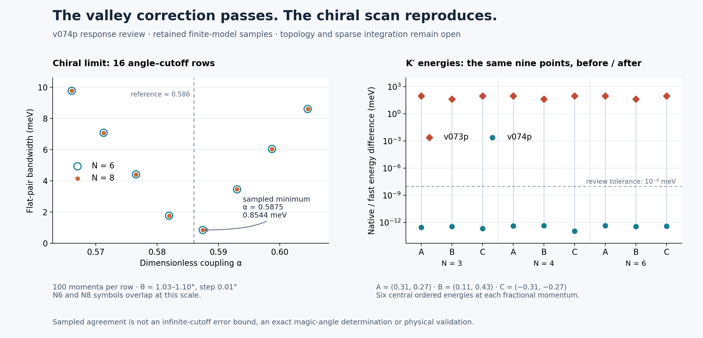

# v074p review — valley correction verified; topology safeguards still open

**This response makes substantial progress.** All eight supplied tests pass. The corrected fast engine matches the native model at all 18 declared points, including K′, and its projected derivatives and central-pair frames also agree. Both control producers run from scratch. The 16-row chiral scan reconstructs exactly from 1,600 retained spectra.

The remaining work is specific: the “fully mirrored” routine still uses unmirrored loop starts, and the new overlap/gap diagnostics are not enforced acceptance gates. A newly supplied sparse inertia routine also has a reproduced kernel counterexample. These limitations prevent broad topology or sparse integration acceptance; they do not undo the successful engine correction or earlier numerical checkpoints.



[Vector figure](response_review.svg) · [Plotting source](figure.py) · [Source hashes](FIGURE.json). The left panel shows all 16 retained scan rows; N6 and N8 markers overlap. The right panel compares the same nine K′ points in v073p and v074p. Its vertical lines connect code revisions, not a parameter path.

## V01–V07 disposition

| Finding | What is now demonstrated | What remains |
|---|---|---|
| **V01 — valley engine** | Corrected in all 18 matrix/energy/derivative/frame checks and six sparse valley samples. | These are finite samples, not general sparse band-identity acceptance or a second independent K′ model. |
| **V02 — mirrored producer** | The producer now generates all three labels, including the recorded “fully mirrored” result. | Loop parameterization is unchanged: transport starts/ends at −r while the actual winding loops start at +r. The second K′ center is inherited from the mirrored separation rather than independently refined. |
| **V03 — topology diagnostics** | Diagnostics are correctly separated and named. Reality, overlap, sewing and external-gap values are retained. | `gap_tol` is unused; zero overlaps return normally; sign transport also accepts zero adjacent overlap. The highest-pair external-gap diagnostic is omitted. |
| **V04 — reality / degeneracy** | The native mass=1 meV case is rejected, and the sampled single-band degeneracy control is rejected. | This closes the tested reality/degeneracy behavior; transport conditioning remains under V03. |
| **V05 — band selection** | Valid integer `lo` now controls the selected pair, and an out-of-range request is refused. | The boundary-pair gap diagnostic still needs correction under V03. |
| **V06 — signed statement** | The unsupported signed numerical claim is withdrawn; the result is explicitly magnitude-only. | Cite a specific equation: the published PRX abstract and its equations contain different signs, so this is not a simple arXiv/PRX convention split. |
| **V07 — chiral scan producer** | Both JSON outputs regenerate with no inherited result file; all 16 scan rows and the symmetry residual are computed. | No momentum/angle mesh refinement or certified minimum is established. Several diagnostics in the response prose differ from its actual JSON. |

[SUMMARY.json](SUMMARY.json) and [PROBES.json](PROBES.json) retain the decision evidence. [NEXT_PASS.md](NEXT_PASS.md) gives the focused corrections.

## Engine checks

The 18 cases use N=3,4,6; both valleys; and fractional momenta A=(0.31,0.27), B=(0.11,0.43), C=(−0.31,−0.27). Model: default θ=1.05°, ε=0.003, `lab_nn_full`, exact geometry, constant w₁=110 meV, w₀/w₁=0.8. Full ordered bases are in [BASIS.json](BASIS.json), with dimensions 116,196,452. This is the same comparison model as the previous review.

| Quantity | Maximum observed disagreement | Declared threshold |
|---|---:|---:|
| Real-basis matrix entries | 4.57×10⁻¹³ meV | 10⁻⁹ meV |
| Six central ordered energies | 4.69×10⁻¹³ meV | 10⁻⁸ meV |
| Projected momentum derivatives | 1.64×10⁻¹³ meV per fractional coordinate | 10⁻⁷ |
| Central-pair projector entries | 3.95×10⁻¹⁵ | 10⁻⁸ |
| Sparse central energies, six N4 samples | 7.28×10⁻¹² meV | 10⁻⁸ meV |

Maxima are rounded upward. Derivatives are compared against differences of the native Hamiltonian at f±0.125 along each coordinate. The declared model is affine in momentum, so this difference introduces no derivative truncation error in exact arithmetic. Projectors compare the pair subspace without requiring arbitrary eigenvector signs to match. Passing values are numerical consistency checks, not physical precision.

## Producers now reproduce

The original result files were removed **only from a disposable extraction** before execution. The preserved partner archive was unchanged. The chiral and valley runs completed separately within the frozen budgets, in 169.92 s and 83.25 s including instrumentation. No speedup is claimed.

[REPLAY_COMPARISON.json](REPLAY_COMPARISON.json) compares all 213 numeric leaves of the supplied and regenerated JSON. The largest absolute difference is 4.45×10⁻¹⁶; nonnumeric fields also match. Thus the advertised outputs are reproducible in this environment, including the labels below. Reproducibility does not establish the geometrical interpretation of a label.

| B | K | K′, unmirrored start | K′, producer's “fully mirrored” mode |
|---:|---|---|---|
| −0.25 | SAME | SAME | SAME |
| −0.30 | OPPOSITE | SAME | OPPOSITE |

The chiral scan uses θ=1.03–1.10° at 0.01° increments, N6/N8, and a 10×10 fractional-momentum grid. Its sampled minimum is at θ=1.06°, α=0.5874668, bandwidth ≈0.8543654 meV. N6 and N8 agree at the displayed precision. That is sampled cutoff consistency, not an infinite-cutoff bound or an exact magic-angle determination.

The producer's actual chiral diagnostics disagree with the response prose:

| Chiral N6 diagnostic | Response prose | Supplied JSON and replay |
|---|---:|---:|
| Minimum overlap singular value | 0.73 | 0.995703421 |
| Maximum sewing diagnostic | 0.014 | 0.0022690735 |
| Minimum external gap (meV) | 5.3 | 101.8343329 |

The 101.8343 meV gap reconstructs from all 540 retained four-band Euler spectra. The strained valley-baseline minima, from 960 spectra per valley, are 5.2491 and 5.2844 meV; these are different models and must not be substituted for the chiral diagnostic. The sewing quantity is computed from the last-sample-to-sewn-first overlap; it includes the finite closing mesh step, rather than measuring only discarded basis norm.

## Remaining measurement defects

**The mirrored path is still incomplete.** A geometry-only instrumented control calls the unchanged winding implementation while holding eigenframes constant. For the +r setting, base/transport endpoints match the first point of each loop. For the −r setting, they differ by 2r=0.024 in fractional coordinates: `pair_charges` changes the base and straight transport segment, but `braid.node_winding` still begins at center+(r,0). No connecting transport or loop-phase change is supplied. This control diagnoses coordinate plumbing; it makes no physical charge prediction.

The producer refines only the first K′ center and uses `p0-d` for the second. Native flat-pair gaps at those second centers are 0.0361813 and 0.0385864 meV for B=−0.25 and −0.30, while the refined first-center gaps are below 3.2×10⁻¹⁰ meV. This does not prove the loops fail to enclose nodes. It means those inherited centers are not demonstrated roots and should not be described as a fully matched mirrored-node measurement without root, image and contour checks.

**Diagnostics are not rejection gates.** A native call with `gap_tol=1,000,000` meV returns normally with a sampled minimum gap of 16.38 meV. A labeled synthetic zero-overlap Wilson product returns overlap singular value 0, sewing loss 1 and polar determinant 1, without rejection. That example has e₂=0; it does not disprove the physical magnitude-one controls. A separate smooth, periodic, isolated synthetic single band with zero adjacent sampled overlap returns a sign-like value ≈1 despite unresolved transport. Add explicit finite thresholds and structured rejection; band isolation alone does not establish resolved transport.

For a four-band diagonal test with spectrum (−3,−1,1,3), the highest pair correctly selects bands 2–3 but reports `min_external_gap_meV=null` even though the lower external gap is 2 meV. The accumulation condition requires an upper neighbor and skips the only available lower neighbor at this boundary.

## Newly bundled sparse routine

The response says the earlier F01–F08 sparse blockers remain open. The included `sparse_mode_v2.py` header nevertheless claims to close F01–F06 and calls absolute identity “PROVED.” This review does not accept that broader claim.

Its `_fact` counts negative entries of SuperLU's U diagonal without establishing that the factors represent a symmetry-preserving congruence. For the nonsingular symmetric test matrix

```text
A = [[0, 1], [1, 0]], mu = 0
```

it returns a negative count of **0**, whereas the exact eigenvalues are −1,+1 and the correct count is **1**. Recorded row permutation is [1,0], column permutation [0,1], and U diagonal [1,1]. This is a direct counterexample to the inertia kernel, **not** a claim that an accepted native sparse window was misidentified. All six native sparse valley samples in this review pass.

Use a justified symmetric-indefinite inertia method with appropriate numerical safeguards or a conservatively enforced ordered dense comparison. Retain the earlier sparse requirements until the actual supported path satisfies them. No full sparse integration audit or event campaign is claimed here.

## Evidence and reproduction

Base commit: `9dc401fc14ab331dbde0aabe26a0e373f9153b6c`. Partner archive SHA256: `be296d77d1051909d04fa91bcff0374bcd1d3f05f9783e6b3c37885f0188f163`.

[INPUT_MANIFEST.json](INPUT_MANIFEST.json), [SOURCE_COMPARISON.json](SOURCE_COMPARISON.json) and [SOURCE.diff](SOURCE.diff) retain source identity and the changes from v073p. All claimed producer/source hashes match the supplied bytes. No partner sources are patched. Inspection of changed/imported code found local source reads and result writes, with no network calls or subprocess launches.

The two compressed evaluation ledgers retain matrix-state coordinates, eigenvalues, bandwidth outputs and refinement returns; [CHIRAL_MODELS.json](CHIRAL_MODELS.json) and [VALLEY_MODELS.json](VALLEY_MODELS.json) retain complete constructor settings and ordered bases. Total producer work is 10,179 SciPy `eigh` calls plus one NumPy full-spectrum call. The 1,600 `fast_bands` records are higher-level views of already counted eigensolves, not additional solves. These are instrumented reproductions sharing the original computations, not an independent validation framework. Eigenvectors are not retained in the ledger.

Use Python 3.12 and [REQUIREMENTS.txt](REQUIREMENTS.txt). From this folder in a **fresh disposable checkout**, run:

```bash
python -m pip install -r REQUIREMENTS.txt
python run_review.py
python report.py
python figure.py
```

The figure reads the preceding review's retained data, so keep the full repository layout. The runner fixes BLAS threads to one, retains failures and enforces budgets of 120 s each for tests/probes, 420 s for the chiral producer and 300 s for the valley producer. It refuses an existing replay directory. For a quick reconciliation of published records, run only `python report.py`. For a fresh targeted repeat without another producer run, use `python clean_smoke.py`; [CLEAN_SMOKE.json](CLEAN_SMOKE.json) records this release's check.

[REFERENCES.md](REFERENCES.md) documents the primary-source sign issue. Earlier scientific scope limits continue to apply: no complete inventory, continuous topology proof, physical validation or novelty claim is added.
